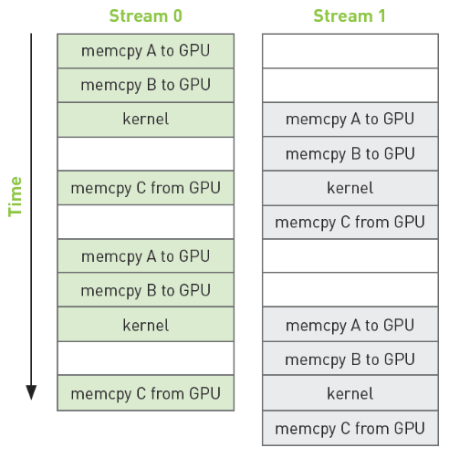
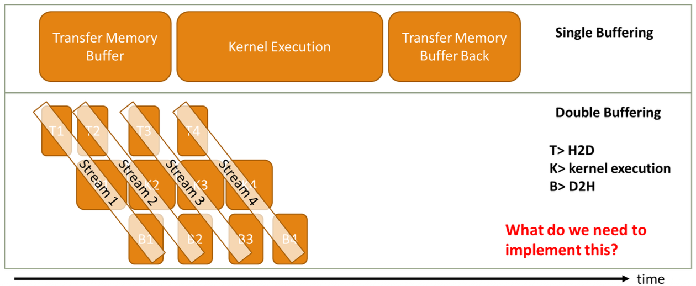

# CUDA III: Advanced features 


### Data transfers are the bottleneck:  

La velocità di calcolo della GPU non serve a nulla se non riusciamo a trasportare i dati tra CPU e GPU abbastanza velocemente.  

  

L'immagine mostra un sistema classico con una scheda video dedicata (discrete GPU), è un concetto generalizzabile a GPU-integrata.  

1. CPU $\rightarrow$ RAM: la CPU parla con la sua RAM a 42 GB/s  
2. GPU $\rightarrow$ VRAM: la GPU parla con la sua VRAM a 288 GB/s
3. CPU $\rightarrow$ GPU: il collegamento (bus PCI-Express) viaggia a solo **8 GB/s**

Notiamo che il *problema* e collo di bottiglia è prorpio la comunicazione tra CPU e GPU, spostare i dati tra i due dispositivi è l'operazione più lenta in assoluto.    

- ogni volta che lanciamo un Kernel , dobbiamo spostare i dati di input e poi recuperare l'output ! dobbiamo trovare un modo per ottimizzare questo passaggio critico.  


<br>

**Conflitto delle memorie**:    
la CPU (host) usa la **memoria virtuale** mentre la GPU usa **indirizzi fisici**  


### Memoria Virtuale

La memoria virutale è un illusione creata dal Sistema Operativo (OS) e dall'Hardware  
- Ogni programma (processo) crede di avere la memoria tutta per se, i suoi indirizzi partono da 0 e vanno fino a infinito (spazio di inidirizzi virtuale)
- L'OS prende le pagine della memoria virtuale e le copia nei buchi liberi della RAM fisica reale.  
- I processi condividono quindi la RAM ma non si toccano mai grazie all'astrazione della memoria virtuale 
- Questo fa si che un processo non possa scrivere sulla memoria di un altro processo, non conosce gli indirizzi fisici dell'altro.  
- Se la RAM è piena, la memoria di alcuni processi finisce sul disco (swap) (con conseguente rallentamento del programma)    

<center>

   

</center>

I blocchi a sinistra sono la virtual memory, ogni processo la vede come contigua.  
Le frecce nere sono il mapping che fa l'OS tra memoria virtuale e memoria fisica, non saranno tutti contigui e uno dietro l'altro!  

### Address Translation  

l'OS usa un traduttore hardware di indirizzi per fare trovare alla CPU l'indirizzo vero, tale componentne è **MMU (memory managment unit)**.   

<center>

  

</center>

- La CPU emette un indirizzo virtuale (es. `0x100`) 
- La MMU intercetta la richiesta:
    - Page Table: la MMU consulta una mappa e usa il **TLB (translation lookaside buffer)** per tradurre la pagina virtuale con quella fisica (es. pagina virtuale 1 -> pagina 55 fisica)  
- La MMU emette l'indirizzo  vero (`0x5500`) verso la RAM    


### Mapping & Fragmentation 

Consideriamo di avere un array `A` che occupa due pagine virtuali (pag 0 e pag 1), queste due pagine virtualmente saranno contigue, e infatti nel codice possiamo scorrere l'array tranquillamente.  


   

Ogni programma ha la usa **Page Table**, la **MMU** è unica per tutti i programmi ed è quella che legge le page table dei vari processi.      

La frammentazione avviene quando abbiamo una struttura dati che occupa più di una pagina virtuale, in quanto la contiguità nella memoria fisica non è mai garantita.  

Nel nostro esempio, la pagina 0 dell'array `A` potrebbe finire in un posto in alto della memoria fisica, mentre la pagina 1 potrebbe finire in un posto in basso, quindi sono **frammentate**, ossia non vicine fisicamente.  

Questo è un problema per la GPU, perchè per spostare i dati usiamo il **DMA** (direct memory access), e il DMA lavora con indirizzi *fisici*.  

Quando vogliamo copiare l'array `A` dalla RAM alla VRAM della GPU il DMA va in crisi perchè:
- l'array non è fisicamente contiguo ma sparpagliato 
- alcuni pezzi potrebbero essere finiti su disco (swap) e il DMA non riesce a leggere il disco.  

<br>

**Nota: Page Table**    

- È una struttura dati salvata nella RAM
    - Ogni processo ha la sua page table personale

- la MMU è l'hardware (chip fisico) che legge le page table dei vari processi
    - l'OS quando cambia processo in esecuzione (context switch) dice alla MMU quale page table guardare per tradurre gli indirizzi.  

Ogni pagina della page table è preceduta da un *valid bit* (`0` o `1`)
- `valid = 1`: significa che la pagina è in RAM fisica, l'indirizzo della page table preceduto dall'1 punta a una posizione valida della memoria fisica

<br>

- `valid = 0`: significa che la pagina non è in RAM, è stata spostata su disco (swap) o non è ancora stata caricata.  
    - quando il bit è a `0` si verifica un **Page Fault**:
        - la MMU vede il bit a `0`, si ferma e lancia il *Page Fault*
        - la CPU smette di eseguire quel processo
        - l'OS va nel disco, prende i dati e li copia in un buco libero della RAM
        - l'OS aggiora la Page Table cambiando il bit a 1
        - il programma riparte come se nulla fosse successo (ma con un ritardo enorme)  


### Soluzione CUDA   

CUDA adotta due approcci principali per il trasferimento dei dati e per risolvere il problema della frammentazione:   


1. **Pageable Memory**: È la memoria paginabile di default, quella che allochiamo con `malloc` o `new`.
    - È soggetta alla frammentazione e allo swap su disco 
    - Per trasferirla su GPU, il driver deve fare molta fatica  

<br>

2. **Pinned Memory**: È una memoria speciale ottimizzata (page-locked)  
    - L'OS viene avvisato e sa che tale memoria NON deve essere spostata e non deve andare su disco
    - Questo permette al DMA di copiare alla massima velocità 

<br>

3. **Unified Virtual Memory (UVM)**: Consiste in un modello avanzato dove il sistema fa finta che Host e Device abbiano un'unica memoria.   


### Memory Transfers: Pageable vs Pinned  

**Pageable Memory**:  


È la memoria di default, quella allocata con con `malloc` seguita dalla `cudaMemcpy`, l'OS può frammentarla o swapparla su disco in qualsiasi momento.   
- Il DMA ha bisogno di inidirizzi fisici contigui per copiare velocemente, la memoria  pageable non offre queste garanzie.    

**Staging Buffer**: Il driver fa un trucco per facilitare la vita al DMA  
- quando chiamiamo `cudaMemcpy` il driver NVIDIA non copia direttamente ma fa un passaggio intermedio per aiutare il DMA:  
    - il driver alloca un buffer temporaneo in una memoria speciale chiamata **Kernel Memory** che è pinned (bloccata e sicura)  
    - la CPU copia i dati dalla memoria pageable al buffer sulla memoria pinned
    - il DMA copia direttamente dallo staging buffer alla GPU  

La tecnica dello staging buffer ha come costo quello di una copia extra (CPU-to-RAM) che non serve a niente se non a 'bloccare' i dati momentaneamente, è uno spreco di tempo e CPU.  


<br>

**Pinned Memory**:  


Possiamo chiedere all'OS di darci pagine di memoria già bloccata fin dall'inizio!  
L'OS garantisce di non spostare mai quelle pagine su disco, e le pagine sono mappate in modo che il DMA possa trovarle facilmente.   

Vantaggio: salta completamente il passaggio intermedio nella Kernel Memory ed è un operazione zero-copy, nel senso che non serve la copia extra fatta dalla CPU, il DMA legge direttamente la memoria.  

Bisogna stare molto attenti e non allocare troppa memoria pinned, in quanto tale memoria è fissa e l'OS non può usarla per altro, se ne allochi troppa il computer potrebbe smettere di essere responsivo in quanto l'OS non ha spazio di manovra.   

Per usare la pinned memory usiamo: `cudaMallocHost((void**)&wo, ...);`    
La `cudaMemcpy` rimane la *stessa* in entrambi i casi, questa funzione è intelligente: contralla il puntatore e se vede che è in memoria pinned usa il percorso veloce (DMA diretto), se vede che su memoria pageable allora usa il percorso lento (stagin buffer).  


### Problema dei Pointers (*)  

In C/C++ un puntatore è un numero (es. `0x00A0`) che rappresenta un indirizzo della memoria, sono ampiamente usati per definire strutture dati.    

Ricordiamo che:
- Host (CPU): usa la memoria virtuale di sistema 
- Device (GPU): usa la sua memoria fisica dedicata 

Se prendo una struttura dalla CPU che contiene un puntatore e la copio sulla GPU, sto copiando il **valore** del puntatore (es. `0x00A0`).  
Quando la GPU prova a leggere quell'indirizzo, lo cercherà nella SUA memoria, ma quel dato è nella memoria virtuale della CPU, non è nella memoria della GPU!  
La GPU quindi legge spazzatura e il kernel crasha.    

Questo è il problema della *Shallow Copy*, copiamo il contenitore e non il contenuto!   


**Zero-Copy (pinned memory)**:          
Possiamo definire la nostra struttura dati direttamente nella pinned memory, la struttura dati rimane quindi nella CPU RAM e la GPU può accederci direttamente grazie al DMA attraverso il bus PCIe.  

Come vantaggio ha il fatto di non dover riscrivere i puntatori per farli puntare alle nuove copie. La GPU legge direttamente la memoria pinned della CPU  

Ha però un grandissimo svantaggio che la rende inutilizzabile quando le performance sono importanti:  
- **latenza altissima:** ogni volta che la GPU fa un operazione che coinvolge i puntatori (es. `node = node->next;`) deve attraversare il cavo PCIe
- questo trasferimento è LENTISSIMO (ricorda collo di bottiglia dei trasferimenti), uccide le prestazioni del Kernel!   


**Deep Copy**:    
È la soluzione manuale, consiste nel ricostruire l'intera struttura dati sulla GPU.   
È un operazione lunga e complessa in quanto dobbiamo:
- allocare la struct 
- allocare il contenuto puntato nella memoria della GPU
- copiare il contenuto allocato su GPU
- aggiornare il puntatore (parte pià difficile): dobbiamo fare in modo che il puntatore dell struct su GPU punti alla corretta area di memoria, ossia all'indirizzo corretto della GPU, quello allocato al passo 2.  

Una volta finita la deep copy avremo l'intera struct su GPU, ma avremo pagato il costo di tante allocazioni e copie di memoria, e anche di tante righe di codice error-prone per fare l'operazione.   


Gestire puntatori tra CPU e GPU è il problema più grande della programmazione CUDA:
- le copie semplici (shallow) non funzionano
- le copie profonde (deep) richiedono tanto codice e gestione manuale degli indirizzi
- l'alternativa zero-copy (pinned) è lenta    


### UVM (unified virtual memory)  
 
A partire da CUDA 6 è stata introdotta la UVM (unified virtual memory), che è una memoria speciale che permette a CPU e GPU di vedere gli stessi indirizzi.    
UVM crea l'illusione che esista un solo blocco di mempria, accessibile sia da CPU che GPU.  

Realtà Fisica $\rightarrow$ sotto il cofano ci sono le due memorie sperate (RAM e VRAM), UVM è un trucco sw che nasconde questa separazione.  

Se il programmatore usa UVM allora per lui esisterà solo la "Unified Memory", allocherà spazio senza preoccuparsi. UVM sposterà i dati avanti e indietro attraverso il bus PCIe, senza che ci sia il bisogno d scrivere le `cudaMemcpy`.   

Per usare la UVM si usa: `cudaMallocManaged()`.   

Risolve il problema delle deep copy e semplifica enormemente la sintassi e la scrittura di codice ma questa astrazione della memoria ha **conseguenze disastrose** per le performance.    

**Meccanismo della UVM:**    
La meccanica di trasferimento dei dati è basata sul concetto di Page Fault.  
Prendiamo il seguente scenario: Allochiamo un array in UVM  

- Host: la CPU scrive i dati iniziali (i dati risiedono fisicamente nella RAM del host)  
- Kernel launch: lanciamo il kernel sulla GPU  
    - la GPU prova a leggere l'array **MA** il dato è fisicamente nella RAM del host
    - la GPU genera un **page fault** e si ferma 
    - interviene il driver che copia la pagina di memoria dalla RAM alla VRAM attraverso il cavo PCIe (lento)
- Finisce il Kernel e la CPU prova a leggere i risultati
    - i dati sono fisicamente nella VRAM
    - la CPU genera un **page fault**, interviene nuovamente il driver che copia nuovamente i dati da GPU a CPU 

Concetto chiave: i dati **MIGRANO** fisicamente, si spostano quando serve 

Il problema della UVM è che fa tanti piccoli trasferimenti!  
Con cudaMemcpy manuale possiamo spostare l'intero array (es. 100MB) in un colpo singolo facendo lavorare il bus PCIe alla massimo della banda.  
Con UVM i dati vengono spostati **pagina per pagina** (es. 4KB alla volta), significa pagare tante volte la **latenza**.   
Il sistema deve anche generare traffico di coerenza per sapere chi ha la pagina e se è sporca.  

<br>

### Asychronous data transfers 

L'obiettivo è quello di migliorare le performance nascondendo i tempi morti, vogliamo ottenere due livelli di sovrapposizione (overlap):  

1. Host-to-Device: vogliamo che la CPU lavori mentre i dati vengono copiati sulla GPU
2. Intra-Device: vogliamo che la GPU esegua un kernel mentre altri dati stanno arrivando o partendo (usare il DMA engine e il compute engine contemporaneamente)   


**`cudaMemcpyAsync()`**   

Fino ad ora abbiamo usato la `cudaMemcpy` che però è **bloccante**: la CPU lancia il comando e dorme finchè la copia non è finita.   

La soluzione è usare `cudaMemcpyAsync`  
- È asincrona (non-blocking): la funzione attiva il driver che inizia a copiare e restituisce subito il controllo alla CPU
- la CPU è libera di fare altro (preparare il prossimo buffer, lanciare un altro kernel)  

REQUISITI:
1. **Pinned memory**: la memoria Host deve essere bloccata  
    Se usiamo memoria pageable il driver deve fare una copia extra e usare uno staging buffer in pinned memory, questa copia la deve fare la CPU il che la bloccherebbe impedendo di ritornare subito!  
    Se la memoria è già pinned il driver passa passa l'indirizzo al DMA e ritorna subito, il DMA farà la copia 
2. **Streams**: dobbiamo usare flussi di esecuzione diversi 


Le API asincrone:  

- `cudaMallocHost()`: alloca memoria pinned sull'host 
- `cudaFreeHost()`: de-alloca memoria pinnata sull'host 
- `cudaHostRegister()`: trasforma un'area di memoria pageable in una pinnata
- `cudaHostUnregister`: trasforma un area pinnata in una normale pageable  


Esempio codice asincrono

```cpp
// allochiamo memoria pinnata su host 
cudaMallocHost((void**)&a, nbytes);
// allochiamo memoria su GPU 
cudaMalloc((void**)&d_a, nbytes);

// copie asincrone e lancio del kernel
cudaMemcpyAsync(d_a, a, nbytes, cudaMemcpyHostToDevice, 0);
kernel<<<blocks, threads, 0, 0>>>(d_a);
cudaMemcpyAsync(a, d_a, nbytes, cudaMemcpyDeviceToHost, 0);

// VANTAGGIO: eseguiamo codice CPU mentre esegue il kernel!
// ps: deve essere indipendente dal kerel
f();

// aspettiamo che le operazioni su GPU siano finite
cudaDeviceSynchronize();
```

- quando l'host fa `cudaMemcpyAsync` riprende il controllo subito, il trasferimento inizia in background su uno specifico stream 
- l'host, mentre la copia sta avvenendo lancia il kernel sullo stesso stream della copia asincrona $\rightarrow$ il kernel viene messo nella coda dello stream e verrà lanciato una volta che l'operazione che lo precede nella coda finisce (ossia la copia asincrona)
- l'host una volta lanciato il kernel riprende il controllo subito e lancia l'altra copia asincrona che viene messa in coda nello stesso stream, verrà eseguita una volta che il kernel termina  
- l'host è libero mentre il driver fa le copie e la GPU esegue il kernel, è qui il vero vantaggio, la CPU può eseguire `f()` che deve essere indipendente dai dati del kernel ovviamente 
- alla fine sincronizziamo tutto con `cudaDeviceSynchronize` per assicurarci che CPU e GPU abbiano finito entrambi le loro operazoni.  


<br>

### CUDA Streams   

Uno stream non è altro che una coda **FIFO** (first-in-first-out) di comandi, la regola interna a uno stream è che i comandi messi nello stesso stream vengono eseguiti in ordine **sequenziale**.  
- se in uno stream mettiamo: copy $\rightarrow$ kernel $\rightarrow$ la GPU non inizia il kernel fino a quando la prima copia non finisce, e non esegue l'ultima copia fino a quando il kernel non termina.  


**Default stream (0)**:   
Se non specifichiamo nulla, tutto finisce nello stream 0, che è quello di defualt.   
Lo stream 0 è **fortemente sincronizzante**, nessuna operazione in altri stream può avvenire mentre lo stream 0 sta lavorando.  

Per avere overlapp effettivo dobbiamo usare più stream e creare più code 

<center>

  

</center>

- I comandi dello stream0 e stream1 sono indipendenti, il driver può eseguire la Memcpy dello stream1 mentre il kernel dello stream0 sta girando  


### Synchronization  

Per gestire i flussi paralleli serve sincronizzazione, esistono due tipi di sincronizzazione:  

1. **Sincronizzazione Esplicita**:  
    - `cudaDeviceSynchronize()`: aspetta tutto e tutti, è la più pesante e di grana grossa
    - `cudaStreamSynchronize(stream_x)`: aspetta solo che lo stream specificato termini
    - `cudaStreamWaitEvent(stream_x, event)`: è un modo per fare aspettare uno stream rispetto ad un altro direttamente sulla GPU, ogni comando sullo stream_x aspetta che l'evento sia eseguito

<br>

2. **Sincronizzazione Implicita**:
    - Qualsiasi comando sullo stream di default 
    - Allocare memoria (cudaMalloc) e copiare memoria (cudaMemcpy) bloccano tutti gli stream  
    - *attenzione:* queste operazioni bloccano tutto di 'nascosto', potrebbero rovinare le performance degli stream! se vogliamo ottimizzare l'uso di stream per andare veloce allora non usare mai lo stream di default e alloca tutta la memoria all'inizio.  


**Stream API**:  
- `cudaStream_t stream`: il tipo di dato, è un puntatore a uno stream
- `cudaStreamCreate(&stream)`: crea lo stream e la coda 
- `cudaStreamDestroy(&stream)`: distrugge lo stream e la coda  


Esempio di codice con gli stream:  

```cpp
// creazione di due stream indipendenti 
cudaStream_t stream[2];
cudaStreamCreate(&stream[0]);
cudaStreamCreate(&stream[1]);

// copia ed eseguiamo il kernel in modo asincrono!  
cudaMemcpyAsync(d_a, a, nbytes/4, cudaMemcpyHostToDevice, stream[0]);
kernel<<<blocks, threads, 0, stream[0]>>>(d_a, value);
cudaMemcpyAsync(a, d_a, nbytes/4, cudaMemcpyDeviceToHost, stream[0]);

cudaMemcpyAsync(d_a+offset, a+offeset, nbytes/4, cudaMemcpyHostToDevice, stream[1]);
kernel<<<blocks, threads, 0, stream[1]>>>(d_a+offset, value);
cudaMemcpyAsync(a+offset, d_a+offset, nbytes/4, cudaMemcpyDeviceToHost, stream[1]);

//run CPU code
f();

// aspettiamo che i due kernel finiscano e distruggiamo gli stream creati
cudaDeviceSynchronize();
cudaStreamDestroy(stream[0]);
cudaStreamDestroy(stream[1]);
```

note:
- il 4o parametro del kernel è lo stream!  
- cosa succede: il driver vede i due stream indipendenti e proverà a incastrare le operazioni di copia dello stream1 mentre lo stream0 sta eseguendo il kernel (DMA engine e compute engine lavorano in parallelo) $\rightarrow$ otteniamo l'overlap perfetto!   


<br>


### Double Buffering 

Ricordiamo che SM e copy engine (DMA) sono due circuiti fisici separati, se usiamo gli stream possiamo accenderli entrambi contemporaneamente.  

<center>




</center>


Nel riquadro in alto abbiamo un caso di single buffering:
    - transfer $\rightarrow$ kernel $\rightarrow$ transfer

Nel riquadro in basso abbiamo lo stesso caso ma usando il **double buffering**:
    - creiamo 4 stream (T1,T2,T3,T4)
    - stream1: inizial il trasferimento
    - stream2: appena stream1 finisce il trasferimento e inizia il suo kernel, lo stream2 inizia il suo trasferimento!
    - *risultato*: saturiamo il bus PCIe e gli SM, lavorano insieme.  


Esempio di codice con Double Buffering:  

```cpp
/*Reminder*/
cudaError_t cudaMemcpyAsync (
    void*                   dst,
    const void*             src,
    size_t                  count,
    enum cudaMemcpyKind     kind,
    cudaStream_t            stream
)

// main.cu 

cudaStream_t stream[4];

for(int i=0; i<4; i++)
    cudaStreamCreate(&stream[i]);

float* hPtr, *d_inp, *d_out;
cudaMallocHost((**void)&hPtr, 4*size);
cudaMalloc((void**)&d_inp, 4*size);
cudaMalloc((void**)&d_out, 4*size);

for(int i=0; i<4; i++)
{
    cudaMemcpyAsync(d_inp+i*size, hPtr+i*size, size, cudaMemcpyHostToDevice, stream[i]);
    myKernel<<<100,512,0,stream[i]>>>(d_out+i*size, d_inp+i*size, size);
    cudaMemcpyAsync(hPtr+i*size, d_out+i*size, size, cudaMemcpyDeviceToHost, stream[i]):
}

cudaDeviceSynchronize();
for(int i=0;i<4;i++)
    cudaStreamDestroy(&stream[i]);
```


**Quando usare il double buffering:**   

Ci sono situazioni dove complicarsi la vita con il double buffering è conveniente 

1. **Global Algorthm on Streams**(video processing):  
    - es. un filmato; ogni frame è indipendente quindi mentre la GPU elabora il frame1 (applica filtro colore), possiamo caricare il frame2 e scaricare il frame0.  
    - zero dipendenze, è lo scenario perfetto.  

2. **Local Algoruthms (Image filtering/ tiling)**:  
    - Quando abbiamo un immagine gigante (troppo grande per la GPU) o quando vogliamo sfrtuttare al massimo il parallelismo. Dividiamo l'input in pezzi (tiles) ed elaboriamo in parallelo i vari pezzi su stream diversi.  
    - *problema:* in questo caso abbiamo del *dipendenze ai bordi!*  


**Apron( halo/ghost cells)**:   

Se stiamo applicando un filtro a un'immagine, per calcolare il valore di un pixel abbiamo bisogno dei suoi vicini.  
Considerando il fatto che stiamo tagliando l'immagine in slices, per elaborare le righe al limite della slice dobbiamo guardare anche la prima riga della slice successiva!  

La soluzione è quella di trasferire le slices con un bordo di sovrapposizione:
- invece di copiare le righe 0-50, copiamo le righe 0-51.  
- la riga 51 serve solo come input ed è *read-only*, serve solo a calcolare la riga 50 
- sacrifichiamo un minimo di banda per permettere il pipelining.  

