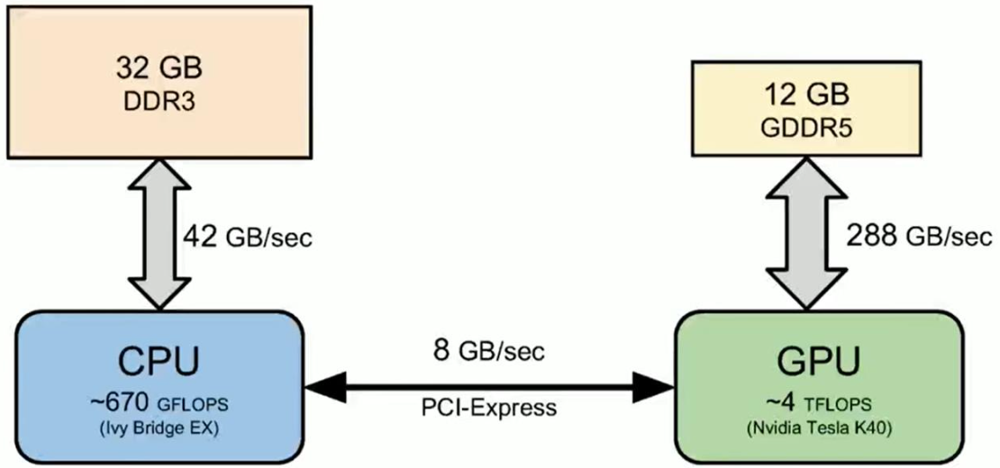
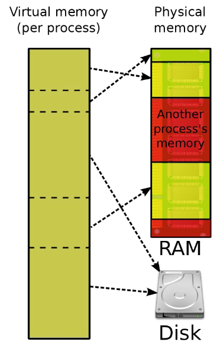
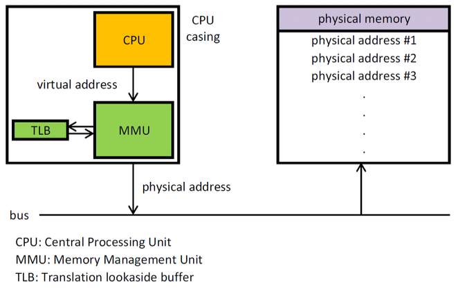
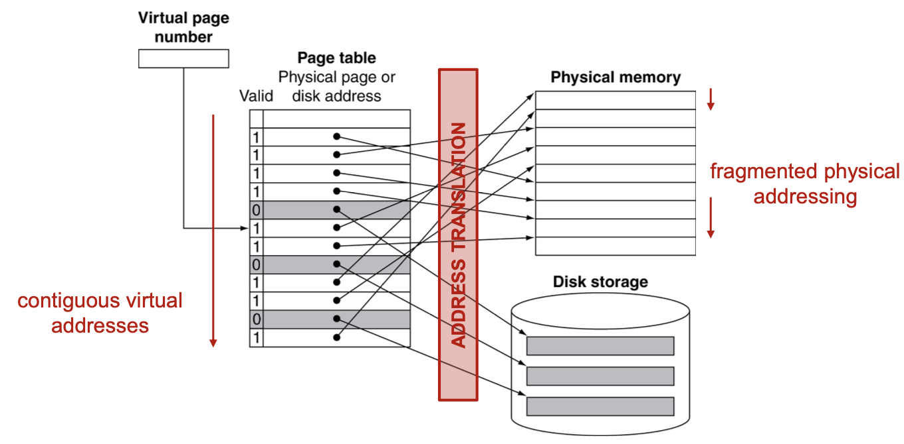
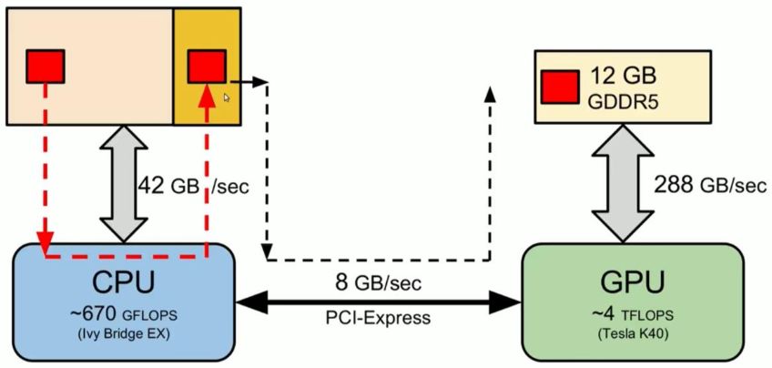
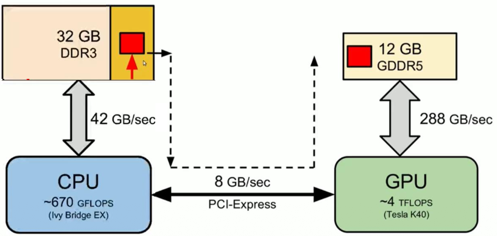

# CUDA III: Advanced features 

### Data transfers are the bottleneck:  

La velocità di calcolo della GPU non serve a nulla se non riusciamo a trasportare i dati tra CPU e GPU abbastanza velocemente.  

  

L'immagine mostra un sistema classico con una scheda video dedicata (discrete GPU), è un concetto generalizzabile a GPU-integrata.  

1. CPU $\rightarrow$ RAM: la CPU parla con la sua RAM a 42 GB/s  
2. GPU $\rightarrow$ VRAM: la GPU parla con la sua VRAM a 288 GB/s
3. CPU $\rightarrow$ GPU: il collegamento (bus PCI-Express) viaggia a solo **8 GB/s**

Notiamo che il *problema* e collo di bottiglia è prorpio la comunicazione tra CPU e GPU, spostare i dati tra i due dispositivi è l'operazione più lenta in assoluto.    

- ogni volta che lanciamo un Kernel , dobbiamo spostare i dati di input e poi recuperare l'output ! dobbiamo trovare un modo per ottimizzare questo passaggio critico.  

**Conflitto delle memorie**:    
la CPU (host) usa la **memoria virtuale** mentre la GPU usa **indirizzi fisici**  

### Memoria Virtuale

La memoria virutale è un illusione creata dal Sistema Operativo (OS) e dall'Hardware  
- Ogni programma (processo) crede di avere la memoria tutta per se, i suoi indirizzi partono da 0 e vanno fino a infinito (spazio di inidirizzi virtuale)
- L'OS prende le pagine della memoria virtuale e le copia nei buchi liberi della RAM fisica reale.  
- I processi condividono quindi la RAM ma non si toccano mai grazie all'astrazione della memoria virtuale 
- Questo fa si che un processo non possa scrivere sulla memoria di un altro processo, non conosce gli indirizzi fisici dell'altro.  
- Se la RAM è piena, la memoria di alcuni processi finisce sul disco (swap) (con conseguente rallentamento del programma)    

   

I blocchi a sinistra è la virtual memory, ogni processo la vede come contigua.  
Le frecce nere sono il mapping che fa l'OS tra memoria virtuale e memoria fisica, non saranno tutti contigui e uno dietro l'altro!  

### Address Translation  

l'OS usa un traduttore hardware di indirizzi per fare trovare alla CPU l'indirizzo vero, tale componentne è **MMU (memory managment unit)**.   

  

- La CPU emette un indirizzo virtuale (es. `0x100`) 
- La MMU intercetta la richiesta:
    - Page Table: la MMU consulta una mappa e usa il **TLB (translation lookaside buffer)** per tradurre la pagina virtuale con quella fisica (es. pagina virtuale 1 -> pagina 55 fisica)  
- La MMU emette l'indirizzo  vero (`0x5500`) verso la RAM    

### Mapping & Fragmentation 

Consideriamo di avere un array `A` che occupa due pagine virtuali (pag 0 e pag 1), queste due pagine virtualmente saranno contigue, e infatti nel codice possiamo scorrere l'array tranquillamente.  

   

Ogni programma ha la usa **Page Table**, la **MMU** è unica per tutti i programmi ed è quella che legge le page table dei vari processi.      

La frammentazione avviene quando abbiamo una struttura dati che occupa più di una pagina virtuale, in quanto la contiguità nella memoria fisica non è mai garantita.  

Nel nostro esempio, la pagina 0 dell'array `A` potrebbe finire in un posto in alto della memoria fisica, mentre la pagina 1 potrebbe finire in un posto in basso, quindi sono **frammentate**, ossia non vicine fisicamente.  

Questo è un problema per la GPU, perchè per spostare i dati usiamo il **DMA** (direct memory access), e il DMA lavora con indirizzi *fisici*.  

Quando vogliamo copiare l'array `A` dalla RAM alla VRAM della GPU il DMA va in crisi perchè:
- l'array non è fisicamente contiguo ma sparpagliato 
- alcuni pezzi potrebbero essere finiti su disco (swap) e il DMA non riesce a leggere il disco.  

 

**Nota: Page Table**    

- È una struttura dati salvata nella RAM
    - Ogni processo ha la sua page table perssonale

- la MMU è l'hardware (chip fisico) che legge le page table dei vari processi
    - l'OS quando cambia processo in esecuzione (context switch) dice alla MMU quale page table guardare per tradurre gli indirizzi.  

Ogni pagina della page table è preceduta da un *valid bit* (`0` o `1`)
- `valid = 1`: significa che la pagina è in RAM fisica, l'indirizzo della page table preceduto dall'1 punta a una posizione valida della memoria fisica

 

- `valid = 0`: significa che la pagina non è in RAM, è stata spostata su disco (swap) o non è ancora stata caricata.  
    - quando il bit è a `0` si verifica un **Page Fault**:
        - la MMU vede il bit a `0`, si ferma e lancia il *Page Fault*
        - la CPU smette di eseguire quel processo
        - l'OS va nel disco, prende i dati e li copia in un buco libero della RAM
        - l'OS aggiora la Page Table cambiando il bit a 1
        - il programma riparte come se nulla fosse successo (ma con un ritardo enorme)  

### Soluzione CUDA   

CUDA adotta due approcci principali per il trasferimento dei dati e per risolvere il problema della frammentazione:   

1. **Pageable Memory**: È la memoria paginabile di default, quella che allochiamo con `malloc` o `new`.
    - È soggetta alla frammentazione e allo swap su disco 
    - Per trasferirla su GPU, il driver deve fare molta fatica  

 

2. **Pinned Memory**: È una memoria speciale ottimizzata (page-locked)  
    - L'OS viene avvisato e sa che tale memoria NON deve essere spostata e non deve andare su disco
    - Questo permette al DMA di copiare alla massima velocità 

 

3. **Unified Virtual Memory (UVM)**: Consiste in un modello avanzato dove il sistema fa finta che Host e Device abbiano un'unica memoria.   

### Memory Transfers: Pageable vs Pinned  

**Pageable Memory**:  

È la memoria di default, quella allocata con con `malloc` seguita dalla `cudaMemcpy`, l'OS può frammentarla o swapparla su disco in qualsiasi momento.   
- Il DMA ha bisogno di inidirizzi fisici contigui per copiare velocemente, la memoria  pageable non offre queste garanzie.    

**Staging Buffer**: Il driver fa un trucco per facilitare la vita al DMA  
- quando chiamiamo `cudaMemcpy` il driver NVIDIA non copia direttamente ma fa un passaggio intermedio per aiutare il DMA:  
    - il driver alloca un buffer temporaneo in una memoria speciale chiamata **Kernel Memory** che è pinned (bloccata e sicura)  
    - la CPU copia i dati dalla memoria pageable al buffer sulla memoria pinned
    - il DMA copia direttamente dallo staging buffer alla GPU  

La tecnica dello staging buffer ha come costo quello di una copia extra (CPU-to-RAM) che non serve a niente se non a 'bloccare' i dati momentaneamente, è uno spreco di tempo e CPU.  

 

**Pinned Memory**:  

Possiamo chiedere all'OS di darci pagine di memoria già bloccata fin dall'inizio!  
L'OS garantisce di non spostare mai quelle pagine su disco, e le pagine sono mappate in modo che il DMA possa trovarle facilmente.   

Vantaggio: salta completamente il passaggio intermedio nella Kernel Memory ed è un operazione zero-copy, nel senso che non serve la copia extra fatta dalla CPU, il DMA legge direttamente la memoria.  

Bisogna stare molto attenti e non allocare troppa memoria pinned, in quanto tale memoria è fissa e l'OS non può usarla per altro, se ne allochi troppa il computer potrebbe smettere di essere responsivo in quanto l'OS non ha spazio di manovra.   

Per usare la pinned memory usiamo: `cudaMallocHost((void**)&wo, ...);`    
La `cudaMemcpy` rimane la *stessa* in entrambi i casi, questa funzione è intelligente: contralla il puntatore e se vede che è in memoria pinned usa il percorso veloce (DMA diretto), se vede che su memoria pageable allora usa il percorso lento (stagin buffer).  

### Problema dei Pointers (*)  

In C/C++ un puntatore è un numero (es. `0x00A0`) che rappresenta un indirizzo della memoria, sono ampiamente usati per definire strutture dati.    

Ricordiamo che:
- Host (CPU): usa la memoria virtuale di sistema 
- Device (GPU): usa la sua memoria fisica dedicata 

Se prendo una struttura dalla CPU che contiene un puntatore e la copio sulla GPU, sto copiando il **valore** del puntatore (es. `0x00A0`).  
Quando la GPU prova a leggere quell'indirizzo, lo cercherà nella SUA memoria, ma quel dato è nella memoria virtuale della CPU, non è nella memoria della GPU!  
La GPU quindi legge spazzatura e il kernel crasha.    

Questo è il problema della *Shallow Copy*, copiamo il contenitore e non il contenuto!   

**Zero-Copy (pinned memory)**:          
Possiamo definire la nostra struttura dati direttamente nella pinned memory, la struttura dati rimane quindi nella CPU RAM e la GPU può accederci direttamente grazie al DMA attraverso il bus PCIe.  

Come vantaggio ha il fatto di non dover riscrivere i puntatori per farli puntare alle nuove copie. La GPU legge direttamente la memoria pinned della CPU  

Ha però un grandissimo svantaggio che la rende inutilizzabile quando le performance sono importanti:  
- **latenza altissima:** ogni volta che la GPU fa un operazione che coinvolge i puntatori (es. `node = node->next;`) deve attraversare il cavo PCIe
- questo trasferimento è LENTISSIMO (ricorda collo di bottiglia dei trasferimenti), uccide le prestazioni del Kernel!   

**Deep Copy**:    
È la soluzione manuale, consiste nel ricostruire l'intera struttura dati sulla GPU.   
È un operazione lunga e complessa in quanto dobbiamo:
- allocare la struct 
- allocare il contenuto puntato nella memoria della GPU
- copiare il contenuto allocato su GPU
- aggiornare il puntatore (parte pià difficile): dobbiamo fare in modo che il puntatore dell struct su GPU punti alla corretta area di memoria, ossia all'indirizzo corretto della GPU, quello allocato al passo 2.  

Una volta finita la deep copy avremo l'intera struct su GPU, ma avremo pagato il costo di tante allocazioni e copie di memoria, e anche di tante righe di codice error-prone per fare l'operazione.   

Gestire puntatori tra CPU e GPU è il problema più grande della programmazione CUDA:
- le copie semplici (shallow) non funzionano
- le copie profonde (deep) richiedono tanto codice e gestione manuale degli indirizzi
- l'alternativa zero-copy (pinned) è lenta    

