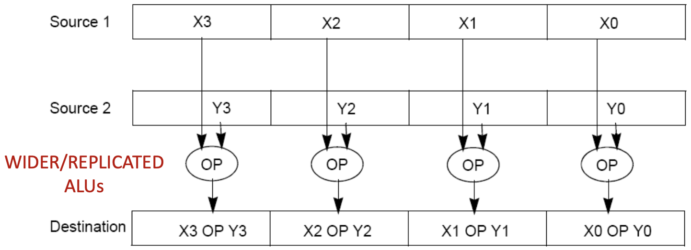
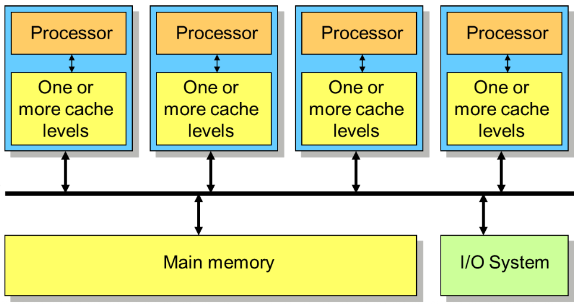
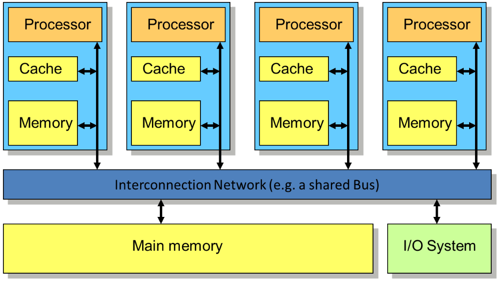
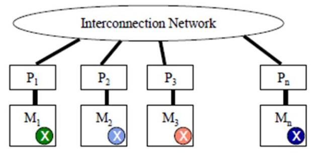
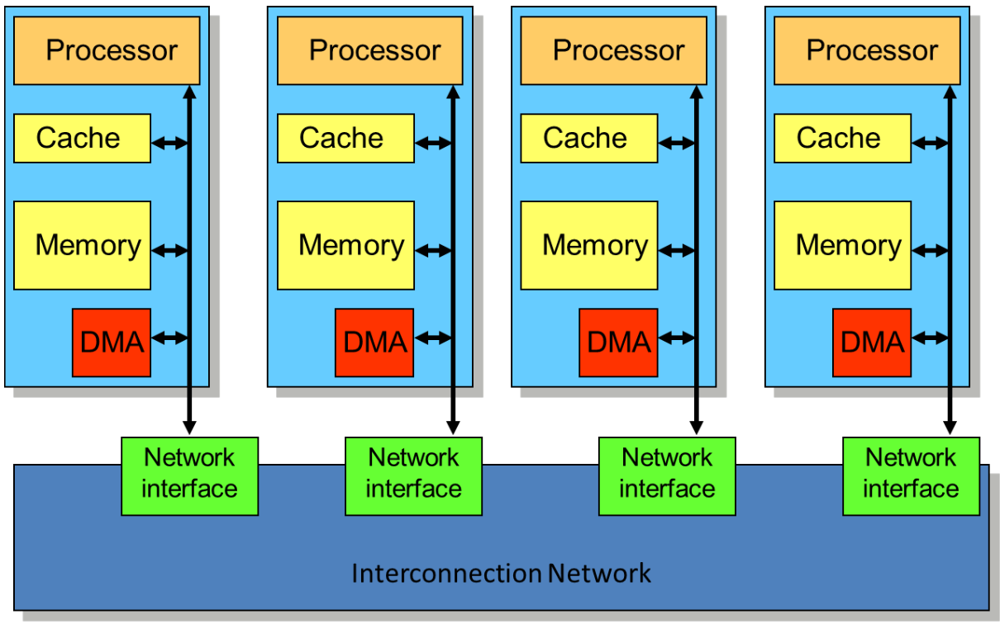

# Parallel Systems 

## Vantaggi dei Multicore (su carta)

- Uso efficace di tutti i transistors (che aumentano secondo la legge di moore ad ogni nodo tecnologico) e anche una maggiore facilità di design e integrazione, in quanto una volta progettato posso fondamentalmente replicare la stessa unità (core).

- Potenziale per permettere un'alta scalabilità: basta continuare ad aggiungere core per raggiungere peak più alti di performance.  

- Ogni core individuale può essere meno potente (clock rate minore): riduzione dei costi per acquistarli e usarli (serve meno energia)


## Svantaggi 

- La parallelizzazione non è un modo illimitato per incrementare la performance
- Algoritmi e harware presentano dei limiti alla performance
- singola task $\rightarrow$ tanti processori:  
    - Bisogna pensare a come dividere la task (share) tra i processori  
    - Bisogna saperli e poterli coordinare bene

Abbiamo quindi bisogno di un **nuovo paradigma** di scrittura dei nostri programmi che venga incontro a queste esigenze.  

**Attenzione:** il parallelismo introduce dell'overhead, costi aggiuntivi che non si avevano nel programma originale. risulta necessario considerare bene questi overhead quando si progetta software parallelo in quanto in alcuni casi può essere maggiore il costo di overhead del beneficio che si ottiene dalla parallelizzazione  


tassonomia: disciplina che si occupa della classificazio e gerarchica di elementi relativi a un determinato settore 

## Tassonomia delle architetture parallele (principali paradigmi dei modelli paralleli)


Michael Flynn disse: "I computer si possono classificare basandosi du due sole domande:"
1. Quanti flussi di istruzione ci sono? (quanti capi stanno dando ordini)
    - Single(S): un solo filo di comandi 
    - Multiple(M): tanti fili di comandi diversi contemopareamente 

2. Quanti flussi di dati ci sono:
    - Single(S): lavoro su un numero alla volta 
    - Multiple(M):  lavoro su un array di numeri tutti insieme


Esistono diversi modelli di architettura parallela:


1. **SISD** (Single Instruction Single Data stream)  
    Processing unit che ha uno stream che viene dalla instruction memory e uno stream (data path unico) dai dati.  
    È la classica rappresentazione di una cpu single core.  

2. **MISD** (Multiple Instruction Single Data stream)  
    Un singolo dato entra (single data stream) ma ci sono istruction pool diverse e diverse processing unit, tutti lavorano sullo stesso dato ma facendo cose diverse (raramente usato).  

3. **SIMD** (Single Instruction Multiple Data stream)  
    L'unità di Fetch/Decode è unica. L'accesso alla memoria avviene tramite un Bus Dati allargato (Wide Bus) che preleva più dati in un colpo solo (Vector Load). Una volta che i dati sono arrivati nei Registri Vettoriali, ogni Processing Unit (ALU) ha un accesso dedicato alla sua porzione di registro.    
    Mi permette di eseguire la stessa operazione su dati differenti, consiste nel più classico tipo di data parallelism (architettura alla base delle GPGPU). 
    **aka:** un solo instruction pool (un solo 'cervello') ma tante processing unit e tanti dati diversi che entrano in parallelo; tutte le processing unit ricevono lo stesso comando!(dato che siamo in SingleIstruction).  

4. **MIMD** (Multiple Instructions Multiple Data streams)  
    Si sfrutta il parallelismo sia nell'asse _istruzioni_ che nell'asse _data_.  
    Ho tante processing unit ciascuna alimentate da un instruction stream dedicato.  
    Modello delle CPU Multicore moderne.   


**Modelli di programmazione parallela:**  

- **SPMD (single program multiple data)** è modello di programmazione più comune per processare parallelismo e consiste nel più classico modo con cui parallelizziamo un programma che ha parallelismo di dati su più thread (es. parallelizzare un programma su CPU che ha multipli core)  
È un singolo programma eseguito su tutti i processori di un architettura MIMD

- **SIMT (single instruction multiple threads)** Unico programma ma eseguito in maniera collaborativa da più thread, si parla di un modello di esecuzione dove si usano più thread per la stessa operazione.  


## Architetture SIMD:  

Abbiamo un ciclo for che itera su un array (es. 1000 elementi), prende ogni elemento e lo incrementa di una costante.

Nell'approccio classico **SISD** dobbiamo fare la fetch dell'istruzione, la Load del dato, l'elaborazione e la Store per **ogni singolo elemento**.
Con l'architettura **SIMD** si ottengono grandi miglioramenti:
1.  **Registri Larghi:** Si usano registri vettoriali (es: 128 bit) capaci di contenere più dati (es: 4 interi da 32 bit).
2.  **ALU Duplicate:** Le unità di calcolo lavorano in parallelo.

**I Vantaggi:**
- **Fetch Ridotto:** Si fa una singola fetch di un'istruzione (es. `VectorAdd`) e la si applica a tutti gli elementi nel registro.
- **Accesso Memoria Efficiente:** Una singola istruzione `VectorLoad` porta in memoria 4 celle contemporaneamente.
    - *Confronto:* Per processare 4 elementi, in **SIMD** facciamo 1 Load + 1 Store = **2** accessi in memoria. In **SISD** avremmo fatto (1 Load + 1 Store) * 4 volte = **8** accessi.




**Definizione di Data Parallelism:**
- Si esegue **una singola operazione** su molteplici flussi di dati (Data Streams).
- **Architettura:**
    - **Singola Control Unit:** Fetch e Decode sono centralizzati (un solo "capo").
    - **Multipli Datapath/PE:** Tante ALU eseguono l'ordine in parallelo sui propri dati locali (ogni ALU è mappata fisicamente in specifici bit del registro vettoriale allargato, es: ALU0 $\rightarrow$ [0-31], ALU1 $\rightarrow$ [32-63], ... )  


### Esempio di SISD vs SIMD  

```c++
// SISD - sequenziale
for each i in array
{
    load x[i] to a register
    add scalar coefficient s
    write result from the register to memory 
}

// SIMD - parallelo 
for each 4 members in array
{
    load 4 members of x to SIMD register
    calculate 4 additions in one operation 
    write the result from register to memory
}
```

La SIMD vuole valori adiacenti in memoria per lavorarli in parallelo, per ottenere in un loop parallelismo di dati in una singola iterazione del loop si fa un **loop unroll** e si aggiusta la iteration rate. 
SIMD ha un unico program counter in comunue, ha solo delle alu e registri allargati per poter ospitare più istruzioni (idonee) contemporaneamente.  


```c++
// loop classico
for (i=0; i<1000; i++){
    x[i] = x[i] + s;
}

// loop unroll
for (i=0; i<1000; i+=4){
    x[i] = x[i] + s;
    x[i+1] = x[i+1] + s;
    x[i+2] = x[i+2] + s;
    x[i+3] = x[i+3] + s;
}
```

Il loop classico in Assembly deve fare:
```assembly
ld   s0, 0(a0)    // s0 -> elemento array
add  s0,s0,a1     // a1 contiene s, è l'incremento costante 
sd   s0, 0(a0)    // store result 
addi a0, a0, 8    // incrementiamo puntatore per andare elemento successivo
bne  a0, t0, L1   // controlliamo di essere i < 1000
```


il blocco di istruzioni ld, add, sd viene eseguito per ogni singolo elemento, inoltre dovremo ripetere per 1000 volte l'istruzione di controllo bne, che è uno spreco di cicli di clock!   

Nell' unroll del loop, avremo 4 load vicine, seguite da 4 add e successivamente da 4 store, ora la addi salterà di 32 bit (4 elementi) e pescherà i prossimi 4.  
In questo modo l'istruzione di controllo bne viene eseguita 250 volte (1000/4), abbiamo risparmiato 750 controlli !  

### Generalizzazione del loop unroll

L'esempio sopra presentava la situazione perfetta, che difficilmente troviamo nella realtà, spesso il numero di elementi di un array non è perfetto per fare l'unroll.  

Es: 11 elementi e il nostro processore SIMD ne fa 4 alla volta  
- possiamo fare 3 cicli e quindi analizzare 12 elementi, ma in questo caso il 12 creerebbe un errore di segmentazione 
- possiamo fare 2 cicli e analizzare 8 elementi, ne lasceremmo 3 non analizzati 

<br>

**Soluzione $\rightarrow$ remainderLoop**  

<br>

Si fanno due operazioni:
1. Main loop (unrolled/SIMD):
    - si calcolano quanti blocchi interi ci stanno: `floor(11/4) = 2`  
    - si esegue il ciclo SIMD per 2 volte (e sistemiamo i primi 8 elementi)
2. Remainder loop (cleanup/SISD):
    - si calcolano quanti elementi mancano: `11 % 4 = 3` 
    - si esegue un ciclo classico SISD lento per i restanti 3 elementi (da 8 a 10)


## Architetture MIMD  

Sono le vere e proprie architetture **multicore**, devono avere almeno due processori interconnessi a un canale di comunicazione

Questa architettura si focalizza sul *thread-level* parallelism, dove ogni thread è un contesto di programma **disgiunto**, ogni unità in esecuzione ha il proprio **PC**.  
È diverso dal SIMD in quanto ogni processing node è un computer completo, con la sua PC e la sua ALU $\rightarrow$ se il nodo_1 fa una pausa o si ferma, il nodo_2 continua a lavorare, non devono andare a tempo.  

- **SIMD:** 1 Control Unit per N processing elements  
- **MIMD:** N Control Unit per N processing nodes


I thread implementano il parallelismo a livello software, ogni thread è indipendente dagli altri e possiede un suo PC dedicato.  
ma ricordiamo che il fork di un thread (creazione di un nuovo thread) porta un overhead che potrebbe essere superiore ai benefici della parallelizzazione.  


## Paradigmi di memoria per architetture multicore

Esistono due principali paradigmi di gestione della memoria  


1. **Shared Memory**:  
    Ho un unica memoria, quindi un unico posto nel sistema dove il dato esiste, di conseguenza la comunicazione per i vari core è semplice in quanto chiamano tutti il dato con il suo 'nome'.  
    Questo crea però delle problematiche di atomicità e sincronizzazione che sono fondamentali per la correttezza.  
    Inoltre ho un limite di scalabilità, in quanto si ha un collo di bottiglia nel bus che collega la memoria al canale di comunicazione.  
    Consiste nell'architettura adottata dai moderni SoC (CPU)


2. **Distributed Memory:**:  
    Architetturalmente più semplice e più scalabile, non si creano colli di bottiglia, viene usata in contesti come quello dei supercomputer o cluster.   
    Questo paradigma però crea molte difficoltà al programmatore, in quanto bisogna esplicitare la comunicazione della memoria (tramite MPI).    
    Ogni processore ha una propria memoria e se il processore $N_1$ vuole raggiungere il dato $x$ che vive nella memoria del processore $N_2$ deve attraversare fisicamente la distanza e creare una *copia* del dato. Deve quindi mandare una richiesta **esplicita** di lettura del dato $x$ al processore $N_2$ (mentre nella shared memory l'accesso ai dati da tutti i processori è invisibile e non servono richieste esplicite).  


<br>
<br>

---

<br>

**Esistono due principali tipi di parallelismo:**  

1. **Data parallelism**: svolgono la stessa operazione ma su dati differenti (es: array di 1000 numeri e 4 processori)

2. **Task (control) parallelism**: svolgono operazioni diverse (es:videogioco dove core1: calcola fisica delle esplosioni, core2: gestisce IA dei nemici, core3: carica la musica, ...)  


Il paradigma più comunemente usato è quello di Data Parallelism (specialmente in AI training e simulazioni scientifiche) su macchine Distributed Memory usando approccio Coarse Grain (grana grande, cercando di dare un carico di lavoro grande ad ogni thread).  


fork (threads) $\rightarrow$ computation $\rightarrow$ join barrier  

la barriera di join sincronizza i vari thread attivi e blocca esecuzione fino a quando tutti i thread non la raggiungono.  

<br>


# Shared Memory:  

Uno degli $N$ processori richiede la risorsa $x$ in memoria, esiste un unica risorsa $x$ in memoria e quindi la comunicazione avvine attraverso variabili condivise, invisibile al programmatore.


Si utilizza il pattern `Fork/Join`: il programma inizia con un singolo processo (`master`), ad un certo punto il master biforca (`fork`) e crea `thread` figli. 

**Esempio: pthreads**  

```c++
int A[12] = {}; int B[12] = {}; int C[12];

void add_arrays(int start){
    int i;
    for(i=start;i<start+4;i++)
        C[i] = A[i] + B[i];
}

int main(int argc, char *argv[]){
    pthread_t threads_ids[3];
    int rc, t;
    for (t=0;t<4;t++){
        rc = pthread_create(&thread_ids[t],
                            NULL       /* attributes       */,
                            add_arrays /* function         */,
                            t * 4      /*args to function  */)
    }
    pthread_exit(NULL)
}
```

<center>


</center>


Nell'esempio ogni thread esegue lo **stesso codice** (`C[i] = A[i] + B[i]`) ma su dati diversi (indice `i` diverso).  
- Ogni thread ha il suo percorso (PC e registri privati)
- MA **tutti** i thread vedono gli array A, B e C (shared resources)
- Alla fine i thread devono aspettarsi e si riuniscono (Join) in un punto, da questo punto il master riprende il controllo!  


## Shared memory: Implementazione fisica 

1. **Physically Shared (SMP: Symmetric Multi-Processors)** $\rightarrow$ memoria centralizzata con accesso uniforme alla memoria (UMA), tipico dei pc moderni

2. **Physically Distributed (DSM: Distributed Shared Memory)** $\rightarrow$ memoria fisicamente distribuita ma logicamente unica, accesso non uniforme (NUMA - non uniform access time)


### SMP - Symmetric Multi-Processors:  



I processori sono isolati e hanno la loro cache, esiste un solo blocco **main memory** e i processori sono collegati da un bus (linea nera orizzontale).  
**UMA (unified memory access):** In questa architettura si accede alla memoria con UMA, signifca che tutti i processori ci mettono lo stesso tempo per accedere alla main memory, sono tutti equidistanti dalla memoria centrale.   
*Problema:* Il bus centrale è il bottleneck, se abbiamo tanti processori il bus si intasa 


### DSM - Distributed Shared-Memory:  



La main memory è spezzata, ogni processore ha il suo pezzo di RAM direttamente collegato.  
**NUMA (Non uniform memory access):** I tempi di accesso alla memoria variano a s econda del processore:
- Se il processore 1 legge la sua memoria è velocissimo 
- se il processore 1 vuole leggere un dato che sta nella memoria del processore 2, deve passare attraverso la **Interconnection Network** (barra blu), ed è più lento.  

**nota:** Siamo comunque in un modello shared memory, l'Hardware è intelligente e se un processore vuole leggere un dato che risiede nella memoria di un altro processore l'hardware fa viaggiare la richiesta sulla rete automaticamente, il tutto è **invisibile** al programmatore.  


**Per riassumere:**  
- Ogni processore può accedere ad ogni locazione fisica della memoria (in quanto è unica, in SMP lo è fisicamente, in DSM lo è concettualmente).  
- Ogni processo può indirizzare tutti i dati che condivide con altri processi 
- I dati vengono trasferiti tramite load e store che vengono gestite 'invisibilmente' dal programmatore
- Si usano comunque modelli di gerarchia della memoria: cache 

I problemi ai quali dovremmo prestare particolare attenzione saranno quelli di **coerenza** e **sincronizzazione**.  


<br>
<br>


# Distributed Memory Programming 




Cambio totale di scenario, qui risiede il mondo Cluster/MPI  
- Non esiste più il bus condiviso o la memoria condivisa, ogni nodo (Processore e Memoria) è un isola, come un sistema completo a parte.  
- Se P1 cerca la variabile $x$, guarda nella sua memoria M1
    - Se $x$ sta in M2, P1 *non* la vede!
- Soluzione: P2 deve fare una copia di $x$ e spedirla via rete a P1  

### Communication Models: MPI (Message Passing Interface)

- Primitive: non usiamo più load/store, ma `send(dati, destinatario)` e `receive(dati,mittente)`
- Standard: questo modello si chiama MPI, è lo standard de facto per i supercomputer 

**Message Passing model details:**   

Lo scambio di dati:
1. È **esplicito** $\rightarrow$ bisogna scrivere nel codice esplicitamente la `send()`
2. È **blocking** $\rightarrow$ quando si invoca la `receive()` il programma si ferma e aspetta finchè il paccchetto non arriva dalla rete


### Message Passing: Physical Implementation (and DMA)



- In alto abbiamo i processori con le loro cache 
- In mezzo le loro RAM e subito sotto il DMA
    - **DMA (Direct Memory Access)**: È un modulo hardware specializzato (programmed I/O) che può leggere e scrvere nella RAM **indipendentemente** dalla CPU, in contesti reali i nodi devono scambiarsi continuamente enormi quantità di dati, se la CPU dovesse gestire ogni pacchetto passerebbe molto (troppo) tempo a fare copia-incolla dei dati e solo il 50% a fare calcoli. Con DMA la CPU fa sempre calcoli mentre il DMA gestisce gli spostamenti dei dati in rete.
- in basso abbiamo la **Network Interface** (scheda di rete) che si collega alla interconnection network  

<center>

Esempio: 

</center>

Abbiamo due array `A` e `B` che contengono 4 punti (con rispettive coordinate $x$ e $y$), vogliamo calcolare la distanza da ogni punto di `A` verso ogni punto di `B` e mettere i risultati in una matrice `C`.  

Ho 4 punti di A e 4 punti in B, devo calcolare 4x4 distanze $\rightarrow$ 16.  

Abbiamo 2 processori: $P_1$ e $P_2$ e vogliamo dividere il lavoro per migliorare le performance.  

**Stato iniziale**  
- $P_1$ ha A e B
- $P_2$ ha la memoria vuota  

1. Decidiamo di dividere A a metà
    - $P_1$ si occuperà di A[0] e A[1]
    - $P_2$ si occuperà di A[2] e A[3] 

2. Affinchè $P_2$ possa calcolare le distanze per A[2] e A[3] avrà bisogno di:
    - A[2], A[3]
    - Tutto B (siccome deve calcolare le disstanze di A per tutti i punti di B)
    - $\rightarrow$ mandiamo la seconda metà di A e duplichiamo B

3. $P_1$ invierà un messaggio a $P_2$:
    - `send(A[n/2+1:], P2)`
    - `send(B[:], P2)`

4. Calcolo parallelo 
    - $P_1$ calcola le righe 0 e 1 di C
    - $P_2$ calcola le righe 2 e 3 di C

5. Raccolta dei risultati:
    - $P_2$ ha in memoria un pezzo della matrice C ma vogliamo tutta la matrice in $P_1$
    - $P_2$ invierà le due righe calcolate verso $P_1$ che le incollerà in fondo alla sua matrice C  


## Communication Models:

- Shared Memory: usiamo OpenMP
- Message Passing: usiamo MPI