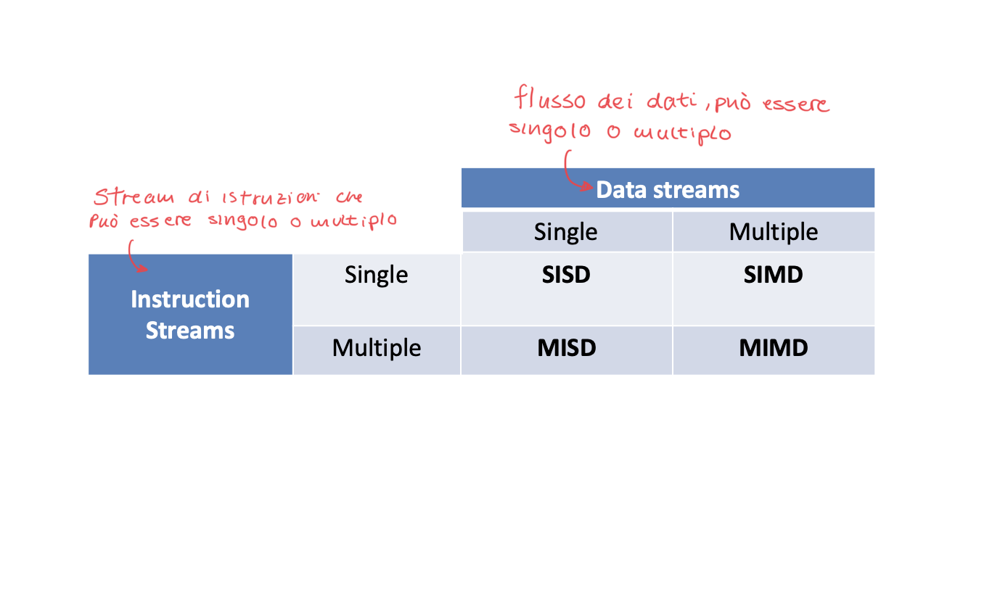
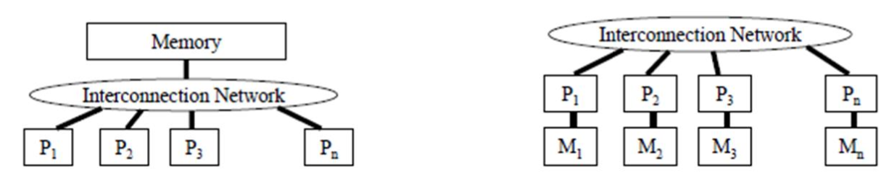
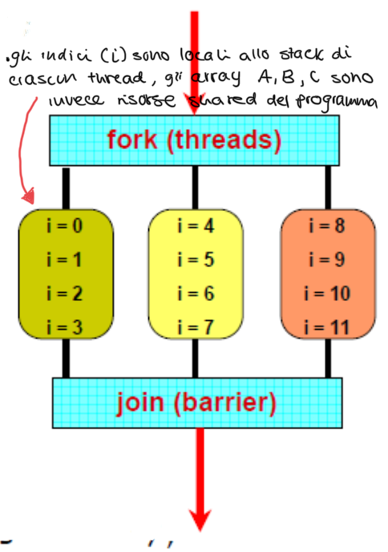

# Parallel Systems 


## Vantaggi dei Multicore (su carta)

- Uso efficace di tutti i transistors (che aumentano secondo la legge di moore ad ogni nodo tecnologico) e anche una maggiore facilità di design e integrazione, in quanto una volta progettato posso fondamentalmente replicare la stessa unità (core).

- Potenziale per permettere un'alta scalabilità: basta continuare ad aggiungere core per raggiungere peak più alti di performance.  

- Ogni core individuale può essere meno potente (clock rate minore): riduzione dei costi per acquistarli e usarli (serve meno energia)


## Svantaggi 

- La parallelizzazione non è un modo illimitato per incrementare la performance
- Algoritmi e harware presentano dei limiti alla performance
- singola task $\rightarrow$ tanti processori:  
    - Bisogna pensare a come dividere la task (share) tra i processori  
    - Bisogna saperli e poterli coordinare bene

Abbiamo quindi bisogno di un **nuovo paradigma** di scrittura dei nostri programmi che venga incontro a queste esigenze.  

**Attenzione:** il parallelismo introduce dell'overhead, costi aggiuntivi che non si avevano nel programma originale. risulta necessario considerare bene questi overhead quando si progetta software parallelo in quanto in alcuni casi può essere maggiore il costo di overhead del beneficio che si ottiene dalla parallelizzazione  


tassonomia: disciplina che si occupa della classificazio e gerarchica di elementi relativi a un determinato settore 


## Tassonomia delle architetture parallele (principali paradigmi dei modelli paralleli)


Esistono diversi modelli di architettura parallela:



1. **SISD** (Single Instruction Single Data stream)  
    Processing unit che ha uno stream che viene dalla instruction memory e uno stream (data path unico) dai dati.  
    È la classica rappresentazione di una cpu single core.  

2. **MISD** (Multiple Instruction Single Data stream)  
    Si originano due percorsi dalla instruction memory, in questo caso quindi si possono alimentare in parallelo più di una processing unit, ma si ha una singola data unit.    
    Non si ha una esecuzione parallela, ma una pipeline.

3. **SIMD** (Single Instruction Multiple Data stream)  
    L'unità di instruction memory (aka Fetch/Decode) è unica ma replico tante volte la fase di execute (processing units) e accesso alla memoria, quindi ogni parte replicata ha un accesso dedicato al data pool.  
    Mi permette di eseguire la stessa operazione su dati differenti, consiste nel più classico tipo di data parallelism (architettura alla base delle GPGPU).  

4. **MIMD** (Multiple Instructions Multiple Data streams)  
    Si sfrutta il parallelismo sia nell'asse _istruzioni_ che nell'asse _data_.  
    Ho tante processing unit ciascuna alimentate da un instruction stream dedicato 


**Modelli di programmazione parallela:**  

- **SPMD (single program multiple data)** è modello di programmazione più comune per processare parallelismo e consiste nel più classico modo con cui parallelizziamo un programma che ha parallelismo di dati su più thread (es. parallelizzare un programma su CPU che ha mmultipli core)  
È un singolo programma eseguito su tutti i processori di un architettura MIMD

- **SIMT (single instruction multiple threads)** Unico programma ma eseguito in maniera collaborativa da più thread, si parla di un modello di esecuzione dove si usano più thread per la stessa operazione.  


## Architetture SIMD:  

Ricordiamo che il SIMD prende un unica istruzione e la distribuisce su più unità che gestiscono pezzi diversi di un dato.    
L'idea chiave è che tanta computazione avviene dentro cicli dove vengono processate strutture dati come array e matrici, e dove si ripete la stessa operazione su un largo numero di dati.  

Quindi si fa il fetch di una istruzione e si fa il lavoro di multiple istruzioni (in un singolo ciclo), servono registri e load-store units più larghi, bisogna anche replicare e allargare le ALU.  


In breve:  

- Data parallelism: si esegue una operazione su multipli stream di data
    - singola control unit (fetch e decode in comune)
    - multipli data path e ALU che eseguono in parallelo, ogni PE(processing elements) è interconnesso e scambiano dati da direttive del control unit, ogni PE esegue la stessa operazione con i propri dati locali.  


### Esempio di SISD vs SIMD  

```c++
// SISD - sequenziale
for each i in array
{
    load x[i] to a register
    add scalar coefficient s
    write result from the register to memory 
}

// SIMD - parallelo 
for each 4 members in array
{
    load 4 members of x to SIMD register
    calculate 4 additions in one operation 
    write the result from register to memory
}
```

La SIMD vuole valori adiacenti in memoria per lavorarli in parallelo, per ottenere in un loop parallelismo di dati in una singola iterazione del loop si fa un **loop unroll** e si aggiusta la iteration rate. 
SIMD ha un unico program counter in comunue, ha solo delle alu e registri allargati per poter ospitare più istruzioni (idonee) contemporaneamente.  


```c++
// loop classico
for (i=0; i<1000; i++){
    x[i] = x[i] + s;
}

// loop unroll
for (i=0; i<1000; i+=4){
    x[i] = x[i] + s;
    x[i+1] = x[i+1] + s;
    x[i+2] = x[i+2] + s;
    x[i+3] = x[i+3] + s;
}
```


## Architetture MIMD  

Sono le vere e proprie architetture **multicore**, devono avere almeno due processori interconnessi da un canale di comunicazione

Questa architettura si focalizza sul *thread-level* parallelism, dove ogni thread è un contesto di programma disgiunto, ogni unità in esecuzione ha un proprio program counter.  

I thread possono essere utilizzati per parallelismo a livello di dati, ma ricordiamo che il fork di un thread (creazione di un nuovo thread) porta un overhead che potrebbe essere superiore ai benefici della parallelizzazione.  


## Paradigmi di memoria per architetture multicore

Esistono due principali paradigmi di gestione della memoria  



1. **Shared Memory**:  
    Ho un unica memoria, quindi un unico posto nel sistema dove il dato esiste, di conseguenza la comunicazione per i vari core è semplice in quanto chiamano tutti il dato con il suo 'nome'.  
    Questo crea però delle problematiche di atomicità e sincronizzazione che sono fondamentali per la correttezza.  
    Inoltre ho un limite di scalabilità, in quanto si ha un collo di bottiglia nel bus che collega la memoria al canale di comunicazione.  
    Consiste nell'architettura adottata dai moderni SoC (CPU)


2. **Distributed Memory:**:  
    Architetturalmente più semplice e più scalabile, non si creano colli di bottiglia, viene usata in contesti come quello dei supercomputer.  
    Questo paradigma però crea molte difficoltà al programmatore, in quanto bisogna esplicitare la comunicazione della memoria.  
    Ogni processore ha una propria memoria e se il processore $x$ vuole raggiungere il dato $a$ che vive nella memoria del processore $y$ deve attraversare fisicamente la distanza e creare una *copia* del dato, altrimenti accederebbe al dato $a$ che vive nella sua memoria. Deve quindi mandare una richiesta **esplicita** di lettura del dato $a$ al processore $y$ (mentre nella shared memory l'accesso ai dati da tutti i processori è invisibile e non servono richieste esplicite).  


## Tipi di parallelismo:

1. Data parallelism: svolgono la stessa computazione ma su dati differenti 

2. Task (control) parallelism: performano funzioni diverse tra di loro 


fork (threads) $\rightarrow$ computation $\rightarrow$ join barrier  

la barriera di join sincronizza i vari thread attivi e blocca esecuzione fino a quando tutti i thread non la raggiungono.  


## Shared Memory Programming:  

Uno degli $n$ processori richiede la risorsa $x$ in memoria, esiste un unica risorsa $x$ in memoria e quindi la comunicazione avvine attraverso variabili condivise, invisibile al programmatore.


**Esempio: pthreads**  

```c++
int A[12] = {}; int B[12] = {}; int C[12];

void add_arrays(int start){
    int i;
    for(i=start;i<start+4;i++)
        C[i] = A[i] + B[i];
}

int main(int argc, char *argv[]){
    pthread_t threads_ids[3];
    int rc, t;
    for (t=0;t<4;t++){
        rc = pthread_create(&thread_ids[t],
                            NULL       /* attributes       */,
                            add_arrays /* function         */,
                            t * 4      /*args to function  */)
    }
    pthread_exit(NULL)
}
```


<center>




</center>

## Shared memory: Implementazione fisica 

- Physically Shared (SMP) $\rightarrow$ memoria centralizzata con accesso uniforme alla memoria (UMA)


- Physically Distributed (DSM) $\rightarrow$ memoria fisicamente distribuita ma logicamente unica, accesso on uniforme (NUMA - non uniform access time)


**Per riassumere:**  
- Ogni processore può accedere ad ogni locazione fisica della memoria (in quanto è unica)
- Ogni processo può indirizzare tutti i dati che condivide con altri processi 
- I dati vengono trasferiti tramite load e store che vengono gestite 'invisibilmente' dal programmatore
- Si usano comunque modelli di gerarchia della memoria: cache 


