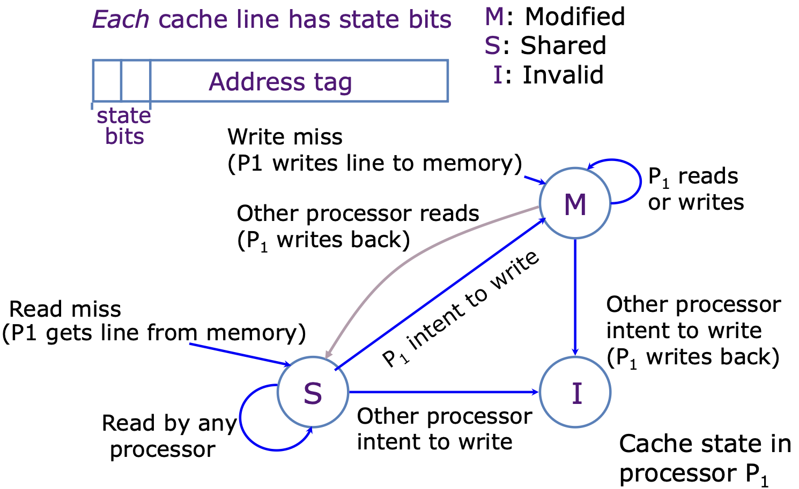
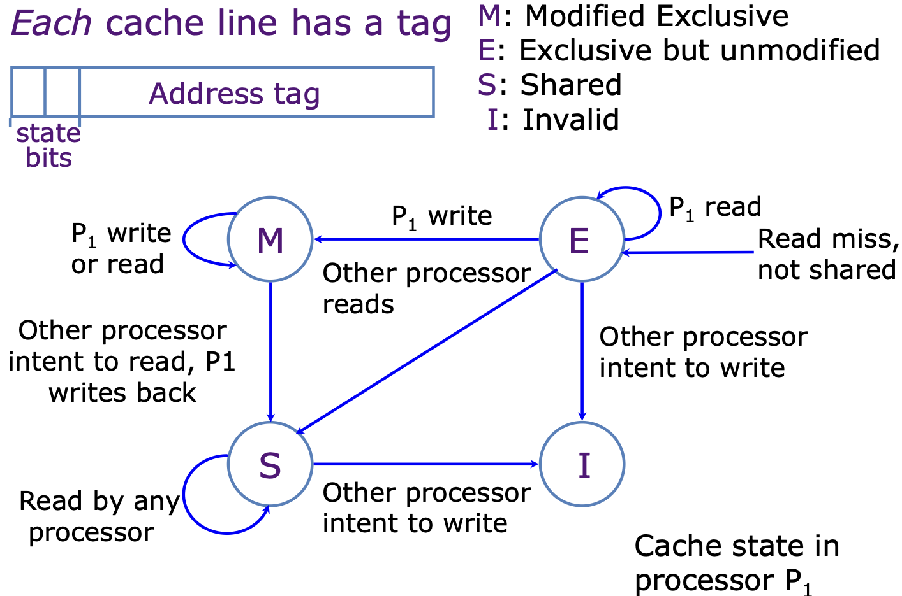
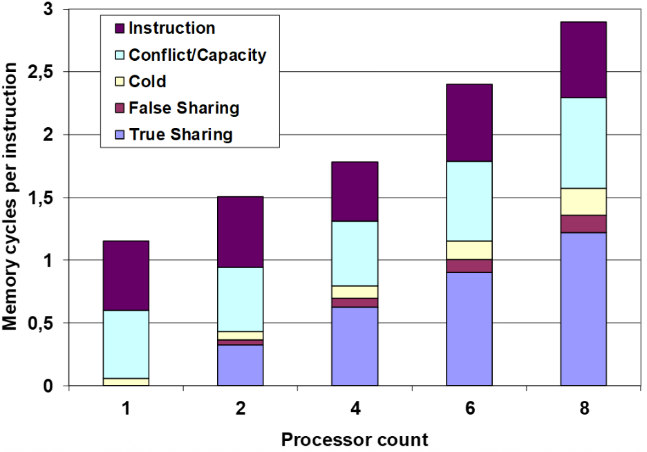
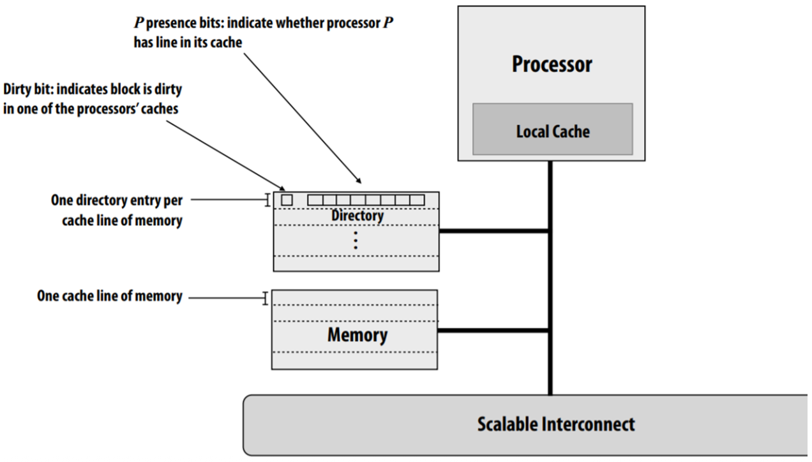
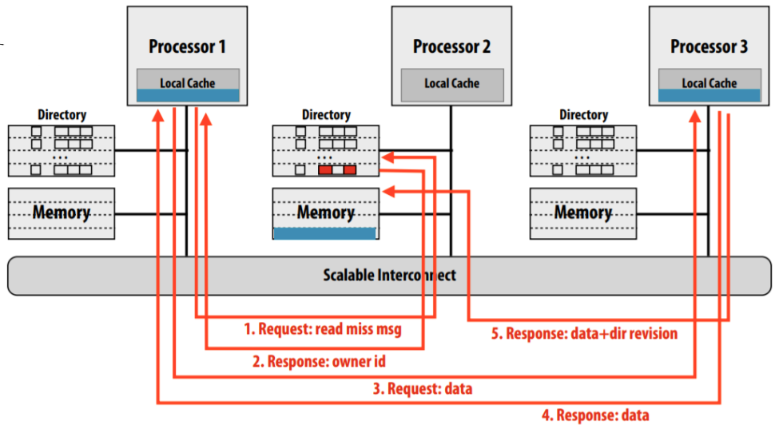
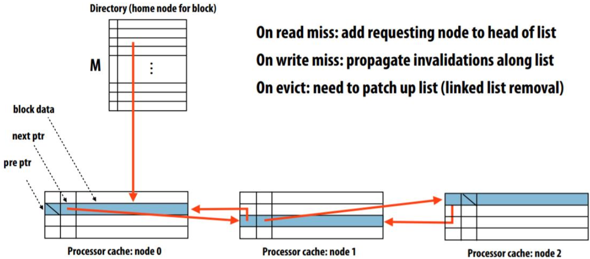

# Coherence

Il problema di coherence nasce nei sistemi shared memory multiprocessors (SMMP)

Rircordiamo che l'accesso in memoria è incrementalmente costoso, più è veloce e più costa (registri cpu molto veloci ma molto costosi a differenza di un hard disk).
Bisogna progettare in modo da diminuire il più possibile questo costo.  

I sistemi con multicore approcciano il problema del memory wall alla stessa maniera dei chip single core, ossia con gerarchia di cache ma introducendo anche nuove challenge dovute al paradigma di **shared memory**.

## SMMP: Shared Memory Multi Processors

Abbiamo 3 principali problemi per le SMMP:
1. **Coerenza:**  
    Gestisce il mantenimento di un ordine globale nel quale una write a una locazione o variabile devono essere viste da tutti i processori $\rightarrow$ _Vedo i dati più recenti ?_

2. **Sincronizzazione:**  
    Come proteggere l'accesso a shared data $\rightarrow$ _come sincronizzo i processi_
3. **Consistenza:**  
    gestisce l'ordering delle operazioni verso multiple locazioni in accordo con tutti i processori $\rightarrow$ _quando vedo un written value_  

Analizziamo il primo problema

## Keeping Multiple Caches Coherent

Es: 3 processori (p0,p1,p2). p1 e p2 leggono il valore `memory[1000]`, entrambi se lo portano in cache, p0 successivamente scrive in `memory[1000]` un valore diverso, questo deve invalidare il contenuto della cache nel processore 1 e 2 per mantenere dati coerenti nel sistema. 

Il compito principale è quindi quello di **mantenere valori coerenti tra le cache dei processori**.  
L'idea è di ottenerlo monitorando le cache miss e write con un sistema che permetta la comunicazione tra processori mediante un interconnection network:
- se solo in lettura, tanti processori possono avere copie 
- se un processore scrive, **invalidare** tutte le altre copie

### MSI Protocol & Performance: 
Protocollo che ha tre stati: 
- M: Modified 
- S: Shared 
- I: Invalid

Guardare esempio interattivo sulle slide.  

In questo protocollo ogni dato è trattato come shared, ogni volta che un processore scrive una cache-line $X$ deve notificare tutti gli altri processori $\rightarrow$ tale processore contiene il dato più aggioranto di $X$, passa in stato M!

_Note Importanti:_   
- Ogni volta che un dato si trova nella cache di un processore in stato M (ossia contiene la versione più nuova del dato, anche rispetto al valore in RAM) **se** un altro processore intende leggere o scrviere quel dato il processore iniziale DEVE fare una write back e andare in stato S se l'altro processore legge, o in stato I se l'altro processore scrive.  
- Se una linea è nello stato M, allora nessun'altra cache può avere una copia di quella linea! garantisce che non esistano mai molteplici copie diverse dello stesso dato.  

Questo genera molto traffico nel bus di comunicazione, e sorge spontanea la domanda: **abbiamo bisogno di trattare tutti i dati come shared?**  $\rightarrow$ Per evitare un eccesso di traffico possiamo fare la seguente distinzione:
- Fino a quando un singolo processore legge e scrive una linea di cache $X$ non dobbiamo notificare gli altri core, i dati sono **privati** a quel processore.  

Queste idee sono alla base del protocollo **_MESI_** che aggiunge uno stato:
- *E* $\rightarrow$ *Exclusive*
Questo stato evita di generare ulteriore traffico per transazioni fatte da un processore su una linea di cache.  

Con l'aggiunta dello stato _Exclusive_ il protocollo MESI è in grado di distinguere tra dati privati e shared in un programma parallelo, riducendo il traffico per mantenere la coerenza nel sistema di bus.  

### Performance di SMMP simmetrico
La performance della cache è una combinazione di:
- Traffico uniprocessor di cache miss 
- Traffico causato dalla comiunicazione 
- Coherence Miss 

### True Sharing Miss & False Sharing Miss

La _true sharing miss_ è necessaria per garantire la coerenza dei dati condivisi tra i core.  
La _false sharing miss_ è un overhead non necessario che si verifica a causa della condivisione di blocchi di cache, ma non di dati effettivamente usati in comune.

- **Cache Miss: Conflict**  
    Si verifica quando due processori accedono a una stessa porzione (linea/blocco) di dati condivisi in scrittura e la cache deve gestire la coerenza dei dati (cache coherence). 

- **True Sharing Miss:**  
    - Succede quando un core modifica un dato specifico che si trova in un bloco condiviso e un altro core (che condivide lo stesso blocco) prova a leggere o modificare lo stesso dato.  È una vera miss in quanto il dato che sta provando a leggere il secondo core è stato modificato dal primo, si avrebbe anche se la dimensione della cache fosse di una singola `word`.  

- **False Sharing Miss:**  
    È una miss che si verifica a causa della struttura del blocco/linea di cache.  
    - Succede quando due core accedono a dati distinti ma che **risiedono** nella stessa linea di cache. Se uno dei due core modifica anche solo una singola variabile della linea di cache l'intera linea viene invalidato per gli altri core anche se i dati non si sovrappongono (altri core lavorano su variabili diverse e si disinteressavano di quella modificata la primo processore).    
    La Miss quindi non è neccessaria per il funzionamento del programma ma avviene per via dell'organizzazione della cache.  
    Es: La variabile $x$ (usata dal core $A$) e la variabile $y$ (usata dal core $B$) sono nello stesso blocco di cache.
    Il core $A$ scrive su $x$. Questo invalida il blocco nella cache del core $B$.
    Quando il core $B$ prova a leggere o scrivere $y$, si verifica una miss, nonostante $y$ non sia mai stato modificato.  
    Si tratta quindi di una cache evitabile in quanto non intacca la funzionalità del programma.   

**nota:** Al tempo 1, P1 scrive su x1. Questo causa una true miss, per i seguenti motivi (Modifica al dato condiviso):

- Quando P1 scrive su x1, la cache coherence protocol (MESI) invalida il blocco contenente x1 nelle cache degli altri processori (in questo caso, P2).
- Questo è necessario perché il dato modificato potrebbe essere richiesto in seguito da P2, quindi occorre garantire che tutti i core abbiano una visione coerente.

Al tempo 2, quando P2 legge x2, si verifica una false sharing miss.
- Anche se x2 non è stato modificato direttamente, la modifica di x1 al tempo 1 ha invalidato il blocco.
- Questo causa una miss inutile per x2, che non sarebbe accaduta se x1 e x2 fossero stati in blocchi separati.

**Impact of misses:**  

Se nel nostro sistema aumentiamo il numero di core/nodi il numero di True/False sharing miss esplode.  
Infatti se più core condividono lo stesso sistema è più probabile che si pestino i piedi e lavorino su dati che vivono nella stessa linea (blocco) di RAM.  

  

 

### Implementare la coerenza: 

Esistono diverse architetture di cache per implementare la coerenza, in particolare i punti fondamentali da tenere a mente sono:

1. Se ho una miss, chi ha il dato aggiornato? a chi devo chiedere 
2. Dove sono le altre copie di una certa linea di cache 
3. Come comunico con le altre copie per invalidarle nel caso di scrittura?

### Snoopy Protocols:

Usa un metodo broadcast basato su un bus:
- quando un processore ha un problema write miss o write manda un messaggio sul bus per chiedere chi possiede quel dato 
- tutti gli altri processori ascoltano 
- tutti i processori controllano le loro cache e chi ha il dato risponde o si invalida 

Il grande problema di questa architettura è la **scalabilità**, se ho un sistema con pochi processori (es: 4 ) funziona tutto bene, ma se aumento aggressivamente il numero di core il bus diventa un collo di bottiglia dove tutti comunicano con tutti, si intasa e satura il canale di comunicazione.  

Es: Usiamo una architettura NUMA (tipica quando scaliamo a macchine con più processori), quindi abbiamo shared memory ma fisicamente distribuita su ogni processore, NUMA scala molto bene, ma se usiamo snoopy per mantenere la coerenza perdiamo tutta la scalabilità.  

Un tentativo di upgrade di questo protocollo è stato snoopy gerarchico a livelli, ma con risultati fallimentari (la radice era il bottleneck e larghe latenze per attraversare l'albero).  

### Directory

Consiste in un approccio scalabile per mantenere la coerenza delle cache, in particolare invece di usare messaggi di broadcast per tenere aggiornate le cache, si usano messaggi point-to-point.  

Vediamo l'architettura che è composta da un nodo (processore + cache), sotto di esso è collegata la directory e la RAM. Il tutto collegato da un bus che permette la comunicazione multiprocesso.  

La directory è una matrice, ha un numro di righe pari al numero di righe della cache, e le colonne sono tante quanti i processori del sistema + 1 per il dirty bit (se acceso significa che qualche processore ha modificato il dato nella sua cache privata, il dato in RAM è vecchio; se spento allora il valore in RAM è aggiornato).  

Es: ho 4 processori, allora avrò 5 colonne, la prima per il dirty bit e le altre quattro mi dicono se gli altri processori hanno nella loro cache una copia di quella riga di cache.  

**Definizioni:**  
Non esiste una directory centralizzata, essa è infatti distribuita, ogni processore ha il suo pezzo di directory (un indirizzo appartiene alla directory di un processore): 
- **Home node**: Nodo proprietario del pezzo di memoria al quale appartiene l'indirizzo di interesse
- **Requesting node**: Nodo che vuole accedere a un dato che vive nella memoria di un altro processore.  

Es: Read miss ad un dirty block

$P1$ vuole leggere un dato che vive nella memoria di $P2$, diventa il requesting node e manda la richiesta.  
$P2$ riceve la risposta, controlla la linea di cache d'interesse e nota che il dirty bit è acceso $\rightarrow$ lui non possiede la versione più aggiornata del dato.  
Controllando gli altri bit si nota che il proprietario della copia più recente è $P3$.  
$P2$ manda indietro una risposta a $P1$ dicendo che il proprietario del dato aggiornato è $P3$, a questo punto $P1$ manda la richiesta direttamente a $P3$ che gli risponde inoltrando il dato di interesse.  
$P3$ manda un messaggio anche a $P2$, ossia il home node del dato che ha inoltrato, per informarlo, ora la directory di $P2$ avrà bit accesi in corrispondenza di $P1$ e $P3$ (un dato shared!), inoltre $P2$ farà write back e pulirà il dirty bit.  

Vantaggi delle directory:
- Sulle read (letture): comunicazione sempre Point-to-Point
    - Se il bit è clean $\rightarrow$ parlo solo con il home node
    - Se il bit è dirty $\rightarrow$ parlo con il home node e il proprietario 
    - Non disturbo mai gli altri nodi creando traffico unitile

- Sulle write (scritture): il vantaggio dipende dal numero di processori che condividono un dato  
    - Se devo invalidare due copie (o poche) è molto efficiente 
    - Se tutti hanno una copia (caso rarissimo) devo mandare messaggi a tutti, in tal caso si torna al broadcast.  

### Cache Invalidation Patterns:

Studi su software (worlkload) dimostrano che esistono pattern di accesso ricorrenti:

1. Mostly-read objects: molte share, le write sono poco frequenti quinid impatto minimo sulla performance 

2. Migratory objects: poche share

3. Frequently read/written obj: dati che cambiano spesso, invalidation frequenti ma basse di numero, non fanno in tempo ad accumularsi troppe copie in giro.  

**Problemi dell'uso di directory full bit vector:** le directory appena descritte hanno uno spazio di overhead di storage proporzionale a $P \times M$ dove:
- $P \rightarrow$ numero di nodi 
- $M \rightarrow$ numero di blocchi in memoria  

Scala male per $P$, quindi per architetture supercomputer:  
Assumiamo 64B per linea di cache, se dovessimo avere 1024 nodi nel sistema allora ogni riga della directory dovrebbe avere 1024 bit, uno per ogni processore (bit vector)  
- stiamo usando più memoria (128B) per sapere chi ha il dato rispetto alla memoria che usiamo per i dati veri (64B), è uno spreco del 200%.    
(perchè ci serve un full bit vector, quindi 1024 bit, che sono 128B per ogni riga di cache)  

Esistono due ottimizzazioni al modello di directory classica: Limited Pointer Schemes (riducono $P$) e Sparse Directories (ridocono la $M$).  

### Limited Pointer Schemes (LPS)

L'idea e intuizione alla base è che ci aspettiamo di avere i dati condivisi in poche cache per volta, non ci serve quindi avere un vettore di bit per tutti i processori, teniamo un 5/10 puntatori a processori (ci aspettiamo che un dato sia condiviso in meno di 10 cache contemporaneamente).  

Il grafico di pagina 119 mostra uno studio che afferma che nel 95% dei casi i dati sono condivisi da meno di 5 processori.  

Es: sistema a  1024 processori, con il full bit vector ci servivano 1024 bit per blocco dell directory.  
Con LPS possiamo salvare 10 puntatori, ci serviranno $log_2(1024)$ bit per rappresentare l'ID di uno di questi processori, quindi in totale 10*10 = 100 bit (risparmio del 90% rispetto al full bit vector).  

Cosa succede se arriva l'undicesimo puntatore e ho solo 10 posti? Ho un **Overflow**  

Si elencano le politiche di emergenza per trattare questa situazione:
1. Broadcast: se ci sono write si torna a fare snooping 
2. Eviction: per fare spazio al nuovo puntatore caccio uno dei vecchi (es: $P1$), mando un messaggio a tale nodo invalidandolo e liberando uno slot. 
3. Coarse Vector: cambia il significato dei bit, ogni bit non vale più un nodo ma un gruppo di $n$ nodi, perdo precisione ma sono capace di coprire molti più puntatori.  

### Sparse Directories 

Consiste in un ottimizzazione che si basa su un osservazione diversa: La RAM è gigantesca in confronto alla cache $\rightarrow$ in ogni istante il 99% dei blocchi della RAM **NON** sono in cache, la sua directory sarà tutta a zero! sto sprecando spazio.  

Soluzione: Costruiamo una **Directory Cache** piccola (come una HashMap) che contiene solo le entry per i blocchi che sono effettivamente in cache, cresce dinamicamente.  

Si implementa usando una Double Linked List ed ha le seguenti componenti:
- Directory centralizzata: È piccola e per ogni blocco cached tiene un puntatore alla testa della lista, è come un dizionario la cui chiave è il blocco di RAM in cache e il valore è la testa della lista (il primo processore che ha il dato).  
- Processor Cache: le cache dei vari processori oltre al dato memorizzano anche un campo in più: `next_ptr` che è il riferimento alla cache che ha una copia di quel dato.  

**Vantaggio:** La directory centrale occupa pochissimo spazio e lo spazio della lista (nuermo di processori che condividono un dato) è distribuito nelle cache dei processori grazie ai puntatori.  

**Contro:** Se dobbiamo invalidare tutti i processori (write miss) non si possono mandare messaggi in parallelo, bisogna scorrere l'intera lista sequenzialmente.  