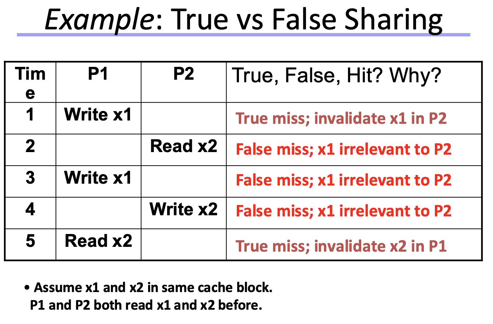

# Novel Issues in Shared Memory Multicore Systems

Rircordiamo che l'accesso in memoria è incrementalmente costoso, più è veloce più costa (registri cpu molto veloci ma molto costosi a differenza di un hard disk).
Bisogna progettare in modo da diminuire il più possibile questo costo.  

I sistemi con multicore approcciano il problema del memory wall alla stessa maniera dei chip single core, ossia con gerarchia di cache ma introducendo anche nuove challenge dovute al paradigma di **shared memory**.

## SMMP: Shared Memory Multi Processors

Abbiamo 3 principali problemi per le SMMP:
1. Coerenza:  
    Gestisce il mantenimento di un ordine globale nel quale una write a una locazione o variabile devono essere viste da tutti i processori $\rightarrow$ _Vedo i dati più recenti ?_

2. Sincronizzazione:  
    Come proteggere l'accesso a shared data $\rightarrow$ _come sincronizzo i processi_
3. Consistenza:  
    gestisce l'ordering delle operazioni verso multiple locazioni in accordo con tutti i processori $\rightarrow$ _quando vedo un written value_  

Analizziamo il primo problema

## Keeping Multiple Caches Coherent

Es: 3 processori, p1 e p2 leggono il valore `memory[1000]`, entrambi se lo portano in cache, il p0 successivamente scrive in `memory[1000]` un valore diverso, questo deve invalidare il contenuto della cache nel processore 1 e 2 per mantenere dati coerenti nel sistema. 

Il compito principale è quindi quello di **mantenere valori coerenti tra le cache dei processori**.  
L'idea è di ottenerlo monitorando le cache miss e write con un sistema che permetta la comunicazione tra processori mediante un interconnection network:
- se solo in lettura, tanti processori possono avere copie 
- se un processore scrive, **invalidare** tutte le altre copie

### MSI Protocol & Performance: 
Protocollo che ha tre stati: 
- M: Modified 
- S: Shared 
- I: Invalid

In questo protocollo ogni dato è trattato come shared, ogni volta che un processore scrive una cache-line $X$ deve notificare tutti gli altri processori $\rightarrow$ tale processore contiene il dato più aggioranto di $X$.  
Questo genera molto traffico nel bus di comunicazione, e sorge spontanea la domanda: **abbiamo bisogno di trattare tutti i dati come shared?**  $\rightarrow$ Per evitare un eccesso di traffico possiamo fare la seguente distinzione:
- Fino a quando un singolo processore legge e scrive una linea di cache $X$ non dobbiamo notificare gli altri core, i dati sono **privati** a quel processore.  

Queste idee sono alla base del protocollo **_MESI_** che aggiunge uno stato:
- *E* $\rightarrow$ *Exclusive*
Questo stato evita di generare ulteriore traffico per transazioni fatte da un processore su una linea di cache.  

Con l'aggiunta dello stato _Exclusive_ il protocollo MESI è in grado di distinguere tra data privata e shared in un programma parallelo, riducendo il traffico per mantenere la coerenza nel sistema di bus.  

### Performance di SMMP simmetrico
La performance della cache è una combinazione di:
- Traffico uniprocessor di cache miss 
- Traffico causato dalla comiunicazione 
- Coherence Miss 

### True Sharing Miss & False Sharing Miss

La _true sharing miss_ è necessaria per garantire la coerenza dei dati condivisi tra i core.  
La _false sharing miss_ è un overhead non necessario che si verifica a causa della condivisione di blocchi di cache, ma non di dati effettivamente usati in comune.

- **True Sharing Miss:**  
    Si verifica quando due processori accedono a una stessa porzione di dati condivisi e la cache deve gestire la coerenza dei dati (cache coherence)  
    - Succede quando un core modifica un dato che si trova in un bloco condiviso e un altro core prova a leggerlo o modificarlo.  È una vera miss in quanto il dato che sta provando a leggere il secondo core è stato modificato dal primo, si avrebbe anche se la dimensione della cache fosse di una singola `word`.  

- **False Sharing Miss:**  
    È una miss che si verifica a causa della struttura del blocco di cache.  
    - Succede quando due core accedono a dati distinti ma che **risiedono** nello stesso blocco di cache in quanto se uno dei due core modifica una parte del blocco di cache l'intero blocco viene invalidato per gli altri core anche se i dati non si sovrappongono.  
    La Miss quindi non è neccessaria per il funzionamento del programma ma avviene per via dell'organizzazione della cache.  
    Es: La variabile $X$ (usata dal core $A$) e la variabile $Y$ (usata dal core $B$) sono nello stesso blocco di cache.
    Il core $A$ scrive su $X$. Questo invalida il blocco nella cache del core $B$.
    Quando il core $B$ prova a leggere o scrivere $Y$, si verifica una miss, nonostante $Y$ non sia mai stato modificato.  
    Si tratta quindi di una cache evitabile in quanto non intacca la funzionalità del programma 

**nota:** Al tempo 1, P1 scrive su x1. Questo causa una true miss, per i seguenti motivi (Modifica al dato condiviso):

- Quando P1 scrive su x1, la cache coherence protocol (MESI) invalida il blocco contenente x1 nelle cache degli altri processori (in questo caso, P2).
- Questo è necessario perché il dato modificato potrebbe essere richiesto in seguito da P2, quindi occorre garantire che tutti i core abbiano una visione coerente.

Al tempo 2, quando P2 legge x2, si verifica una false sharing miss.
- Anche se x2 non è stato modificato direttamente, la modifica di x1 al tempo 1 ha invalidato il blocco.
- Questo causa una miss inutile per x2, che non sarebbe accaduta se x1 e x2 fossero stati in blocchi separati.

