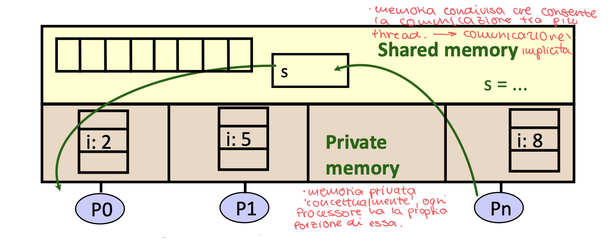
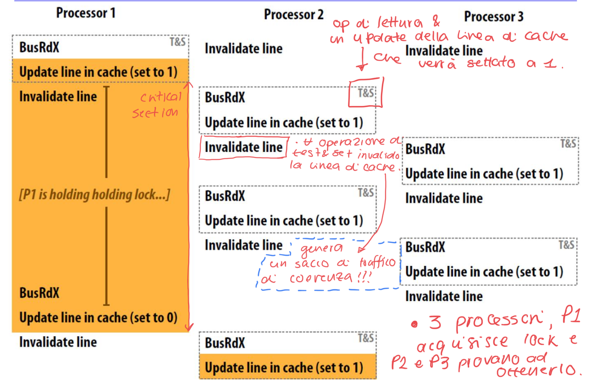
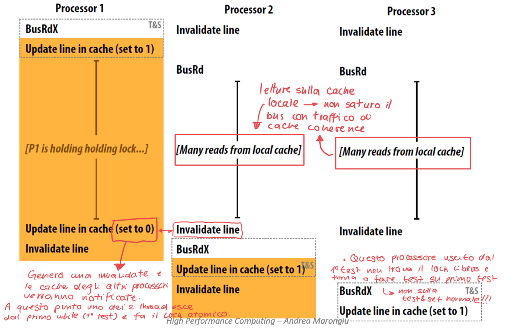

# Synchronization 


Un thread è l'astrazione di un programma dinamico in esecuzione, in un programma parallelo i thread possono essere creati in maniera dinamica (fork da un thread gia esistente)  

Un thread ha un insieme di variabili private (come lo stack: memoria automatica) e un insieme di variabili shared (oggetti visibili a tutti i thread)  

I Thread comunicano **implicitamente** quando leggono e scrivono su variabili condivise  
I Thread si coordinano **sincronizzando** le variabili condivise  





### Race condition


```c++
static ins s = 0;

#THREAD1
for (i = 0,i++,(n/2)-1){
    s = s + sqr(A[i])
}

#THREAD2
for (i=n/2;i++;n-1){
    s = s+ sqr(A[i])
}
```

Nello snippet di codice si presenta una **Race Condition** sulla variabile `s` del programma (che è visibile da entrambi i thread, mentre la variabile `i` è privata su ciascun thread).  

Una _**Race Condition**_ avviene quando:
-  Due thread mappati su due processori accedono alla stessa variabile e almeno uno dei due ci scrive dentro 
- Gli accessi sono concorrenti (non sincronizzati) e quindi potrebbero accadere simultaneamente  


### Operazioni Atomiche

Per comprendere un programma concorrente bisogna conoscere le operazioni indivisibili (atomiche) sottostanti

- **Atomic Operation:** Un operazione che esegue fino al completamento o non esegue proprio
    - È indivisibile: non può essere arrestata e non può essere modificata da nessuno mentre esegue (le normali istruzioni `load` e `store` sono atomiche, ma ad esempio `i++` non lo è: è una load + write + store).  
    - È il _BuildingBlock_ in quanto se non esistessero operazioni atomiche non si avrebbero modi per fare lavorare insieme i thread.  

### Definizioni: 

1. _**Sincronizzazione:**_ Uso di operazioni atomiche per assicurare la cooperazione tra Thread 
2. _**Mutual Exclusion:**_ Assicurare che un unico Thread faccia una task in un particolare istante: un Thread esclude gli altri mentre fa la propria task (MutEx)
3. _**Critical Section:**_ Pezzo di codice che **solo** un unico Thread può eseguire in un momento
    - Critical Section definisce la granularità di condivisione tra Thread
4. _**Lock:**_ Impedisce a qualcuno di fare qualcosa
    - Si mette un lock prima di entrare in Critical Sections e prima di accedere a dati condivisi 
    - Si fa unlock quando si esce una volta acceduto il dato shared
    - Si aspetta se si trova un lock 

**Concetto di Lock**:  
Vogliamo creare una struttura software lock con due metodi:
1. `Acquire()` voglio entrare in una zona del programma, se è libera allora entro e chiudo; se è occupato allora aspetto
2. `Release()` una volta finita la computazione rilascio il lock che fa tornare la zona ad essere libera e sveglio chi sta aspettando.  


ES (tentativo con solo software):

```c++
if(noMilk){
    if (!Note){
        // un thread potrebbe inserirsi tra !Note e leave(Note)
        // queste sono due operazioni separate, NON un è un op atomica
        leave(Note);
        buy(milk);
        remove(Note);
    }
}
```


L'esempio sopra ci mostra che implementare la struttura di Lock con solo il software è **impossibile** a causa dell'interleaving e della mancanza di vere operazioni atomiche.  
Il Contenxt Switch del sistema operativo potrebbe mettere in pausa un thread all'istruzione che precede la modifica del flag (`leave(Note)`). In questo caso un secondo thread potrebbe venire attivato e se arriva fino alla condizione del flag (`if(!Note)`)la vedrà come False, in quanto l'altro thread non ha fatto in tempo a modificarla $\rightarrow$ il thread2 entra nella zona critica e avremo due thread al suo interno, rischiamo di cambiare la semantica del programma in questo modo.  
Questo succede perchè l'istruzione di controllo e attivazione del lock è composta da due istruzioni separate, un thread potrebbe infilarsi in mezzo!  
Bisogna che il **controllo e acquisizione del lock sia atomico**!  


Per questo motivo serve l'aiuto del hardware, abbiamo bisogno di istruzioni speciali chiamate **Atomic Read-Modify-Write**

### Implementazione di un `lock`:

Il `lock` deve essere atomico, quindi indivisibile, per andare in contro a questa evenienza si fanno istruzioni hardware dedicate:

1. **`test&set`**: maggior parte delle architetture (RISC)  
    ```c++
    // address mi rappresenta l'indirizzo che ha il valore del lock
    test&set(&address){  
        result = M[address];
        M[address] = 1;
        return result;
    }
    ```

2. **`swap`**: architetture x86 (CISC)
    ```c++
    swap(&address, register){
        temp = M[address];
        M[address] = register;
        register = temp;
    }
    ```


3. **`compare&swap`**: architetture 68000
    ```c++
    compare&swap(&address, reg1, reg2){
        if(reg1==M[address]){
            M[address] = reg2;
            return success;
        }else{
            return failure;
        }
    }
    ```

Esempio semplice d'uso:

```c++
int value = 0; // variabile flag 
// Acquire -> lock 
Acquire() {
    while (test&set(&value)); //while busy 
}
// Release -> unlock 
Relese() {
    value = 0;
}
```

**Importante:** La sezione di codice tra `Acquire()` e `Release()` è chiamata **`Critical Section`**  

Come cambia l'esempio della race condition sfruttando il lock e la privatizzazione di una variabile locale:

```c++
static int s = 0;

#THREAD1
local_s1 = 0
for (i=0;i++;n/2-1){
    local_s1 = local_s1 + sqr(A[i])
}
lock();
s = s + local_s1; //Critical section
unlock();

#THREAD2
local_s2 = 0
for (i=n/2;i++;n-1){
    local_s2 = local_s2 + sqr(A[i])
}
lock();
s = s + local_s2; //Critical section
unlock();
```

### Criteri di performance per operazioni di sincronizzazione

1. **Latenza:** Tempo minimo per acquisire il lock se non c'è contenzione (quanto ci impiega un thread a fare il lock).  È rilevante in casi di contenzione bassa (pochi thread che competono)  
nota: le istruzioni atomiche t&s o CAS sono lente, impiegano decine di cicli.  

2. **Bandwidth:** Velocità di scambio sotto stress, ossia operazioni di sincronizzazione al secondo sotto alta contenzione tra i thread (se ci sono tanti thread, quanti riescono a passare al secondo)  

3. **Traffico:** Numero di eventi generati come invalidazione della cache, accessi alla memoria e scambi di messaggi. Più thread competono per il lock e più eventi verranno generati saturando il sistema di comunicazione.  Rilevante in particolar modo in sistemi con risorse condivise limitate.  

4. **Storage:** Memoria necessaria per rappresentare il lock e le sue strutture di supporto, più thread concorrono sul lock più memoria è necessaria. Particolarmente rilevante in sistemi embedded a memoria limitata

5. **Fairness:** Capacità del sistema di garantire che tutti i thread abbiano una possibilità _equa_ di accedere alla risorsa condivisa.  Rilevante in applicazioni che richiedono un comportamento _prevedibile_ come sistemi in tempo reale.  


## Coherence Traffic:  

Esiste un colpevole per il detoriamento delle performance quando si usano più thread, ossia il **coherence traffic**.  

Guardiamo in assembly la `test&set`:  

```asm
// atomically load mem[addr] into R0 and set mem[addr] to 1
ts R0, mem[addr] 

lock:
    ts R0, mem[addr] //load word into R0
    bnz R0, #0       //if 0, lock obtained

unlock:
    st mem[addr], #0 // store 0 to address 
```

Possiamo notare che la `test&set` **scrive sempre**! Questo uccide le performance, specialmente quando abbiamo spinlock !  

Mettiamo caso che P1 avesse chiuso il lock, P2 prova a entrare nella sezione critica, incontra il lock e chiama la `test&set`, nonostsante il lock sia chiuso (val==1), l'istruzione di P2 ci riscrive sopra un 1 $\rightarrow$ per i protocolli di cache coherence MESI/MSI, scrivere 1 sopra è comunque una write, e le write invalidano le altre cache $\rightarrow$ per invalidare le altre cache dobbiamo scambiare messaggi lungo il bus, se ho tanti thread saturo il canale di comunicazione.  

Il grafico a pagina 45 mostra come perdiamo performance usando la `test&set` all'aumentare di processori, fino a quando sono 3 il tempo del benchmark sale linearmente, se andiamo su 4+ processori esplode esponenzialmente.  




Bisogna trovare un modo per rendere più 'snella' questa operazione

### `Test&Test&Set` Lock : prima ottimizzazione

Prima faccio un test, e solo quando il primo test mi dice che ho le condizioni per fare la test&set la eseguo (evito di invalidare altre cache e di generare troppo traffico sul bus).    


```c++

void Lock(volatile int* lock){
    while(1){
        while(*lock != 0);
        if (test&set(*lock) == 0)
    }
}

void Unlock(volatile int* lock){
    *lock = 0;
}
```

Viene implementato con un `while(*lock != 0)`, che è una normale lettura, non invalido la cache degli altri.

Continuo quindi a leggere il valore del lock in cache, tale valore cambierà solamente quando qualcuno farà release, in quanto:
- Quando un thread fa release, il protocollo di cache coherence mi avviserà che il dato di `*lock` in cache è invalido, e a quel punto avrò il segnale che è cambiato il valore di quella variabile, e potrò fare la mia `test&set`, se riesco ad ottenre il lock, atomicamente lo blocco, se non riesco riparto dal controllare il valore di `*lock` in cache che costa poco.  



Caratteristiche della T&T&S:  
- Letenza: Peggiore, faccio due controlli invece di uno solo
- Traffico: Migliore (aspetto in silenzio senza intasare il bus)
- Fairness: Pessima, è una rissa disordinata appena il lock si libera.  


_nota:_ Mettiamo caso che ci siano 15 thread in un sistema, uno ha il lock e gli altri 14 fanno la T&T&S, mentre th1 ha il lock gli altri fanno letture sulle loro cache senza generare traffico di coerenza.  
Quando th1 libera il lock:
- invalida le cache di tutti gli altri lock 
- tutti gli altri th si buttano ad acquisire il lock e generano un ingorgo momentaneo sul bus

**T&T&S con backoff:**  
Per evitare l'ingorgo momentaneo introduciamo l' Exponential Backoff  
- se un th prova a prendere il lock e fallisce, non riprova subito ma dorme per un po'.  

Pro: Spalma il traffico nel tempo, evita che tutti i core colpiscano il bus nello stesso momento
Contro: Molto unfair, i nuovi arrivati hanno un enorme vantaggio rispetto ai processori che sono in attesa da più tempo!  

### Ticket Lock: Soluzione alla fairness

```c++
struct lock{
    volatile int next_ticket;
    volatile int now_serving;
}

void lock(lock *l){
    int my_ticket = atomicIncrement(l->next_ticket);
    while(my_ticket != l->now_serving); // wait 
}

void unlock(lock *l){
    l->now_serving++;
}
```

Questo lock implementa una fairness perfetta ma il problema del traffico rimane $\rightarrow$ tutti i processori in attesa fanno spin sulla stessa variabile now_serving, infatti quando viene incrementato now_serving vengono invalidate le cache di tutti i processori, tutti leggeranno e metteranno in cache il nuovo valore ma solo uno entrerà (generiamo traffico $O(P)$)


### Array-based Lock 
Questo lock vuole evitare l'ingorgo momentaneo sul bus quando il lock si libera.  
l'idea alla base è che ogni thread aspetti su una variabile diversa.  

Invece di un unico valore now_serving abbiamo un array status[] grande quanto il numero di processori.  

```c++
struct lock{
    volatile int status[P];
    volatile int head;
}

int my_element;

void lock(lock *l){
    my_element = atomicIncrement(l->head);
    while(l->status[my_element] == 1);
}

void unlock(lock *l){
    l->status[next(my_element)] = 0; 
}
```

Performance: 
- Traffico: $O(1)$, quando libero il lock invalido la cache di un solo processore (il successivo), gli altri non si accorgono di niente
- Difetto: Storage, serve un array di dimensione P, se abbiamo tanti lock e tanti processori rischiamo di sprecare molta RAM.  
- Fairness: perfetta ! i thread arrivano e si posizionano nell'array in ordine di arrivo (indice dell'array indica l'ordine di arrivo _NON_ l'id del thread).  


Attenzione al Convoy Effect $\rightarrow$ tallone d'achille dei lock FIFO.  

Immaginiamo 3 processi in fila nell'array lock 
`status = [0, 1, 1]` (p1 ha il lock, p2 e p3 aspettano).  
Proprio mentre p1 sta per finire, il OS decide di interrompere il time slice di p2 e lo addormenta.  
p1 fa unlock e invalida la cache di p2, ma p2 sta dormendo e non è in ascolto, non si accorge di niente, non può ottenere il lock.  
p3 sta aspettando che p2 gli dia il via libera, cosa che non accadrà nel breve termine, se avessimo altri processi in coda sarebbero tutti bloccati da p2 che dorme.  


