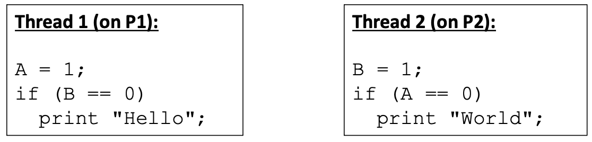
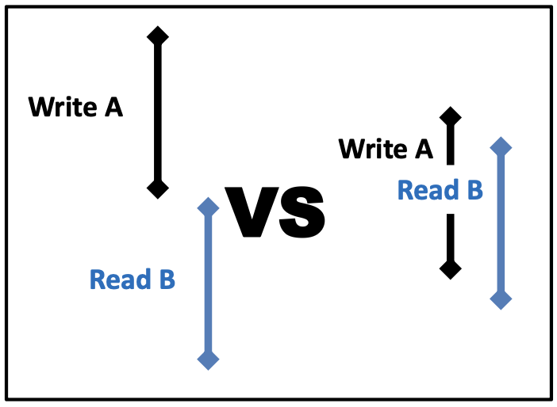
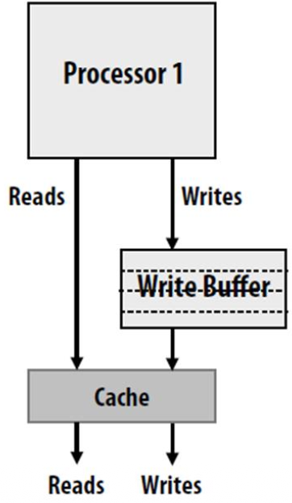
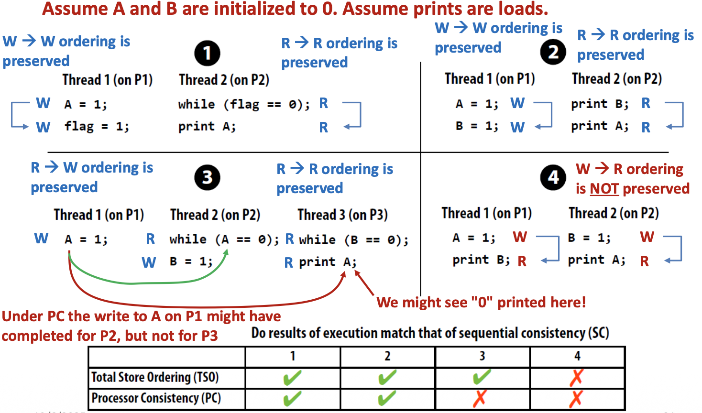

# Consistency:  

Riguarda l'ordine delle operazioni su locazioni di memoria diverse.  

La Cache Coherence da sola non basta, questa ci sice solamente che eventualmente tutti vedranno gli stessi dati, ma non ci dice niente sull'ordine di arrivo.   
(es: P1 scrive x=5 e y=1, allora P2 vede l'aggiornamento di x prima di quello di y?)  

## Memory Model:  
Un modello di memoria è un '**contratto**' tra: 
- Hardware/Compilatore: che vogliono fare ottimizzazioni (spostare istruzioni)
- Programmatore: che si aspetta che il codice venga eseguito riga per riga dall'alto verso il basso.  


### Instruction Reordering:

Per motivi di performance, è concesso al HW e compilatore di riordinare istruzioni indipendenti.  
In sistemi single core questa operazione non modifica la semantica del programma. (in quanto istruzioni indipendenti)  

Passando al sistema multicore cambiano le cose:      
Spesso il paradigma utilizzato in programmazione parallela è quello di `producer-consumer`.  
Ma le istruzioni sui singoli core sembrano statement indipendenti.  


es:  

th1:
```c++
A = 5;
flag = 1;
```

th2:  
```c++
while (flag == 0) {};
print(A);
```

È ovvio che l'intenzione del programma è quella di aspettare fino a quando th1 aggiorna A e il flag, nel frattempo th2 aspetta che avvenga questo aggiornamento in un ciclo while, ci aspettiamo 5 in output.  

**MA** se per una qualche ragione il sistema decide di fare reordering sulle istruziini di th1 invertendo flag=1 con A=5; allora il th2 esce dal while e fa la print di A, che sarà zero in quanto th1 non ha ancora eseguito A=5.  

<br>

### Memory Operation Ordering: 

Un programma qualsiasi è una sequenza di letturre(R) e scritture (W).   
Ci sono 4 combinazioni possibili di ordine tra due istruzioni consecutive (istruzione1 $\rightarrow$ istruzione2).  

1. W $\rightarrow$ R: Scrivo X, poi leggo Y
2. R $\rightarrow$ R: Leggo X, poi leggo Y
3. R $\rightarrow$ W: Leggo X, poi scrivo Y
4. W $\rightarrow$ W: Scrivo X, poi scrivo Y 


### Sequential Consistency: 
È il modello più severo e sicuro   
Dice che tutte e 4 queste sequenze devono esser rispettate! nessun reordering o out-of-order execution.  

Il problema è che è LENTA, obbligare il processore ad aspettare che le scritture finiscano prima di poter fare una lettura uccide le prestazioni.  


La Sequential Consistency permette l'interleaving di istruzioni su processori diversi **mantenendo** l'ordine locale.  

  

In questo esempio, provando tutti gli incastri possibili potremmo avere:
- caso1: A=1, B=1, non stampa nulla 
- caso2: P1 velocissimo, A=1, B==0 e quindi stampa 'Hello'
- caso3: P2 velocissimo, B=1, A==0 e quindi stampa 'World' 
- caso impossibile: è impossibile che entrambi i processori leggano 0 sulla variabile condizionale, quindi non avremo mai la stampa 'Hello World'.  

La sequential consistency rende il programma prevedibile e deterministico ma è **lenta**, obbligare il processore ad aspettare che le scritture siano terminate (svariati cicli) prima di poter leggere il prossimo dato uccide le performance.  

Se volessimo costruire una CPU veramente SC (sequentially consistent) dovremmo forzare due regole ferree che distruggono la velocità:

1. Ritardo: quando la CPU esegue un accesso alla memoria, NON può fare nient'altro di legato alla memoria finche quella scrittura non è finita al 100%.  
2. Finire compito in memoria: significa che non basta spedire il dato, bisogna aspettare che il messaggio di invalidazione  (in caso di W) raggiunga gli altri processori, aspettare che rispandono e ricevere la conferma (ack).   

Costringe la CPU a passare la maggior parte del tempo 'congelata' ad aspettare conferme dalla rete, invece di fare calcoli.  

<br>

### Relaxed Memory Consistency Models:  

Ricordiamo che la SC impone rigorosamente di rispettare i 4 ordini temporali, dove il primo termine è l'struzione precedente e il secondo termine è l'istruzione successiva.   

I modelli rilassati permettono di violare alcuni di questi ordini per andare più veloci e guadagnare in performance, la correttezza non è più automaticamente garantita.  

1. **TSO (Total Store Ordering): Relax W $\rightarrow$ R**  
    Permette a una lettura (R) di scavalcare una scrittura (W) precedente che è ancora in attesa.  
    Es: Scrivo A=1 (ci mette 100) cicli, nel frattempo leggo subito B [Usato da Intel/AMD]  

2. **PSO (Partial Store Ordering): Relax W $\rightarrow$ W**  
    Se ho in sequenza A=1 e B=1, l'hardware potrebbe permettere di scrivere prima B e poi A (magari perchè il blocco di B è in cache e quello di A no)  
    Usato da alcune architetture SPARC vecchie

3. **Weak Ordering: Relax tutte le regole**  
    Permette la totale libertà, le istruzioni possono essere riordinate quasi a piacere per massimizzare la velocità.  
    Il **patto**: La CPU va velocissima ma il programmatore ha bisogno di usare istruzioni speciali chiamate `fence` per fermare il riordino.  
    Usato da ARM, RISC-V  


Rilassare i requisiti della SC è fondamentale per nascondere la latenza della memoria e guadagnare in termini di performance, consente di avviare in parallelo operazioni di accesso alla memoria (costose!) che sono indipendenti tra loro.  

  

A sinistra le operazioni in SC, a destra quella rilassata; è facile notare che il tempo di accesso alla memoria è praticamente dimezzato, consente alla CPU di passare il suo tempo a fare calcoli e non ad aspettare dati dalla memoria.  


A livello hardware questa cosa è implementata con un **write-buffer** 

  

Quando un processore fa una W lo mette nel write buffer, è un operazione istantanea.  
La CPU considera la scrittura come avvenuta e passa all'istruzione successiva!  

_nota_: sotto il cofano, il write buffer parlerà con la cache e la memoria per salvare davvero il dato e gestire le invalidazioni.    

_effetto collaterale:_ mentre la scrittura A=5 è nel buffer (quinid ancora non visibile agli altri processori), la CPU esegue l'istruzione di lettura successiva! Agli occhi del sistema la lettura di B avviene prima della scrittura di A! (abbiamo effettuato reordering)    


### Processor Consistency (PC) 

La PC riguarda la visibilità delle scritture, corrisponde a un uleteriore rilassamento della TSO, infatti:

- TSO (total store ordering): Esiste un ordine **globale** delle scritture, se il processore 2 vede che `A` è cambiato prima di `B`, vuol dire che **TUTTI** i processori del sistema vedranno `A` cambiare prima di `B`.  

- PC (processor consistency): rilassa questa regola, si perde la garanzia di visione globale. Non c'è più la garanzia che tutti vedano le cose nello stesso tempo!  

Ricordiamo che il write buffer è un 'parcheggio locale' per i dati, solo il processore che ha scritto vede la scrittura subito, per gli altri non è ancora avvenuta la scrittura
- TSO vs PC:  
    TSO: Appena il dato esce dal write buffer, diventa visibile a **tutti** contemporaneamente  
    PC: Il dato esce dal write buffer, ma **può** diventare visibile a qualcuno prima e a qualcun altro dopo, alcuni processori posso avere il dato aggiornato mentre altri vedono ancora quello vecchio!  


 

nell'esempio 3 vediamo che P1 scrive A=1, allora P2 in quanto vicino a P1 (potrebbero condividere la stessa cache lv2) vede subito questo cambiamento ed esce dal ciclo per scrivere B=1. P2 è vicino a P3 e riceve l'aggiornamento, vede B==1, allora esce dal ciclo e prova a scrivere A, **MA** P3 non ha ancora visto il cambiamento di A, la modifica sta ancora navigando in rete, quinid legge e stampa il vecchio valore di A.  


<br>

### Release Consistency:  

Ricordiamo che il Weak ordering rilassa tutti i vincoli, il processore in queste architetture può rimescolare le istruzioni purchè il risultato locale del singolo thread abbia senso!  

In questi casi l'hardware non garantisce più l'ordine e servirebbero delle `fence` che impongono che tutte le operazioni di memoria scritte PRIMA del fence vengano completate prima di QUALSIASI operazione dopo il fence.  

La Release Consistency è un ottimizzazione, il fence è troppo brutale in quanto blocca tutto, vorremmo avere una granularità maggiore.  

Ricordiamo i **lock** che servivano per garantire la sincronizzazione.  

Possiamo usare i lock al posto delle fence generiche, leghiamo l'ordine della memoria alle operazioni:
- `acquire(lock)`
- `release(lock)`  

Note:
- L'istruzione `release(lock)` non è una semplice scrittura come `s=0` che potrebbe essere soggetta a reordering.  
    Quando l'hardware incontra una `release(lock)` si ferma, guarda se ci sono istruzioni pendenti nel write buffer e se ce ne sono le spinge tutte in memoria. Solamente nel momento in cui il buffer è vuoto e i dati sono visibili a tutti fa la realease!  


<br>

### Semantica di `acquire(lock)`:

- le istruzioni che stanno dentro la sezione critica (oltre l'acquire) non possono 'scappare' e venire eseguite prima di aver acquisito il lock
- **ottimizzazione:** tuttavia le operazioni che precedevano l'acquire possono cadere dentro la sezione critica, ossia possono essere riordinate. Se prima di acquisire il lock stavamo calcolando `i++`, allora la CPU potrebbe finire di calcolare i++ una volta acquisito il lock!  
- `acquire(lock)` è una barriera che blocca la salita delle operazioni nella sezione critica (oltre l'acquire), ma permette la discesa delle operazioni che precedono!  

<br>

### Semantica di `release(lock)`: 
- Le istruzioni che stanno dentro la sezione critica non possono scappare e venire eseguite **dopo** aver rilasciato il lock
- **ottimizzazione:** tuttavia le istruzioni che stanno dopo l'uscita possono risalire ed essere eseguite prima. Se dopo la release c'è una print allora la CPU potrebbe iniziare a preparare la stampa mentre sta ancora chiudendo il lock!  


```
Istruzione A (Non critica)
    |
    V  (Può scendere)
------------------ ACQUIRE ---------------
    |
    X  (NON PUÒ USCIRE)
    |
    |  SEZIONE CRITICA (Write X, Read Y)
    |
    X  (NON PUÒ USCIRE)
    |
------------------ RELEASE ---------------
    ^  (Può salire)
    |
Istruzione B (Non critica)
```

