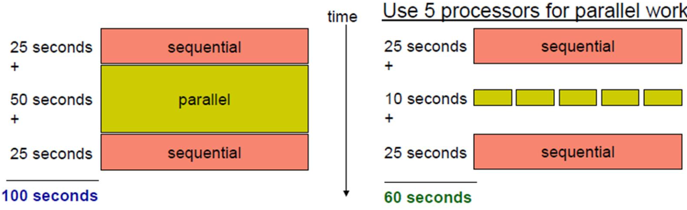

# Understanding Performance in Parallel Programming:  

Le performance di un programma parallelo dipendono da 3 fattori fondamentali:
1. **Coverage:** Mi dice quanto è grande la porzione del mio codice che posso parallelizzare.  
2. **Granularity:** Come suddivido il lavoro tra i vari thread? pezzi grossi (coarse granularity), pezzi piccoli (fine granularity) 
3. **Locality:** Mi dice quanto spesso la CPU deve andare a prendere i dati lontano (RAM o rete) invece di trovarli vicino in cache o memoria locale.  


#### Coverage:

Nella pratica non è tutto parallelizzabile, esistono istruzioni che dipendono da altre precedenti e che devono per forza essere eseguite in ordine sequenziale.  

```c++
// es. non parallelizzabile
a = b+c;
d = a+1; // devo aspettare 'a'
e = d+1; // devo aspettare 'd' 
```


Esistono istruzioni che non hanno dipendenze e che vengono chiamate _embarrassingly parallel_, come ad esempio riempire un array di 100 elementi con un valore fisso.  

La performance totale sarà un mix tra la velocità della parte sequenziale e quella parallela.  


### Legge di Amdahl

La legge di Amdahl dice che il miglioramento di performance che si può ottenere usando una modalità di esecuzione più veloce (i.e parallela) è **limitato** dalla frazione di tempo in cui quella modalità viene usata.  

Ciò significa che la velocità **massima** che un programma parallelo può raggiungere è vincolata e limitata dalla parte di codice che NON può essere parallelizzata.  



Nell'esempio confrontiamo le peformance dello stesso programma usando 1 processore e 5 processori, la zona rossa non è parallelizzabile.  
Usando 5 processori vorremmo vedere uno speedup 5 volte migliore, ma la realtà è che lo speedup = $\frac{100}{60} = 1.67$ 

<br>

**Formula di Amdahl** per calcolare lo speedup di un programma usando il paradigma parallelo:  


$$
\text{Speed-up}_{\text{Amdahl}} = \frac{1}{(1-p) + \frac{p}{n}}
$$

- **$p$**: percentuale di codice che può essere parallelizzata (es. 0.75 per 75%)
- **$1-p$**: parte sequenziale, ossia il resto del codice
- **$n$**: numero di core in uso

