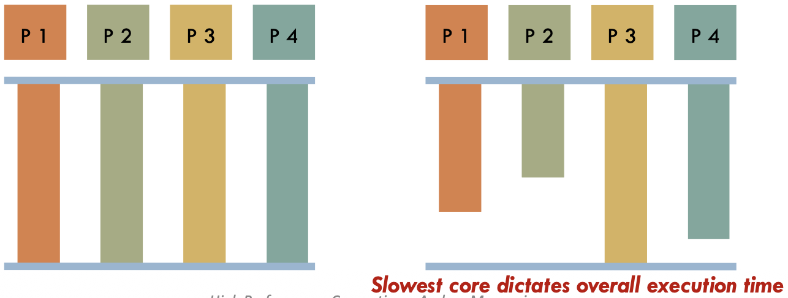
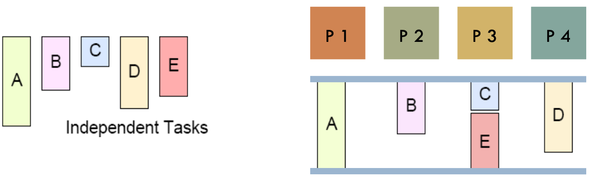
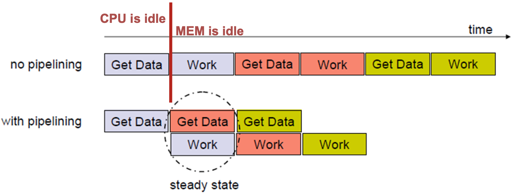
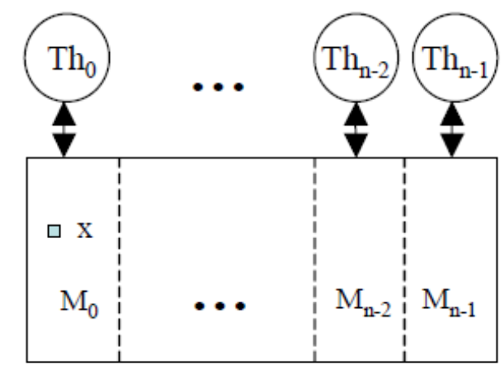
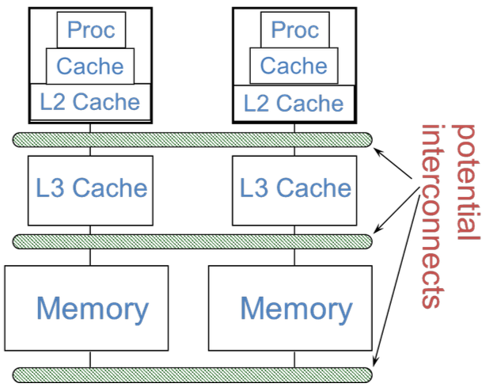
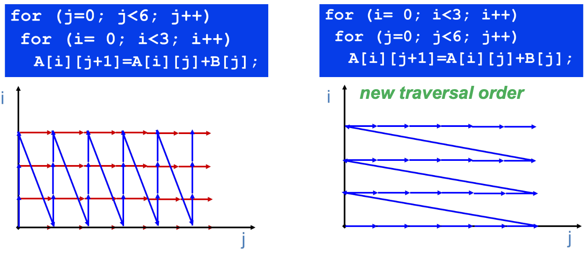
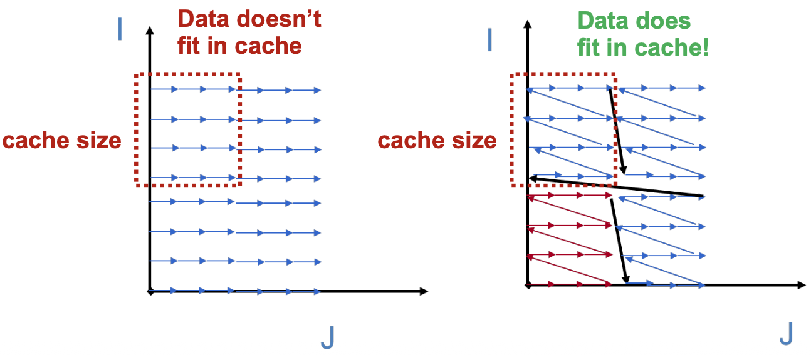
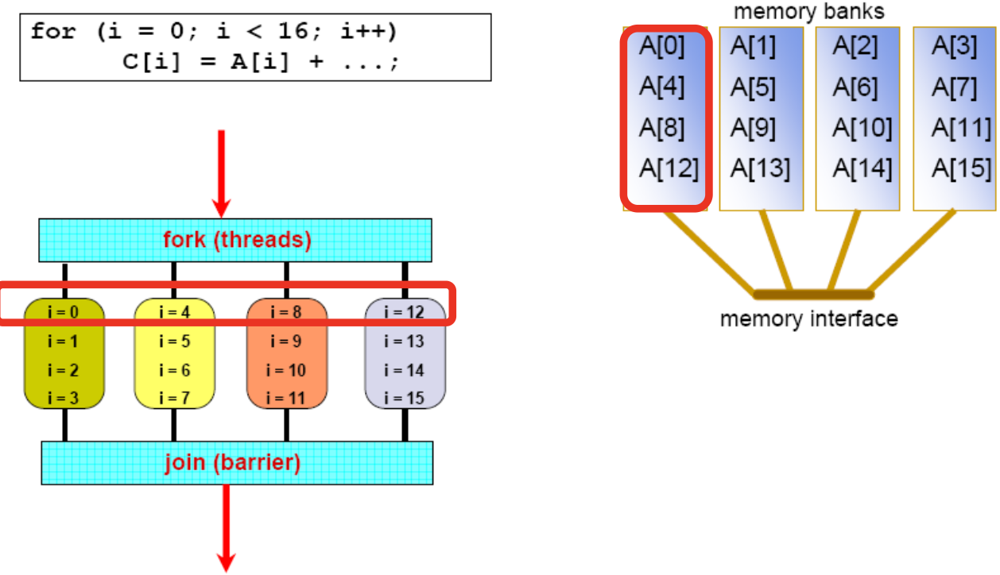

# Understanding Performance in Parallel Programming:  

Le performance di un programma parallelo dipendono da 3 fattori fondamentali:
1. **Coverage:** Mi dice quanto è grande la porzione del mio codice che posso parallelizzare.  
2. **Granularity:** Come suddivido il lavoro tra i vari thread? pezzi grossi (coarse granularity), pezzi piccoli (fine granularity) 
3. **Locality:** Mi dice quanto spesso la CPU deve andare a prendere i dati lontano (RAM o rete) invece di trovarli vicino in cache o memoria locale.  


## Coverage:

Nella pratica non è tutto parallelizzabile, esistono istruzioni che dipendono da altre precedenti e che devono per forza essere eseguite in ordine sequenziale.  

```c++
// es. non parallelizzabile
a = b+c;
d = a+1; // devo aspettare 'a'
e = d+1; // devo aspettare 'd' 
```


Esistono istruzioni che non hanno dipendenze e che vengono chiamate _embarrassingly parallel_, come ad esempio riempire un array di 100 elementi con un valore fisso.  

La performance totale sarà un mix tra la velocità della parte sequenziale e quella parallela.  


### Legge di Amdahl

La legge di Amdahl dice che il miglioramento di performance che si può ottenere usando una modalità di esecuzione più veloce (i.e parallela) è **limitato** dalla frazione di tempo in cui quella modalità viene usata.  

Ciò significa che la velocità **massima** che un programma parallelo può raggiungere è vincolata e limitata dalla parte di codice che NON può essere parallelizzata.  


Nell'esempio confrontiamo le peformance dello stesso programma usando 1 processore e 5 processori, la zona rossa non è parallelizzabile.  
Usando 5 processori vorremmo vedere uno speedup 5 volte migliore, ma la realtà è che lo speedup = $\frac{100}{60} = 1.67$ 

<br>

**Formula di Amdahl** per calcolare lo speedup di un programma usando il paradigma parallelo:  


$$
\text{Speed-up}_{\text{Amdahl}} = \frac{1}{(1-p) + \frac{p}{n}}
$$

- **$p$**: percentuale di codice che può essere parallelizzata (es. 0.75 per 75%)
- **$1-p$**: parte sequenziale, ossia il resto del codice
- **$n$**: numero di core in uso

La legge di Amdahl ci spiega i dimishing returns del passaggio al multicore (22%/year invece di 50%)! 
- anche se mettiamo 100 processori, se il software legacy ha parti sequenziali non potrà andare più veloce  


### Overhead of Parallelism 

La formula di Amdahl assume che aggiungre un processore sia gratis, ma nella realtà ogni volta che si parallelizza c'è da pagare un overhead  

Costi principali:
- **Start-up cost:** Creare un thread o processo non è un'operazione instantanea, l' OS deve allocare memoria, stack, ...  
    Se il lavoro che deve fare il thread è brevissimo potremmo metterci più tempo a creare il thread che a fare la computazione in se!  

- **Communication:** Spostare i dati (da RAM a cache o via rete se con MPI) costa tempo!  
- **Synchronization:** I lock, le barriere e le attese sono tempo perso in cui la CPU non fa lavoro utile.  


Bisogna tenere a mente i **tradeoff:**  
- abbiamo bisogno di unità di lavoro da dare ai thread grandi (coarse granularity) per ammortizzare i costi fissi 
- bisogna stare attenti! se le unità di lavoro sono troppo grandi rischiamo di non sfruttare al massimo il parallelismo (pochi processori lavorano, altri aspettano)  

<br>


## Granularity:

Definiamo come **granularità** il rapporto tra **lavoro utile** e **lavoro di contorno**.  


$$
\text{Granularita} = \frac{\text{lavoro utile}}{\text{lavoro contorno}}
$$

Di solito un programma parallelo alterna fasi di calcolo puro (in cui i processori lavorano) a fasi di comunicazione (i processori si scambiano i risultati / si sincronizzano).  

Dividiamo la granularità in due tipi:

1. **Fine grain parallelism:** divide il lavoro in tanti pezzettini piccoli.  
    _Vantaggio_: Load balancing perfetto! È facile distribuire uniformemente tanti pezzi di computazione   
    _Svantaggio_: Overhead altissimo! se ogni pezzo dei tanti richiede che un thread prenda un lock/mandi un messaggio in rete, passeremo molto tempo a gestire la logistica.  

2. **Coarse grain parallelism:** Divide il lavoro in pochi pezzi ma di grandi dimensioni.  
    _Vantaggio_: Overhead  bassissimo, pochi setup in quanto usiamo pochi core   
    _Svantaggio_: Load balancing difficile, se un pezzo è più grande di un altro o più pesante, un core finirà dopo e gli altri saranno limitati in quanto dovranno aspettare che quello lento finisca.  

_Regola d'oro:_ In HPC si predilige il coarse grain, finchè non si inizia a soffrire di sbilanciamento del carico.  


## Load Balancing:  

Come anticipato prima, i processori che finiscono prima rispetto ad altri si fermano e non fanno lavoro utile, comportano uno spreco di risorse, è un problema particolarmente urgente in presenza di barriere.  



In queste situazioni il tempo totale dell'esecuzione non è la media ma è dettato dal processore più lento (ossia quello con carico maggiore) che diventa un bottle neck per il sistema.  

Esistono due principali modi di gestire il load balancing:

1. **Static Load Balancing:**  Il programmatore decide a priori come suddividere il lavoro tra i core (es: array di 100 elementi e 4 core: assegno 1/4 di elementi a core).  
    **Vantaggi:** funziona bene se i processori sono omogenei (stesse performance e frequenza) e se il workload è regolare, ossia se il lavoro da fare è prevedibile e uguale per tutti (es. sommare numeri)  
    **Svantaggi:** fallisce quando siamo in sistemi con core eterogenei (big.LITTLE) e se il lavoro dipende dai dati (es. rendering grafico, su alcuni pixel facile, su altri pesantissimo).  

2. **Dynamic Load Balancing:** È la soluzione agli svantaggi del load balancing statico, non assegna subito la quantità di lavoro a ogni core ma crea una **work queue** centrale e distribuita. Ogni core prende una task dalla coda, lo esegue e quando finisce torna alla coda e chide il prossimo task da fare.  
    **Vantaggi:** massimizza l'uso della CPU e minimizza i tempi di attesa inutili  
    **Svantaggi:** gestire la coda condivisa porta con se overhead (lock e sincronizzazione)  

  


### Interconnection Metrics: 

Per capire la rete dobbiamo saper misurare 2 cose:

1. **Bandwidth (banda):** Mi dice quanto è largo il canale di comunicazione, ossia quanti gigabit al secondo passano. È un parametro di fondamentale importanza in contensti dove dobbiamp spostare grandi quantità di dati (es. matrici giganti)  

2. **Latency (latenza):** Mi dice quanto è lungo il canale di comunicazione, ossia quanto tempo passo da quando spedisco un bit a quando arriva. È cruciale per i messaggi di controllo (che sono piccoli e frequenti, es. lock); se la latenza è alta i messaggi sono lenti e di conseguenza la CPU passa troppo tempo ad aspettare.  


<br>

### Physical Interconnects: 

Corrisponde al modo che abbiamo per collegare i core, ne esistono 2 principali: 

1. **Shared Bus:**  Un cavo unico per tutti i core  
    Vantaggio: semplice    
    Svantaggio: non scala, abbiamo banda limitata    
2. **Network-on-Chip (NoC):** Canale di comunicazione in rete (mini-internet) dentro il processore, ogni core è collegato a un NoC che gli consente di comunicare con altri core.  
    Vantaggio: i pacchetti viaggiano da 'router' a 'router' ed è scalabile! se aggiungi altri core, aggiungi anche altri 'router'.  


### Nascondere la latenza:  
Ricordiamo che la latenza blocca il tempo utile di CPU, quindi dobbiamo minimizzarla il più possibile, abbiamo però un vincolo fisico (velocità della luce/elettroni) e quindi si usano 3 principali tecniche per **nascondere** la latenza nel sistema.  

1. Overlap: mentre il messaggio viaggia, faccio calcoli utili invece di aspettare (richiede DMA i.e. direct memory access) 
2. Prefetching: carico in anticipo dati che so mi serviranno in modo da averli pronti subito  
3. Multithreading: se un thread si blocca in attesa di dati, la CPU switcha istantaneamente al thead successivo che ha i dati pronti 
4. Pipelining di task 


### Communication cost model:

Usiamo la seguente formula per calcolare il tempo totale ($C$) che si perde per comunicare.  

$$
C = f \times (o + l + \frac{\frac{n}{m}}{B} + t - \text{overlap})
$$

- $f$ è la frequenza, ossia il numero di messaggi per unità di tempo
- $o$ è l'overhead, ossia il tempo che la CPU impiega per preparare il messaggio (chiamare funzione MPI, preparare il buffer); si paga sempre 
- $l$ è la latenza, dipende dalla fisica del sistma (luce, fibra ottica)
- $\frac{\frac{n}{m}}{B}$ è il bandwidth term  
    - $\frac{n}{m}$ rappresenta la quantità di dati totali (total data sent)
    - $B$ è la bandwidth della rete (es. 10Gb/s)  
- $t$ è il contention, ossia la congestione/traffico sulla rete, è un costo aggiuntivo variabile  
- $\text{overlap}$ è il tempo recuperato! il tempo che recuperiamo nascondendo la latenza, se mentre il messaggio viaggia la CPU fa altro quel tempo è guadagnato, lo sottraggo al costo totale.  

In conclusione, per ottimizzare bisogna: 
- ridurre la $f$ (impacchettare più dati insieme),  ridurre $o$ (usare drivere veloci) o aumentare il termine di $\text{overlap}$  


**Tipi di comunicazione:**  
Distinguiamo due tipi di messaggi:
1. Control messages: sono quelli di comunicazione tra thread per sincronizzazione (es. rilascio di lock). Sono molto piccoli e per quello conta solamente latenza e l'overhead (la banda non conta!)  

2. Data messages: sono i dati veri e propri, tipicamente molto grandi (es. passo matrice da 1GB). In questo caso conta _molto_ la banda! dobbiamo avere un canale abbastanza grosso per fare passare i dati.  


---


### Pipelining: aumentare l'overlap

Per aumentare l'overlap $o$ sfruttiamo il concetto di pipelining.  

  

Nell'esempio in alto vediamo che la CPU è idle quando fa 'get data' in quanto è in attesa di ricevere i dati dalla memoria/rete, similmemente quando la CPU lavora 'work' notiamo che la rete è ferma $\rightarrow$ ci sono buchi (idle time) che rendono il sistema inefficiente.  

Il pipelining risolve questo problema, nell'esempio sotto (pipelining applicato) notiamo che gli 'idle time' sono fortemente diminuiti, CPU e memoria lavorano insieme, le sovrapponiamo una sull'altra.   
Mentre la CPU sta elaborando il blocco1, il controller di memoria/DMA sta già scaricando il blocco2.  
Definiamo come **stady state** lo stato privo di buchi idle, ossia quando memoria e CPU lavorano al 100% contemporaneamente


Es: Importanza della latenza  
Abbiamo lo 0.2% di accessi che saranno remoti, e che richiedono 100 cicli su un processore di base CPI = 0.5. Qual'è l'impatto sulla comunicazione?  

$$
\text{CPI} = \text{CPI}_{\text{base}} + \text{CPI}_{\text{stall}} = 0.5 + 0.002*100 = 0.5 + 0.2 = 0.7
$$

Impatto (slowdown) = $\frac{0.2}{0.5} \times 100 = 40$% !

<br>


### Memory Access Latency 

Ricordiamo i due principali tipi di implementazione fisica della memoria (UMA vs NUMA):

- **UMA**: uniform memory access, la memoria è al centro e i processori sono intorno ad essa, tutti i processori ci mettono la stessa quantità di tempo ad andare in memoria.  

- **NUMA**: Non-uniform memory access, il tempo di accesso in memoria dipende da dove si trova il processore; la memoria è fisicamente partizionata e attaccata ai singoli processori (rimanimao comunque in memoria condivisa!). Se P1 legge la sua memoria locale è velocissimo (10ns), se deve leggere la memoria attaccata a P2 diventa lento (100ns) in quanto deve attraversare il bus di rete.  
    In un sistema NUMA non bata dividere il lavoro, sarà necessario assicurare che i procesori lavorino il più possibile sui dati che si trovano nella propria memoria per evitare slowdown e comunicazioni sulla rete.  


---


### Distributed Shared Memory: PGAS
È un modello ibrido, ogni processore ha il proprio pezzo di RAM ma tutti i processori condividono lo stesso spazio di indirizzamento.  

  

Dobbiamo programmare in modo che il $Th_0$ lavori quasi esclusivamente sui dati contenuti nel blocco di memoria $M_0$ che è fisicamente ai suoi piedi.  
Non basta dire quale calcolo fare ai processori, dobbiamo dire quale calcolo fare e farlo con i dati che ha in memoria.  


_Nota:_ PGAS è un modello di programmazione, NUMA è un architettura hardware.  
 
### Località: 

È importante fare lavorare i processori sulla propria partizione di memoria ma è ancora più importante usare in modo corretto la **Cache**!  
Vogliamo che i dati vivano il più possibile nei registri e nelle cache, rendendo velocissimo il programma e l'accesso ai dati.   
Non esistono primitive per mandare dati in cache quindi dobbiamo scrivere e strutturare il codice in modo che 'piaccia' all''hardware così che automaticamente lui tenga i dati in cache.  


 

L'immagine mostra una visione a due processori, è generalizzabile ad N processori.  
Notiamo che più scendiamo in basso, verso L3 o memory, la strada si 'allarga' e diventa lenta e condivisa. L'obiettivo della località è restare il più possibile in cima, ossia nei registri o in Cache/L2cache.  


### Ottimizzazioni alla gerarchia di memoria:  

Gli obiettivi da avere in mente quando si scrive codice sono i seguenti:  

1. **Reduce Memory Latency:** Cercare di non fare aspettare la CPU per i dati. se un dato serve, deve essere già in cache

2. **Maximize Memory Bandwidth:** Quando dobbiamo spostare dati conviene usare tutta la larghezza della banda! quindi cercare di spostare tanti dati insieme.  

3. **Manage Overhead:** I costi delle ottimizzazioi devono essere più bassi del guadagno, altrimenti perdiamo performance.  


Distinguiamo due termini fondamentali che spesso sono scambiati:  

- **Data Reuse:** È una proprietà dell'algoritmo!  
    Es: il mio algoritmo deve leggere il valore X 10 volte, si tratta di reuse in quanto il dato serve più volte.  

- **Data Locality:** È una realizzazione pratica!  
    Es: Quando l'algoritmo richiede X per la seconda volta, ho X in cache? Se si ho Locality! Ma se nel frattempo X è stato buttato dalla cache vorrà dire che ho reuse ma NON Locality.  

L'obiettivo è trasformare il Reuse teorico in Locality fisica.  

  
ES: 

```c++
for(int i=1; i<N; i++){
    for(int j=1; j < N; j++){
        A[j] = A[j+1] + A[j-1];
    }
}
```

- Temporal Reuse: Usiamo lo stesso dato in momenti diversi.      
    Nell'istante `i` calcolo `A[j]` usando `A[j+1]`, nell'istante successivo (`i+1`) quel valore sarà diventato il dato corrente $\rightarrow$ accedo alla stessa cella di memoria più volte nel corso del tempo.  

- Spatial Reuse: Uso dati vicini in memoria.     
    Quando la CPU legge `A[j]` non porta solo quei 4 byte dalla RAM, carica l'intera linea di cache, quindi caricheremo anche `A[j+1]`, `A[j+2]`, ...  
    Il codice usa subito i dati vicini, stiamo sfruttando la spatial reuse.  


### Reordering Transformations  

Se il codice è scritto 'male' (accede ai dati in ordine sparso), dovremo cambiare l'ordine di esecuzione per accede ai dati nell'ordine che attivi la data locality.  
Richiede un attenta analisi e profonda conoscenza della logica del programma e dei pattern di accesso ai dati.  
Particolarmente rilevante in cicli/loop e spesso effettuate dal compilatore.  

1. **`Loop Permutations`:**  
    Consiste nel riordinare l'ordine di cicli innestati per migliorare i pattern di accesso  
    Es: se abbiamo una matrice, che in C/C++ è salvata in ROW-Major Order (righe per righe), conviene processare prima le righe (al primo elemento della riga portiamo tutta la linea in cache e quindi gli altri elementi della riga) e poi le colonne! Se analizziamo prima le colonne avremo delle miss per ogni dato.   
    


2. **`Tiling(Blocking)`:**  
    Affronta il problema di matrici giganti che non entrano in cache.  
    Le frecce blu dell'immagine rappresentano l'ordine in cui il programma legge la matrice, mentre il quadrato rosso è la dimensione della nostra cache.     
    Se dobbiamo fare operazioni su tutta la matrice magari entrano le prime righe in cache, ma quando arriviamo alle ultime, in quanto non sta tutta in cache, le righe iniziali saranno state buttate via, se servono faremo cache miss e perderemo tempo.  
    La soluzione è ragionare a blocchi, cambiamo l'ordine dei cicli per lavorare a piastrelle (**tiles**).   
    <br>
    Il programma elabora una piccola tile (quadratino) della matrice, e si faranno le operazioni al suo interno.  Mentre lavoriamo dentro tale quadratino, riutilizzeremo i dati e siccome saranno in cache sarà velocissimo.   

      
    _Nota_: corrisponde anche al modo preferito e indicato per programmare in CUDA, nelle GPU il tiling è fondamentale per le performance.  


3. **`Memory Banking`:**    
    Ricordiamo che la memoria è divisa a banchi, se accediamo alla memoria in modo sbagliato o la organizziamo male avremo _Bank Conflicts_.  
    Nell'immagine vediamo 4 thread, i loro indici di accesso sono 0, 4, 8 ,12.  
    Teoricamente la memoria potrebbe servire i 4 thread contemporaneamente, ma vediamo che gli inidici che ci interessano sono tutti nello stesso banco, di conseguenza la banda passante massima teoria sarebbe 4X ma il bank confilict ci fa andare la memoria alla velocità di un singolo banco (1/4 della banda).  
    Tutt i thread puntano allo stesso banco di memori.  

      

    Dovremmo fare in modo che il primo banco abbia: 0,1,2,3 ; il secondo 4,5,6,7 ecc... 


