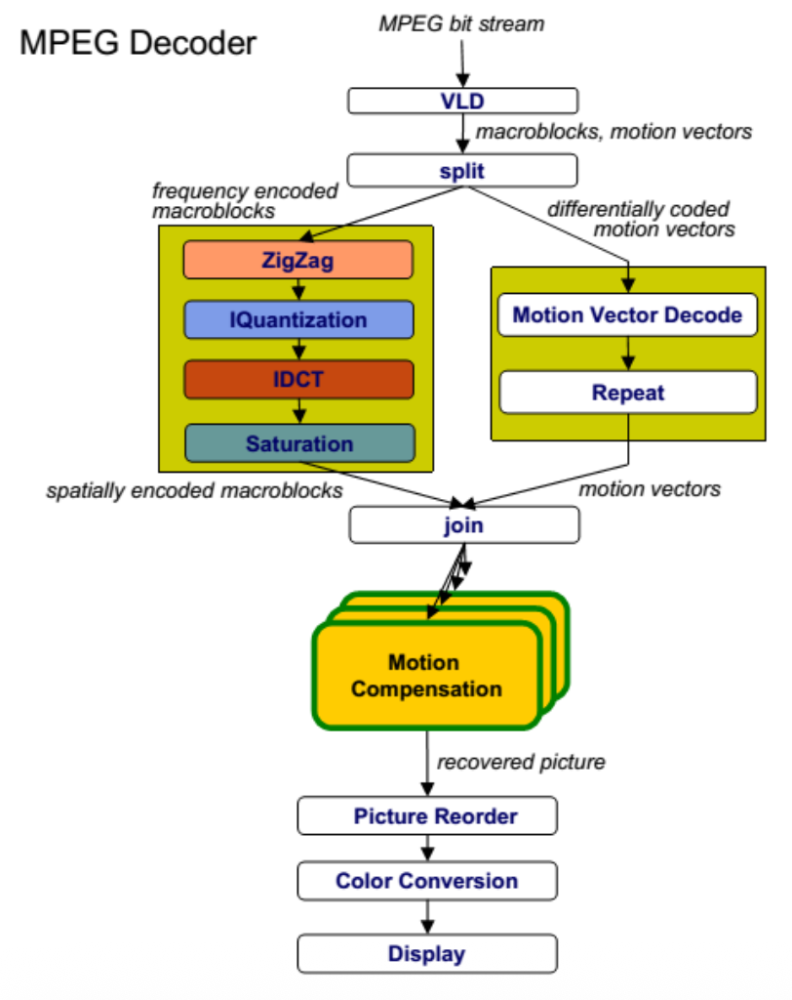
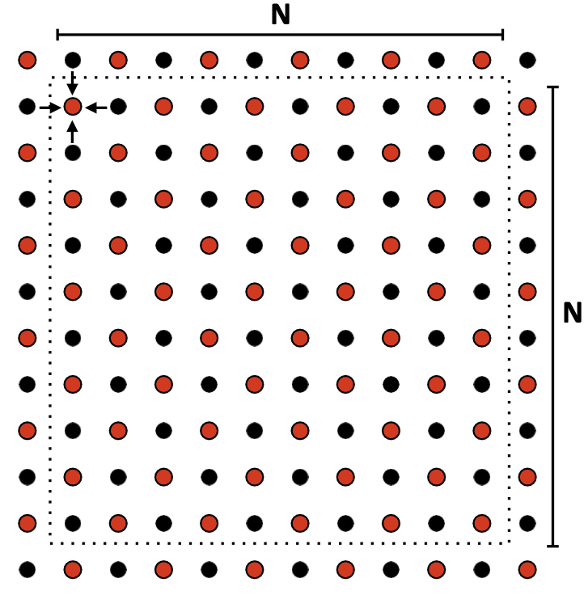
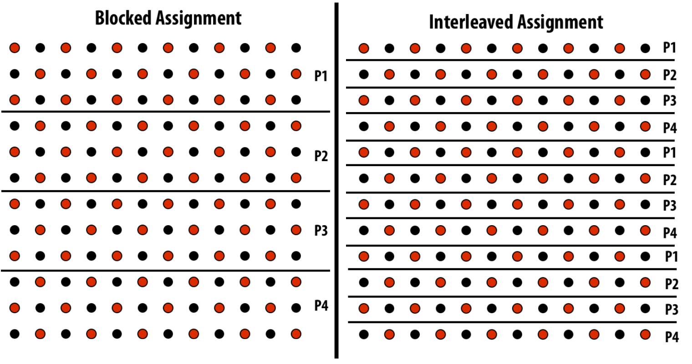

# Parallel Programming in Practice

Quando creiamo un programma parallelo dobbiamo pensare a come strutturarlo, il processo si divide in 3 fasi fondamentali:  

1. **Identificare**: si guarda il problema e si analizzano le parti che possono essere farre in parallelo senza rompere la logica.  
2. **Partizionare**: Si prende l'intero workload e lo si divide in pezzi più piccoli.    
3. **Gestire**: Una volta che abbiamo i pezzi di lavoro che gireranno insieme dobbiamo gestire come questi accedono ai dati (evitare race condition), come comunicano tra di loro e come si sincronizzano.  

L'obiettivo è ottenere *SpeedUp* 

$$
\text{Speedup} = \frac{\text{t con 1 processore}}{t con P processori}
$$


## Workflow:  

L'immagine mostra la mappa di workflow che dobbiamo seguire, con i 4 passaggi fondamentali

  


1. **Decomposition:**        
    Si parte dal probelma da risolvere 'intero' e lo si spezza in subproblems o task (mattoncini grigi)  
    es: devo dipingere una stanza $\rightarrow$ dipingi parete Nord, dipingi parete Sud, ...

<br>

2. **Assignemnt:**       
    Ho i task e devo decidere chi li fa! Creo i parallel threads o _workers_ e assegno i task ai thread.  
    es: th0 fa parete Nord, th1 fa parete Sud, ... 

<br>

3. **Orchestration:**  
    I thread non sono 'isole' e devono poter comunicare tra di loro, in questa fase definiamo la comunicazione e sincronizzazione.  
    es. th0 non inizare il soffitto finchè th3 non ha finito la parete Ovest  

<br>

4. **Mapping:**    
    Consiste nel passaggio che lega il software al hardware, il SO (o il programmatore) decide quale th fare girare su quale core fisico   


Questi passaggi possono essere fatti dal compilatore, dal hardware o dal programmatore. In HPC per massimizzare le performance è spesso il prgrammatore a dover fare tutto!  


<br> 

# 1. Decomposition

Ci concentriamo sul primo passo: rompere il problema in sottoproblemi.  
Seguiamo la seguente **regola**: creare abbastanza task da tenere occupati tutti i processori (legge di amdahl!)   
La sfida è **identificare le dipendenze**: 
- Non possiamo decomporre a caso! se il task B ha bisogno del risultato del task A non possono girare in parallelo 
- Il segreto sta nel cercare e trovare _mancanza_ di dipendenze!  

<center>

ES: MPEG decoder 

</center>





Il diagramma mostra un caso reale, un decoder di video. I dati (bit) entrano dall'alto e scendono attraverso vari stadi di elaborazione.   
Abbiamo vari blocchi come VLD, ZigZag/IQuantization/IDCT, Motion Compensation, ... e le frecce indicano dipendenza (non possiamo fare IDCT se non abbiamo prima finito IQuantization)   

Dobbiamo capire come sfruttare il parallelismo in questo caso reale!  

Abbiamo 3 strategie principali per la decomposizione:    

1. Task decomposition (Parallelismo funzionale): guardiamo le funzioni diverse  
    Nel diagramma i task diversi sono quelli in giallo, e di solito, come in questo caso, non sono tantissimi, inoltre se un task è molto più lento di un altro è difficile bilanciare bene il lavoro.   

2. Data decomposition (Parallelismo sui dati): il re dell'HPC  
    Invece di cercare funzioni diverse, prendo la stessa funzione e la applico a pezzi di dati diversi!  
    Nel blocco Motion Compensation notiamo che ci sono fogli sovrapposti, significa che se dobbiamo elaborare 100 macroblocchi possiamo lanciare 100 thread che fanno la **stessa** cosa ma su macroblocchi diversi.  
    È un meccanismo che scala molto bene 

3. Pipeline Decomposition: Paradigma Producer-Consumer
    L'idea è quella di fare pipelining delle task come in una fabbrica.  
    Th0 fa ZigZag sul frame1 e appena finisce passa il frame1 al th1 che fa IQuantization su tale frame, a questo punto il th0 passa subito a fare ZigZag al frame2. In questo modo ZigZag non deve processare e consumare l'intero input, lo manda per pezzi per fare lavorare anche le altre task.   
    Segue un paradigma **Producer-Consumer**, ogni stadio produce dati per quello dopo.  
    Es: Unix pipes `cat file | grep parola | wc` $\rightarrow$ 3 programmi che girano insieme passandosi i dati.  


La decomposizione è nel 99% dei casi responsabilità del programmatore, il compilatore ci prova ma fallisce spesso(in quanto non può fare assunzioni di nessun tipo e rimane sequenziale se davanti a codice con puntatori o dipendenze di dati).  


<br>

## Come decomporre: da dove iniziare   

Function calls: Se abbiamo funzioneA e funzioneB che non si parlano $\rightarrow$ farle girare su th diversi   
Loop iterations: Se abbiamo un ciclo, ogni iterazione è un potenziale task  
**Regola d'oro:** Conviene sempre iniziare spezzettando tanto all'inizio e poi raggruppare i pezzi se notiamo essere lento.   


### **Regole per Task Decomposition:**  
- Flessibilità: I task decomposti non devono essere legati all'architettura, devono essere parametrizzati (se scrivo codice che crea esattamente 4 th e lo lancio su un PC a 16 core allora sto sprecado 12 core!).  
    Il codice deve creare N task, dove N è un parametro che decido quando lancio il programma.  

- Efficienza: Il task decomposto deve fare abbastaza lavoro utile da ripagare il costo di creazione e devono essere il più indipendenti possibile, se ho troppi task che si devono sincronizzare per funzionare allora hai creato un collo di bottiglia per le performance.  

- Semplicità: Il codice deve essere leggibile e si preferisce un codice leggermente meno efficiente ma leggibile rispetto che a uno estremamente complesso e complicato, fare debug su sistemi paralleli è un incubo (es: race condition che si presenta 1 volta su 1000)


### **Regole per Data Decomposition**  

Il legame Task-dati spesso sono facce della stessa medaglia, a volte conviene partire da data decomposition, in particolare se il problema è:
- Data centric: il cuore del programma è manipolare una struttura dati enorme, un immagine, un database, ... 
- Composto da operazioni simili: devo fare la stessa operazione su tutti i pezzi (schiarire un pixel)  

Anche per la data decomposition valgono le regole di qualità: 
- Flessibilità: dimensione dei pezzi non deve essere fissa ma parametrica
- Efficienza: I pezzi dei dati devono essere abbastanza grossi da giustificare il lavoro e devono minimizzare lo scambio di dati tra processori (e massimizzare la località dei dati)
- Semplicità: gestire strutture dati in parallelo è difficile, se si possono usare array semplici allora usali!  

### **Pipeline Decomposition**

Il dato in questo caso non è un oggetto statico che sta fermo e che bisogna consumare per intero, in questo caso il dato è un **FLUSSO** che scorre attraverso vari stadi!  

Il parallelismo in questo caso non si concentra nel dividere i dati e nemmeno nel dividere le funzioni.  
Dividiamo l'intero workflow in **stadi** e assegniamo ogni stadio a un processore diverso!  

**ES:** Unix Pipe `|`

`cat foobar.c | grep bar | wc`

cat legge il file e mentre lo legge inizia a sparare testo, grep riceve testo e filtra le righe con 'bar' sparandole fuori, wc conta le righe che entrano!  
Questi 3 programmi girano contemporanemante, grep non aspetta che cat abbia finito tutto il file, processa le righe man mano che arrivano.  

Questo modo di parallelizzare è ottimo per stream continui, ma la velocità è limitata dallo stadio più lento (collo di bottiglia della catena).  

<br>

---

<br>

<center>

Esempio chiave: 2D grid solver  

</center>



Abbiamo una grglia di punti $(N+2 \times N+2)$ e vogliamo per ogni punto calcolare la media dei suoi 4 vicini.  

```c++
prev = A[i,j]
A[i,j] = 0.2f * (A[i,j]+A[i,j−1]+A[i−1,j]+A[i,j+1]+A[i+1,j])
diff += fabs(A[i,j]-prev);

if ((diff /(n*n)) < TOLERANCE)
    done = true;
```  

Continuiamo ad aggiornare i punti passando su tutta la grigilia fino a raggiungere la convergenza.   


---

**Dependency Analysis:**   
Per sapere se possiamo parallelizzare due operazioni usiamo la **Condizione di Bernstein**:   

- IN(R- read set): quali celle di memoria legge la task (input)
- OUT(W - write set): quali celle di memoria scrive (output)

Diremo che due task $T_1$ e $T_2$ sono paralleli se e solo se:
1. L'input di $T_1$ non è parte dell'output di $T_2$ (non leggo ciò che tu stai scrivendo)
2. L'input di $T_2$ non è parte dell'output di $T_1$ (tu non leggi quello che sto scrivendo)
3. L'output di $T_1$ e $T_2$ non si sovrappongono (non scrivono sulla stessa casella)  

Tutte queste 3 regole devono essere contemporaneamente vere, se solo una non lo è allora 
non si può parallelizare (senza usare sincronizzazione).   

---

Applichiamo Bernstein al nostro algoritmo, vogliamo vedere se possiamo calcolare in parallelo due punti vicini:  
- task1 calcola il punto `A[i,j]`   
    Input: 4 punti adiacenti (tra cui `A[i,j+1]`)
    Out: `A[i,j]`
- task2 calcola il punto `A[i,j+1]`  
    Input: 4 punti adiacenti (tra cui `A[i,j]`)
    Out: `A[i,j+1]`  

Conflitto: task1 scrive `A[i,j]` e task 2 legge `A[i,j]`! stiamo violando al seconda regola di Bernstein, si tratta di una dipendenza Read after Write (RAW).   
Il codice così com'è **non** è parallelizzabile, ogni punto dipende da quello prima.  


**Soluzione: Cambio di Algoritmo**  

Conoscendo l'obiettivo dell'algoritmo iniziale possiamo individuare algorimti che portino allo stesso risultato e che siano parallelizzabili.  
In questo specifico esempio possiamo usare l'algoritmo Red-Black Coloring (quello che si vede nell'immagine in alto).  

Alterniamo celle rosse e nere, e facendo così notiamo che la formula di aggiornamento di una cella dipende solo da celle di colore diverso, non abbiamo dipendenze tra i dati e le condizioni di Bernstein sono soddisfatte.  

Nuovo algoritmo parallelo:
1. Aggiorniamo tutte le celle rosse contemporaneamente
2. Sincornizzazione (Barriera): aspettiamo che tutti abbiano finito le celle rosse
3. Aggiorniamo tutte le celle nere contemporaneamente (usando i valori delle rosse che abbiamo precedentemente calcolato).  


Nota: Il trucco applicato in questo caso è lecito in quanto il nuovo algoritmo porta alla stessa soluzione finale dell'algoritmo sequenziale, questo ci dice che in HPC è neccessario avere una profonda conoscenza del problema che abbiamo davanti per poterlo ottimizzare.  


<br>

# 2. Assignment

Siamo al passo successivo, abbiamo scomposto il problema e ora dobbiamo assegnare questi task ai thread worker.   

### Obiettivi dell'assignment 

1. Workload balance (Bilanciamento): Vogliamo che i thread workers finiscano tutti insieme, se uno lavora troppo rispetto algi altri abbiamo uno spreco di risorse e tempo.  
2. Reduce Comunication (Locality): Vogliamo dare a un thread compiti che usino dati vicini, per minimizzare lo spostamento di dati che è lento.  


Esistono due modi di fare assignment:
1. **Static**: Decido a priori come suddividere il lavoro
2. **Dynamic**: Decido mentre il programma gira

Tornando all'esempio, proviamo due possibili assignment.  



- Blocked:  
    Tagliamo la matrice a fette orizzontali e assegniamo 3 righe a processore  
    Pro: Ottima località spaziale, P1 accede alle righe 0,1,2 che sono contigue in memoria.  
    Pro2: Poca comunicazione, P1 deve scambiare dati solo con P2 (e P2 con P3, ...)  

- Interleaved:  
    Assegniamo le righe a giro (round robin), quindi riga0 a P0, riga1 a P1, ...  
    Pro: se il lavoro per riga fosse variabile (es: righe in basso più difficili) questo metodo spalmerebbe il carico meglio
    Contro: pessima località! comunicazione esplosiva in quanto ogni riga confina con una riga di un altro processore, ogni processore deve parlare con 2 processori per fare la sua task!  

Nell'esempio la scelta ottimale è senza dubbio blocked, in quanto ha un ottima località e minor comunicazione.     


### Static Assignment  

È quello che abbiamo visto nell'esempio sopra, il programmaotre scrive una formula diretta nel codice che suddivide il carico di lavoro.   
Ha un costo di overhead pari a zero in quanto non abbiamo bisogno di un 'manager' che distribuisca il carico, ogni thread sa già cosa fare appena viene istanziato.  

Usiamo l'assegnazione statica quando il lavoro è **prevedibile**, nell'esempio sopra abbiamo una matrice di 12 righe, quindi 12 task (che sono computazionalmente identici) e abbiamo 4 processori $\rightarrow$ $\frac{12}{4} = 3$ task a thread.  
Risulta perfettamente bilanciato e senza sprechi.  

_Nota_: Usiamo l'assignment statico anche quando i task sono diversi ma il carico totale è conosciuto! se sapessimo a priori che alcuni task sono lunghi e altri corti potremmo dare a th0 un task lungo e uno piccolo, mentre algi altri th diamo task medi. Se riusciamo a fare si che la somma del lavoro che devono fare i th sia la stessa, abbiamo vinto.  

**Conclusione:** L'assegnazione stastica è la migliore se conosciamo il carico di lavoro in anticipo.  


### Dynamic Assignemnt 

Modello da applicare nel caso il caico di lavoro sia imprevedibile! se assegniamo staticamente i job ai processori e una specifica parte dei job è molto più pesante degli altri (numeri primi grandi), allora il processore che riceve i job pesanti ci metterà molto più tempo sbilanciando il carico.  

Possiamo usare una **Work Queue**:

```cpp
const int N = 1024;
const int GRANULARITY = 10;

LOCK counter_lock;
bool* is_prime = new bool[N];
int counter = 0;

while(1)
{
    int i;
    lock(counter_lock);
    i = counter;
    counter += GRANULARITY
    unlock(counter_lock);
    if(i>=N)
    {
        break;
    }
    int end = min(i+GRANULARITY, N);
    for(int j = i; j<end;j++)
    {
        is_prime[j] == test_primality(x[j]);
    }
    
}
```

I thread si autobilanciano, se un thread finisce presto il suo numero allora torna al contantore/coda e prende un altro task. Se un thread ci mette tanto per un task allora prenderà meno task totali!  
Sono i thread che apena sono liberi fanno pull del lavoro dalla coda.   

**Task Granularity**: È fondamentale usare una unità di granularità sensata, se usassimo un singolo lavoro per thread e se la nostra funzione test_primality fosse veloce, allora avremmo un alta contenzione del lock, tantissimi thread si mettono in coda per prendere il lock, in questo modo muore il parallelismo e torniamo al sequenziale.  

Usare una granularità di 10 task permette di avere meno contenzione del lock e maggiori performance, varia di caso in caso, bisogna sapere analizzare e individuare il funzionamento del problema.  

**Scegliere la granularità:**  
- Task piccoli: hanno il vantaggio di avere un buon load balancing di natura, se rimane un po' di lavoro è un pezzetto piccolo, gli altri thread non aspettano a lungo (occhio all'overhead!)  
- Task grandi: hanno poco overhead, gestiscono meno burocrazia (occhi al load balancing!)

**Smart Task Scheduling:**  
- approccio naive: creare una work queue FIFO, ma se ci sono task significativamente più grandi di altri e mettiamo tutto in fila allora il processore che prende il task grande ci metterà molto più tempo dei processori che prendono task piccoli, rallentando il sistema.  

Usiamo una tecnica di scheduling molto famosa: **Longest Processing Time** 
- si mette il task grande all'inizio 
- il processore che lo prende inizia a lavorarci, rimangono tanti task piccoli nella coda
- mentre il processore lavora al task lungo gli altri consumano i task piccoli riempendo i buchi temporali

Per applicare questa tecnica bisogna conoscere il workload, se non sai qual'è il task lungo (o se ce ne sono proprio) non puoi ordinare la coda.  


La soluzione migliore prevede l'utilizzo di code di task **distribuite** per evitare rallentamenti dovuti a lock (una sola coda centrale = tutti litigano per lo stesso lock).  

- Ogni thread ha la sua coda privata 
- Quando un thread genera nuovo lavoro o ne cerca, guarda nella sua coda, senza dover chiedere permesso a nessuno $\rightarrow$ velocissimo  
- Se la coda è vuota $\rightarrow$ **Work Stealing**  
    - se t1 finisce il lavoro sulla sua coda NON va a dormire 
    - guarda la coda degli altri thread, se threadN ha ancora work nella sua coda allora th1 prende un task dal fondo della coda di threadN.  
    - il bilanciamento avviene quando serve e la contesa è rara.  


# 3. Orchestrazione 

Corrisponde alla fase in cui coordiniamo i thread, in particolare:
- structuing communication: quale thread parla con quale thread 
- synchronization: quando serve 
- data structures: come organizziamo la memoria

**L'obiettivo** è ridurre i costi di comunicazione e preservare la località dei dati.  
Es: esempio nelle slide di blocked vs interleaved execution, dove la prima ha un maggior vantaggio di località e riduce lo scambio di dati.  

Esistono due filosofie per implementare questa fase e si distinguono dall'architettura:

1. **SPMD / single program multiple data**:     
    - uso i threads, shared memory, barriere e lock   
    Si scrive un singolo file di codice e quando viene lanciato si creano i vari thread, tutti e 4 i thread eseguono quel codice, da inizio a fine.   
    Ogni thread ha un `id` diverso, grazie a questo id possiamo fare lavorare i vari thread su porzioni diverse del programma.  


2. **MPI / Message passing**:  
    - ogni processore ha un proprio array locale e privato, devo esplicitare manualmente la comunicazione tra processori quando serve.    
    Situazione di quando lavoriamo su un cluster, non c'è memoria condivisa, ogni nodo ha la sua RAM, dovremo usare MPI  
    Es: nodo1 (ha la sua CPU, cache, RAM)  non può leggere la memoria del nodo2, l'unico modo è che la CPU del nodo2 impacchetti i dati e li spedisca su cavo (ethernet/infiband)  
    Si comunica con: 
        - `send(X, ... to thread2)`: prende dato x e lo spedisce al thread2 via rete 
        - `recv(Y, ....)`: aspetta il pacchetto, e quando lo riceve lo mette nella sua varibile locale Y


_Extra su MPI:_    


**Ghost/Halo Rows**:  

Siamo in questa situazione: thread2 (su nodo2) deve calcolare i valori della sua prima riga (esempio della matrice usato prima), per farlo la formula richiede l'ultima riga del thread1 (sul nodo1), e la stessa cosa la deve fare per prima riga del thread3 (sul nodo3).  
Allora il thread2 deve allocare spazio extra nel suo array locale, oltre allo spazio per le sue righe deve allocare spazio per 2 righe extra, ossia l'ultima del thread1 e la prima del thread3.  

**Riduzione globale - Master Thread**:  
A differenza del modello SPMD qui ogni `diff` che calcoliamo è globale al nodo ma locale se vista dal sistema intero.  
Noi vogliamo mettere insieme tutte queste diff, per farlo dobbiamo spedire i dati in rete a un nodo unico che farà la somma aggiungendo le varie diff dei diversi nodi.  
Questo nodo prende il nome di master thread, e tutti i thread che hanno `id` != 0 dovranno spedire i propri dati a questo nodo, che riceve tutti i remote_diff e fa il controllo per la terminazione dell'algoritmo.  

Nel modello SPMD usavamo i lock, qui dobbiamo spedire i dati esplicitamente.  

**Synchronous send/recv**:  
`send` e `recv` sono di default sincrone e bloccanti: 
- il sender chiama `send()`
    - il sistema copia i dati nel buffer di rete e invia il messaggio 
    - il sender si **blocca** fino a quando non riceve l'`ack` dal receiver che conferma la ricezione 
- il receiver chiama `recv()` 
    - si blocca fino a quando non riceve qualcosa
    - copia i dati nel buffer e manda un `ack` al mittente

- Pericolo di deadlock: se th1 fa `recv` e th2 fa `recv` a sua volta, i thread si bloccano a vicenda aspettando per sempre! Bisogna stare molto attenti all'ordine, uno deve fare send e l'altro receive!   

**Asynchronous send/recv**:  
Le chiamate sincrone bloccano gli altri nodi, questo potrebbe diminuire il fattore di `overlap` e ricordiamo dalla formula di minimizzazione del costo di comunicazione, che il fattore di overlap è una variabile da massimizzare!  

- `Isend()`: versione asincrona della send 
    - viene invocata e il sistema operativo (grazie a DMA, senza non si può fare) spedisce il buffer con i dati 
    - la funzione ritorna immediatamente, non aspetta un ack 
    - **warning:** non puoi toccare il buffer subito dopo! il sistema lo sta ancora leggendo per spedirlo, se lo modifichi spedisci dati corrotti!  

- `Irecv()`: versione asincrona della receive   
    - dice al sistema di tenere pronto il buffer , prima o poi arriveranno dei dati lì! 
    - ritorna immediatamente !
    - **warning:** non puoi accedere subito dopo al buffer, potrebbe essere ancora vuoto!  


<br>

# Mapping to Hardware

Il mapping consiste nell'assegnare ai core fisici della macchina / cluster i thread, ci sono 3 attori che possono prendere questa decisione:

1. **Sistema Operativo (OS):** (pthreads)     

    Il programmatore crea 1000 thread, l'OS vede che ha 4 core e decide lui momento per momento chi far girare e dove (con time sharing)  
    PRO: facile per il programmatore 
    CONTRO: L'OS non sa che magari il th1 e th2 parlano molto, magari li mette su due socket lontani rendendo la comunicazione lenta.  

2. **Compilatore:** (openMP)  
    Il compilatore (o libreria runtime) cercadi essere furbo e mappare i thread in modo ottimale 


3. **Hardware:** (CUDA)  
    Il programmatore lancia 10.000 thread su GPU, ed è l'hardware della GPU che decide quali mandaer in esecuzione sui core disponibili     


**Decisioni Importanti:**  
- Place related threads on same processor:  
    Se due thread collaborano molto (condividono moltii dati nella cache L1) allora mettili vicini per massimizzare la località.  

- Place unrelated threads on same processor:  
    Se un thread fa tanti calcoli (compute bound) e un altro fa tanti accessi alla memoria (memory bound) mettili insieme! mentre uno usa l'ALU l'altro usa il BUS di memoria, sfrutti meglio l'hardware (resource saturation)

Queste due decisioni sembrano contraddirsi, ma ovviamente sono da prendere in base al caso d'uso al quale ci troviamo davanti! Analizzare bene il problema è fondamentale.  


# Performance Analysis: 

Per ottimizzare un programma parallelo è fondamentale saperlo profilare, per conoscere le parti da migliorare.  

1. **Identify Hotspots:** individuare dove passa la maggior parte del tempo il programma (ricorda: ahmdal's law)

2. **Identify Bottlenecks:** individuare perchè il programma è lento  
    - colpa della CPU (compute bound) ? della RAM (memory bound) ? dei lock (synch bound) ?  


Per aiutarci possiamo stabilire delle **watermarks**, per scovare i bottle necks mofificando il codice in modo empirico:

1. **add math:** aggiungiamo operazioni inutili sui dati locali che non cambiano la semantica del programma  
    - se il tempo NON aumenta, significa che la CPU era scarica (stava aspettando la memoria), il collo di bottiglia è la memoria!  
    - se il tempo aumenta linearmente allora eri già al limite della CPU 

2. **remove math:** rimuovi i calcoli e lascia solamente le letture dei dati  
    - se il tempo rimane alto $\rightarrow$ il programma è memory bound! la CPU non è la colpevole

3. **change array access to A[0]:** invece di leggere A[i] (che causa cache miss) leggiamo sempre A[0] che è in cache.  
    - se il programma diventa velocissimo significa che il problema era la località dei dati (cache misses)

4. **remove locks:** togliamo tutti i locks e quindi la sincronizzazione (il risultato sarà casuale)  
    - se diventa molto più veloce allora il problema era la contention del lock (troppi thread che litingano)

