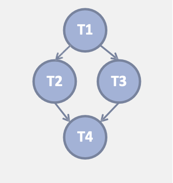

# OpenMP: The Tasking Model  


Viene introdotto il concetto di **task** per supportare parallelismo funzionale (i costrutti su for visti prima sono solo per data parallelism).  
Nel 2008 con la versione OpenMP3.0 viene introdotto il **Tasking Model**, che permette di parallelizzaer algoritmi complessi e imprevedibili, strutture dati dinamiche e ricorsione.  


## Task Parallelism: 

La direttiva `sections` vista precedentemente è _statica_, bisogna esplicitamente scrivere nel codice le sezioni (sezioneA, sezioneB, ...).  
Se siamo davanti a strutture dati complesse o davanti a un ciclo `while`, ossia costrutti dove non sappiamo a priori quante volte girerà il nostro algoritmo, NON possiamo scrivere infinite `#pragma omp section` !   

Ci serve un modo per generare lavoro parallelo **_dinamicamente_**, mentre il programma gira.   


Es: Ricorsione con `sections` (sarebbe un ERRORE)

```cpp
void traverse_tree(Tree* root)
{
    #pragma omp parallel sections 
    {
        #pragma omp section 
        traverse_tree(root->left);
        #pragma omp section 
        traverse_tree(root->right)
    }
}
``` 

- Ogni volta che incontri `#pragma omp parallel` il programma cerca di creare o svegliare un nuovo team di thread 
    - call1: crea 2 thread
    - call2: ognuno dei 2 thread chiama la funzione, e ognuno crea altri thread
    - callN: si continua cosi creando thread in maniera esponenziale
- L'OS viene inondato di richieste di creazioni di threa, l'overhead diventa molto più alto del lavoro utile, il programma va lentissimo o crasha!  

--- 

I **`task`** permettono di gestire problemi irregolari come:
- loop non contati (while)
- algoritmi ricorsivi 
- pattern producer/consumer

**Idea di base** $\rightarrow$ Non più 'crea un thread ora' ma **crea una task e mettilo in una coda**.  


### Task: 

Un `task` è composto da: 
- **Code to execute**: Le istruzioni da eseguire 
- **Data Environment**: Una 'foto' delle variabili che servono a quel codice nel momento in cui viene creato 
- **Internal Control Variables (ICV)**: Sono variabili invisibili che openMP mantiene in memoria per gestire lo stato dell'esecuzione, non modificabili direttamente dal programmatore. Servono ai thread che eseguono la task per capire il contesto 

L'esecuzione può essere **Differita**  
- il codice incontra `#pragma omp task` 
- il thread che la incontra NON esegue il codice subito MA impacchetta il codice e i dati creando una `task` 
- mette tale task in una **Work Queue**
- prosegue subito all'istruzione successiva

Il `task` viene eseguito da qualsiasi thread del team che in quel momento è libero! tale thread va alla work queue e pesca un task per eseguirlo.  


<br>

### `task` directive


Sintassi:  

```cpp
#pragma omp task [clausole]
{
    blocco_di_codice;
}
```


Nota: 
- È fondamentale che sia preceduta da `#pragma omp parallel` in quanto è questa direttiva che crea i thread del team.  
- Vogliamo che sia un thread a fare da producer di task, per assicurarci di avere un thread producer possiamo usare `#pragma omp single`; gli altri thread saltano alla fine della barriera implicita del `single`, ma non stanno fermi, appena vedono lavoro nella queue lo processano.  
    - una volta che il thread producer finisce di generare i task esce dalla barriera single, dobbiamo sincronizzare anche questo thread per fare in modo che non esca prematuramente mentre gli altri thread figli stanno eseguendo il lavoro (barriera `taskwait`), il thread padre invece di stare fermo da una mano a processare ciò che rimane nella workqueue.  

1. **Ecountering thread**: il thread che incontra questa riga NON esegue il blocco subito
2. **Packaging**: crea una task contenente
    - puntatore al codice 
    - data environment (istantanea delle variabili catturate)
    - ICV (contesto)
3. **Deferring**: mette la task nella coda e differisce ai thread pronti
4. **Composability**: I task possono essere _nested_, un task può creare altri task che possono crearne altri a loro volta, ogni task viene messo nella working queue; questo permette la ricorsione.  


```cpp
void traverse_list(List l )
{
    Element e;
    for(e= l->first; e; e = e->next)
    {
        #pragma omp task 
        process(e); // e -> firstprivate 
    }
}
```

! prestare attenzione allo scoping delle variabili !

<br>


### Task Data Scoping 

Per gestire lo scoping e visibilità delle variabili dobbiamo capire come `task` gestisce la memoria.  
Le clausole sono le solite: `shared, private, firstprivate, ...`   

**Clausole default(implicite)**:  

- global variables: sono `shared` 
- local variables: sono `firstprivate` (cattura valore della variabile in quell'istante, fa una copia privata dentro la task che userà quella).  

Es: visibilità delle variabili

```cpp
int a; //globale

void foo()
{
    int b, c;
    #pragma omp parallel shared(c)
    {
        int d;
        #pragma omp task
        {
            int e;
            a = shared;
            b = firstprivate;
            c = shared; //specificato in omp parallel
            d = firstprivate;
            e = private;
        }
    }
}
```

<br>

### Task Synchronization:  

Consideriamo il seguente codice:

```cpp
void traverse_list(...)
{
    // ciclo che crea task 
    // Fine funzione 
}
```

In questo caso il thread produttore che crea i task finisce l'intero ciclo in pochi millisecondi ed esce dalla funzione, ma i task sono ancora nella work queue!   
Se usciamo ora dalla funzione non eseguiamo i task e perdiamo la semantica del programma.  

Abbiamo 2 modi per sincronizzare:

1. **Barrier**: `#pragma omp barrier`  
    - aspetta **tutti** i task creati da tutti i thread del team, è uno stop globale
2. **Taskwait**: `#pragma omp taskwait`  
    - aspetta solamente i task _figli_ diretti creati dal thread corrente 
    - non aspetta i discendenti, se il task figlio crea a sua volta un task, `taskwait` non se ne occupa (shallow wait)  

Nota: se i task che crea il thread producer creano a loro volta altri task, dovremo mettere un taskwait anche li! altrimenti il thread consumer del thread padre crea il nuovo task e ritorna subito, insieme agli altri figli del primo producer che fanno la stessa cosa.  
A questo punto il thread padre vede che i suoi figli sono tornati ed esce dalla task wait quando magari abbiamo ancora lavoro nella workqueue.  
Per questo prima di far ritornare i thread figli del primo thread producer dobbiamo mettere la task wait, aspettare che le sottotask finiscano e solo allora il thread figlio ritorna abilitando il thread padre a superare la taskwait, la work queue sarà vuota.  

Il codice corretto diventa:  

```cpp
void traverse_list(List l)
{
    Element e;
    for(e = l->first; e ; e->next)
    {
        #pragma omp task
        process(e);
    }
    #pragma omp taskwait
}
```

### Pattern corretto con singolo creator  

```cpp
#pragma omp parallel // crea team di thread 
{
    #pragma omp single // seleziona un thread come producer 
    // tale thread entra in traverse list
    traverse_list(l);
}

...

void traverse_list(List l )
{   
    //entra il thread producer 
    Element e;
    for(e = l->first; e ; e->next)
    {
        #pragma omp task // crea le task per i thread figli 
        process(e);
    }
    #pragma omp taskwait
}
```

Esempio con più thread consumer:  

```cpp
#pragma omp parallel
{
    #pragma omp for 
    {
        for(int i=0; i<N; i++)
        {
            #pragma omp task
            process(i);
        }
    }
}
```

In questo modo invece di avere un singolo produttore (che potrebbe essere un bottleneck), abbiamo N produttori che riempiono la coda contemporaneamente; utile se la creazione dei task è lenta o se i task sono tantissimi.   


<br><br>


# Task Dependences 


Le Task Dependencies sono l'evoluzione del `taskwait`, è un modo più fine di sincronizzare le task (introdotte in OpenMP4.0).   
Con taskwait dovevamo aspettare tutti i figli; con le task dependencies possiamo fare aspettare solamente un task specifico (che sta preparando i dati che servono al prossimo task).  

Queste dipendenze trasformano il programma in un Grafo di Dipendenze (DAG), massimizzando il parallelismo.  

Sintassi:   

```cpp
#pragma omp task depend(type: vars)
```

Abbiamo 3 type di dipendenze:

1. **`in`**: Significa che la mia task sta per leggere la variabile.  
Questo task non può partire fino a quando tutti i task precedenti che avevano dichiarato `out/inout` su questa variabile non hanno finito.  

x2. **`out`**: Significa che sto per scrivere sulla variabile, il task non può partire fino a quando ci sono delle `in` sulla stessa variabile, altrimeti rischio di scrivere il valore mentre la vecchio task in stava leggendo, cambia la sintassi del programma!  


3. **`inout`**:  Significa che sto per leggere e scrivere sulla variabile, stessi vincoli di `out`; viene usata spesso per inizializzare la variabile che crea dipendenza tra task.  


ES:
- `depend(in: A)`: tale task diventa figlio (dipendente) dell'ultimo task che ha dichiarato out su A e che precede questo task!
- `depend(out: A)`: diventa dipendente dell'ultimo task che ha usato A (sia in / out), e diventa padre per chiunque vorrà usare A dopo di lui.  


Esempio grafo delle dipendenze:

```cpp
int x = 0;
#pragma omp parallel 
#pragma omp single 
{
    #pragma omp task depend(inout: x) // T1
    { ... } 
    #pragma omp task depend(in: x)    // T2
    { ... } 
    #pragma omp task depend(in: x)    // T3
    { ... }
    #pragma omp task depend(inout: x) // T4
    { ... }
}
```

Tale codice genera il seguente DAG:  

<center>

  


</center>

Note:  
- T1 fa `inout: x` per inizializzare la dipendenza su tale variabile! È fondamentale, altrimenti T2 partirebbe subito in quanto non troverebbe nessun dipendenza dichiarata.  
- T2 e T3 devono aspettare che T1 finisca, ma possono girare in parallelo! possiamo avere due `in: x` contemporanee!   
- T4 ha `inout: x` quindi deve aspettare che tutte le task a lui precendenti finiscano di fare il loro lavoro. Una volta che queste hanno finito lui può partire.  


<br>

### Data flow model   

Bisogna stare attenti e non confondere la **Dipendenza** con lo **Scoping**.  
- Dependencies: dicono QUANDO un task può partire 
- Data Sharing: dicono come vengono catturate le variabili da inserire dentro il task

Prendiamo il seguente esempio chiarificatore:

```cpp
int x = 0;
#pragma omp parallel 
#pragma omp single 
{
    #pragma omp task depend(inout: x) firstprivate(x)
    x++;
    #pragma omp task depend(in: x)
    std::cout<< x << std::endl;
}
```

Questo codice stamperà sempre `0`! Dobbiamo ricordarci di come viene gestita la memoria  
- creiamo il nostro team di thread e con la clausola single viene selezionato uno per essere il producer dei task
- il producer crea i task ma nel primo task notiamo il firstprivate, che cattura un istantanea della variabile x in quel momento e fa la copia **privata** dentro quella task.  
    Questo vuol dire che il thread che prende quella task, farà l'incremento su una variabile privata e visibile solo da lui!  
- una volta terminato partirà il secondo task grazie alla dipendenza, ma lui vedrà la variabile x come shared! e quindi stamperà `0` in quanto la modifica del task1 è avvenuto sulla sua copia e non sulla variabile shared.  

<br>

**Il dataflow model** consiste nel combinare correttamente le dipendenze tra task e le clausole di data-sharing.  

La filosofia corretta di questo modello richiede che sia dichiarato TUTTO ciò che la task modifica! non bisogna lasciare scoperti e nascosti effetti collaterali su altre variabili.  

Esempio di Bad practice vs Good practice:  

Bad:  

```cpp
int x = 0;
int y = 0;
#pragma omp parallel 
#pragma omp single 
{
    #pragma omp task depend(inout: x)
    {
        x++;
        y++; // non viene messa nelle var che creano dipendenza!!
    }
    #pragma omp task depend(in: x)
    std::cout<<x ;  

    #pragma omp taskwait // serve a evitare la data race
    std::cout<<y;
}
```

Good:  

```cpp
int x = 0;
int y = 0;
#pragma omp parallel 
#pragma omp single 
{
    // includiamo TUTTE le variabili che modifichiamo !
    #pragma omp task depend(inout: x,y) 
    {
        x++;
        y++;
    }
    #pragma omp task depend(in: x)
    std::cout<<x ;  

    #pragma omp task depend(in: y)
    std::cout<<y;
}
```

in questo esempio la stampa di x e di y può partire in parallelo. nell'esempio sopra non poteva succedere.  
Ps: l'ordine di stampa sarà non deterministico.  
