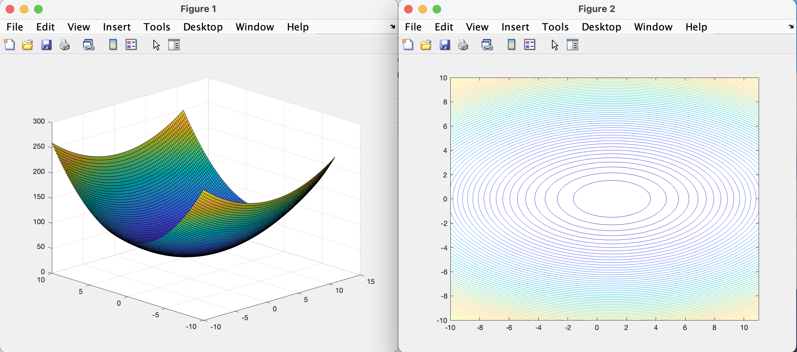
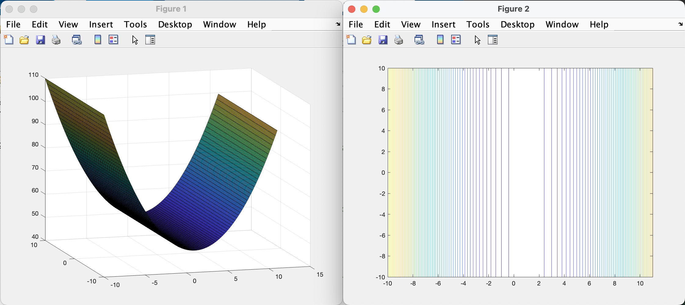
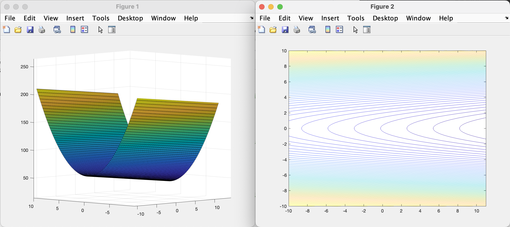
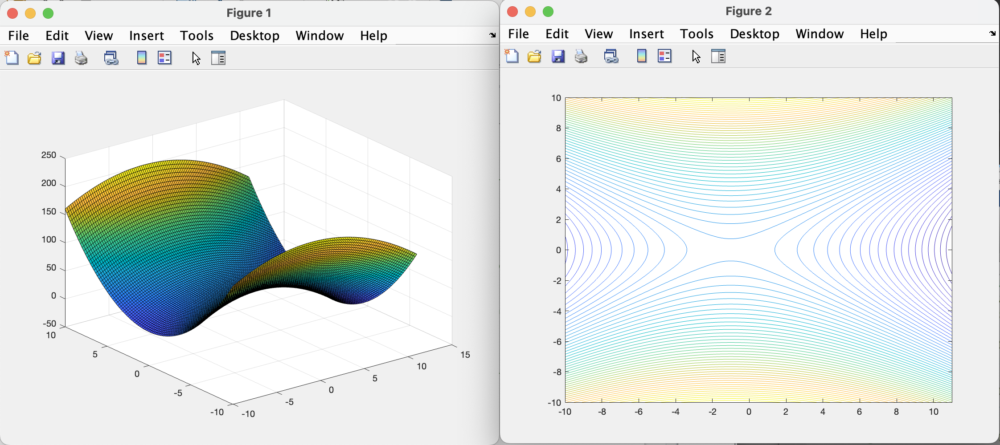
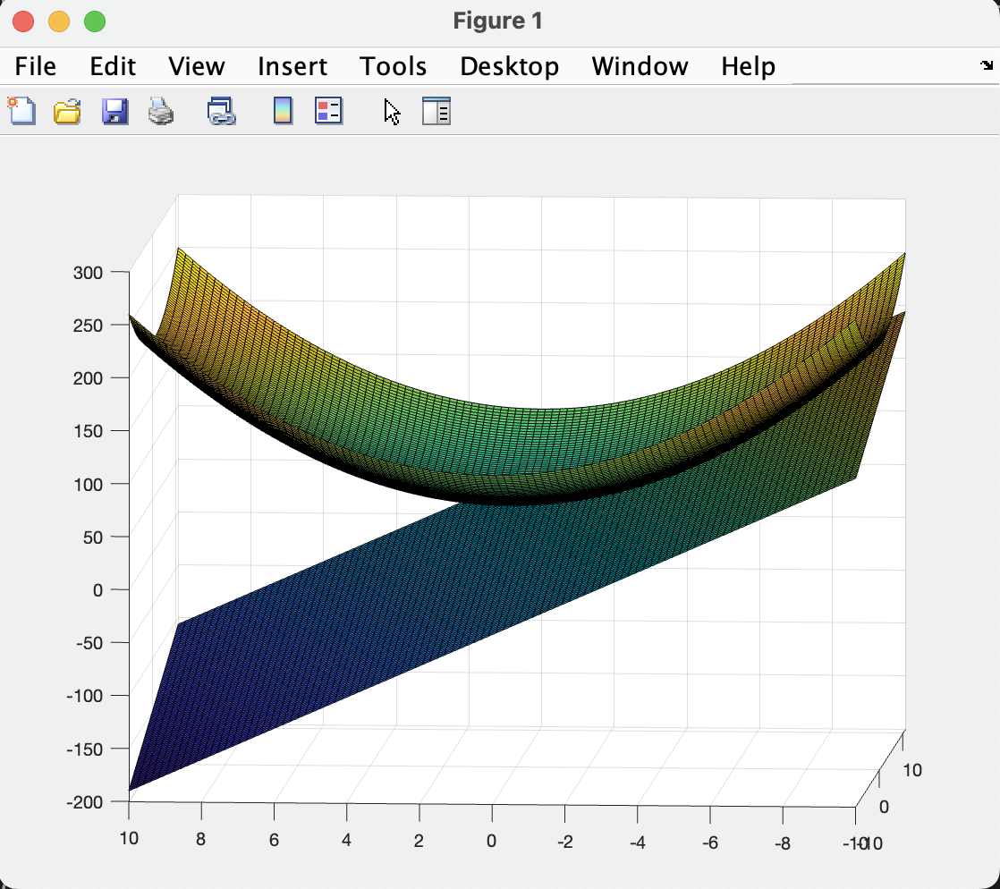

# Convessità di funzioni

Si consideri una funzione $f:\mathbb{R}^2 \rightarrow\mathbb{R}$  
Tale funzione è quadratica e ha equazione:  

$$
f(x) = 1/2 * x^T * A * x + b^T * x + c
$$

  

---

### Es1: Funzione strettamente convessa

$$
A = \begin{bmatrix}
1 & 0 \\
0 & 3
\end{bmatrix}, \quad
b = \begin{bmatrix}
-1 \\
0
\end{bmatrix}, \quad
c = 50
$$

$$
z = 0.5 * (x_1.^2 + 3 * x_2.^2) - x_1 + 50
$$

In questo primo esempio la matrice $A$ (Hessiana) è definita positiva in quanto ha gli autovalori $\gt 0$ e di conseguenza la funzione ha un unico punto di minimo (globale).   

Possiamo notare nel grafico che la funzione si incurva verso l'alto in tutte le direzioni, quindi tutte le traiettorie che partono da un punto più alto conducono verso un unico punto più basso al centro.  

Le curve di livello sono chiuse e concentriche attorno a un unico punto al centro. Questo suggerisce che la funzione ha un'unica direzione in cui decresce fino a raggiungere il minimo.  
L'ellisse più interna corrisponde al livello più basso della funzione, ossia il minimo globale.  

 

### Es2: Funzione convessa (non strettamente)

Con la perdita della stetta convessità si può perdere l'unicità della soluzione.  

$$
A = \begin{bmatrix}
1 & 0 \\
0 & 0
\end{bmatrix}, \quad
b = \begin{bmatrix}
-1 \\
0
\end{bmatrix}, \quad
c = 50
$$

La matrice $A$ è semidefinita positiva in quanto ha autovalori $\ge 0$, notiamo che in posizione $A_{22}$ abbiamo proprio un autovalore uguale a $0$

$$
z = 0.5*(x_1.^2) - x_1 + 50;
$$

In questo grafico possiamo notare che la funzione non è più strettamente convessa e ha infiniti punti di minimo in prossimità di $x1 = 1$ e $x2 = \inf$.  

Non esiste un unico punto di minimo, i punti di minimo sono in prossimità della $x1=1$ e dove $x2$ può assumere qualsiasi valore del dominio, questo è facilmente osservabile dal grafico delle curve di livello.  

 

### Es3: Funzione convessa non strettamente 2

La matrice $A$ in questo esempio ha autovalore $A_{11} = 0$, il resto dei parametri rimane uguale.  

$$
z = 0.5*( 3 * x_2.^2) - x_1 + 50;
$$

Anche questa funzione è assente di punto di minimo, tale funzione non è limitata dal basso $\rightarrow$ se $x1$ cresce la funzione decresce.  
Tale informazione è intuibile dalle curve di livello che assumono valori sempre più piccoli per $x1$ crescente.  

 

### Es4: Funzione con punto di sella 

In questo esempio si fissano gli autovalori a quantità con segno discorde.  

$$
A = \begin{bmatrix}
-1 & 0 \\
0 & 3
\end{bmatrix}, \quad
b = \begin{bmatrix}
-1 \\
0
\end{bmatrix}, \quad
c = 50
$$

$$
z = 0.5*(-x_1.^2 + 3*x_2.^2) - x_1 + 50
$$

Dal grafico della funzione si vede bene che ci sono direzioni lungo le quali si ha un punto di minimo e direzioni verso le quali lo stesso punto risulta un punto di massimo (lo si vede bene dalle curve di livello).  
Si hanno quindi punti stazionari dove il gradiente $\nabla f(x)=0$ ma che non sono ne punti di minimo ne di massimo globale.  

 

### Es5: Funzione convessa con piano tangente 

Ricordiamo la caratterizzazione delle funzioni convesse di classe $C^1$:  
$f$ è una funzione strettamente convessa sull'insieme $\Omega$ se e solo se $\forall z,y \in \Omega$ si ha:

$$f(z) \gt f(y) + \nabla(y)^T(z-y)$$

Cioè se la funzione valutata in $z$ assume valori maggiori dei valori assunti dal piango tangente alla $f$ in $y$ valutato nel punto $z$   

dove: $f(y) + \nabla(y)^T(z-y)$ = piano tangente.  

Quindi nell'espressione matlab devo mettere al posto di $z$ tutti i punti su cui voglio valutare il piano tangente;  

ricordiamo che $y$ rappresenta il punto in cui il piano risulta tangente.  

Nell'immagine il punto scelto per disegnare il piano tangente è stato [5 -5].  

Dall'immagine notiamo come il piano tangente sia sempre sotto la mia funzione convessa, rispettando la caratterizzazione delle funzioni convesse succitata.  