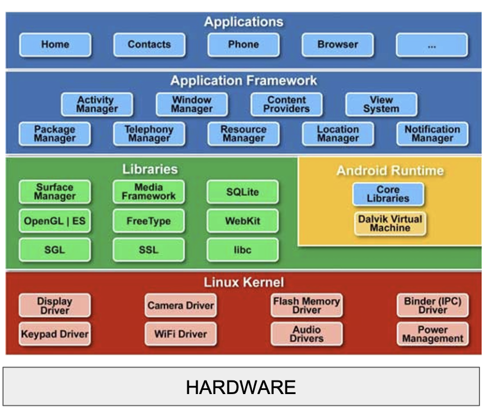

# Mangers, Risorse e Activities 

Android segue una architettura a **strati**, dove ogni livello offre  servizi a quello superiore nascondendo la complessità del livello inferiore.  

1. Hardware:  
    Metallo nudo, sono le componenti fisiche del nostro dispositivo, come processore, memoria, fotocamera ecc... 

2. Linux Kernel:  
    Primo strato di SW, cuore del OS, fa da tramite tra l'hardware e il resto del software, implementa _driver_ che permettono al SW di parlare con l'hardware (camera driver, wifi driver, ecc...)  

3. Libraries & Android Runtime:  
    Le librerie scritte in C++, si occupano di compiti pesanti in modo efficiente (OpenGL per grafica 3D, Webkit per pagine web, SQLite per database)  
    L'Android Runtime è l'ambiente in cui esegue il nostro codice Java/Kotlin.  

4. **Application Framework:**    
    Livello più importante per lo sviluppo mobile, contiene tanti metodi e attrezzi di alto livello che ci permettono di costruire le app astraendo i dettagli dei livelli inferiori, si interagisce con i servizi attraverso i **Manager**.  

5. Applications:  
    Lo strato di più alto livello, è ciò che vede l'utente finale, quindi le applicazioni complete.  

Le applicazioni android sono costruite utilizzando due linguaggi:
1. **XML**: Per definire l'interfaccia grafica (struttura, colori, testi)
2. **Java/Kotlin**: Per definire il comportamento e la logica (es: cosa succede quando clicco un pulsante, come vengono caricati i dati, ...)  

  

# Manager

Un **Manager** in Android è una classe dell'application framework che agisce come tramite tra la nostra applicazione $\rightarrow$ un servizio specifico del OS, fornisce una API per accedere a questi servizi.  
I manager hanno anche il compito di proteggere le risorse, la nostra app non può liberamente accedere a tutti i dati del nostro dispositivo, per accedere a un determinato servizio deve chiedere i permessi e ottenere un riferimento al manager di quel servizio (se il permesso viene garantito).  

 

## Manager Principali:  

### 1. Activity Manager  

È il supervisore del ciclo di vita delle applicazioni, i suoi compiti principali sono:

1. Gestire lo stack delle activity per garantire una navigazione coerenete e prevedibile per l'utente, ogni app messa in primo piano (la sua activity) viene messa in cima allo stack, questo manager gestisce questo stack. 

2. Governare il ciclo di vita: Un'app può essere in primo piano e attiva (`Resumed`), visibile ma non interattiva (`Paused`) oppure in background e non visibile (`Stopped`).  L'activity manager ordina a ogni activity di passare da uno stato all'altro invocando metodi specifici $\rightarrow$ fondamentale per gestire le risorse e memoria.  

3. Gestire le risorse: decide quante risorse allocare per le applicazioni, se in un momento lo stack è grande e le risorse iniziano a scarseggiare allora può decidere di chiudere processi per liberare risorse (tipicamente quelli in fondo allo stack).  

### 2. Package Manager: 

Il package manager conosce tutte le applicazioni installate nel sistema (protegge e interroga il file `packages.xml`), serve a interrogare il sistema per ottenere informazioni su tutti i pacchetti (app) installati.  
Conosce tutte le app e le loro 'intenzioni' (`intent`), sa quindi quali app sono registrate come 'browser web' o 'app per scattare foto'.  
Fondamentale nello sviluppo quando ci dobbiamo appoggiare a servizi di altre app.  

### 3. Window Manager: 

Il window manager è l'amministratore dello schermo, bisogna pensare allo schermo come una serie di fogli trasparenti sovrapposti.  
Gestisce i livelli di profondità: Ogni elemento visuale è una finesta su un 'foglio' separato, il windoww manager sa che ordine devono essere impilati questi fogli.  
Se sono in un app e mi arriva una notifica il window manager disegna il foglio della notifica sopra quello dell'app che sto utilizzando.  

