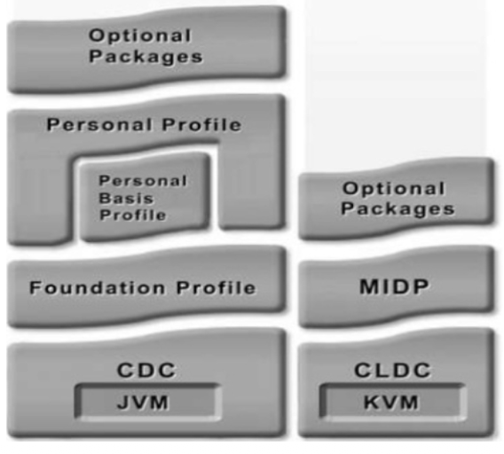

# Programmazione Mobile -  

### Mobile OS:

Sistema operativo progettato per dispositivi 'mobile', ha risorse limitate e presenta un HW diverso rispetto a Desktop/Server.  

**Android** è l'OS mobile più diffuso (di un grande margine), è open source, ha ampia documentazione ed è basato sul kernel di linux.  

## Java ME (micro edition) $\rightarrow$ Piattaforma  

Struttura stratificata, divisibile in:
1. Configuration Layer: determina uali funzionalità minime (regole di base) sono necessarie, può essere:
    - CLDC (connected limited device configuration): pensato per dispositivi molto limitati , tipicamente usa una cpu a 16 bit e dispone di 160KB di RAM; spesso alimentata da batteria e con connessione di rete non affidabile. Non presenta una GUI e usa la KVM come JVM per occupare il minor spazio possibile.  
    - CDC (Connected Device Configuration): pensata per dispositivi con più risorse, tipicamente con almeno 32 bit e 2 MB di RAM, si usa una JVM completa in questo caso.  

2. Profile Layer: Aggiunge una collezione di API specifiche e funzoni per diversi tipi di dispositivi, esistono diverse famiglie di profile (MIDP, game profile, PDA, ...)  
Ogni profile è una collezione di API adatte a un certo dispositivo o uso.  
Se ho un dipositivo con poche risorse userò MIDP, se ne ho uno potente allora userò Foundation, questo mi permette di risparmiare sulla memoria, in quanto verranno caricare in RAM solo le librerie che lo specifico dispositivo userà (es: se sono in dispositivo minimale, non caricherà allora la libreria per la grafica avanzata).  

La scelta è dello sviluppatore, e il principale vantaggio è il risparmio di memoria e batteria, il problema è che ogni profile è pensato per una sola famiglia di device, Si ha quindi compatibilità limitata e bassa portabilità.  

Programmare applicazioni per mobile è chiaramente diverso da programmare per Desktop:
- i linguaggi di programmazione sono gli stessi ma cambia come il SW viene progettato e cambiano le best practices di utilizzo delle risorse del sistema in quanto limitate.  

Alcune differenze tra Android vs Linux:  

### POSIX compliance (Parziale su Android):  

- Thread: per gestire e interfacciarsi con i thread si usano le API POSIX
- **IPC** (Inter Process Comunication): Per gestire il sistema di IPC non si usano le interfacce POSIX, bensì si usano in Android i **binder**, che sono un sistema IPC pensato e progettato appositamente per la piattaforma mobile.  

### Display Server su android: 

Android non usa Xorg o Wayland (tipici di linux) come display server, esso usa infatti un sistema chiamato: **SurfaceFlinger** unito ad un **Hardware Composer**.  
- SurfaceFlinger: È un compositore grafico che riceve superfici (layer) da varie applicazioni e servizi, le organizza e decice che cosa disegnare e come ad ogni aggiornamento dello schermo (VBLANK).  
    - Ogni layer è indipendente ed è rappresentato da un buffer che SurfaceFlinger gestisce in coda
    - I buffer vengono passati tramite IPC (binder IPC) all'**Hardaware Composer** che si occupa di interfacciarsi direttamente con la GPU per eseguire la composizione finale e l'invio alle periferiche video.  