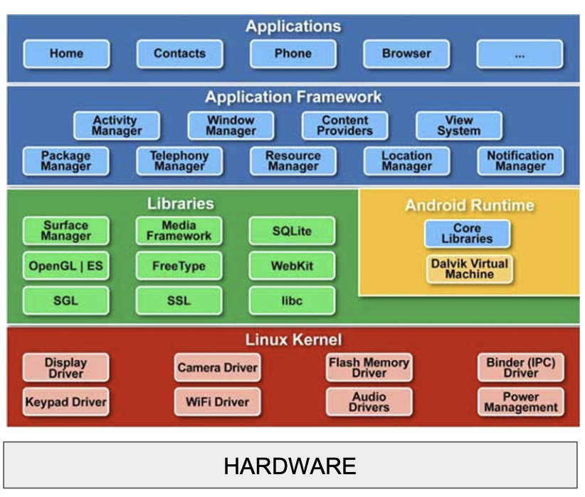
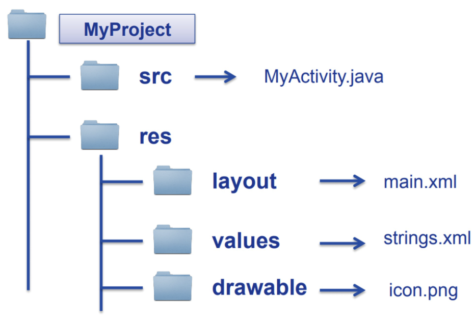
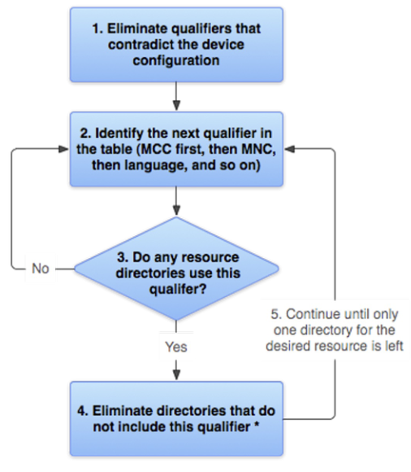
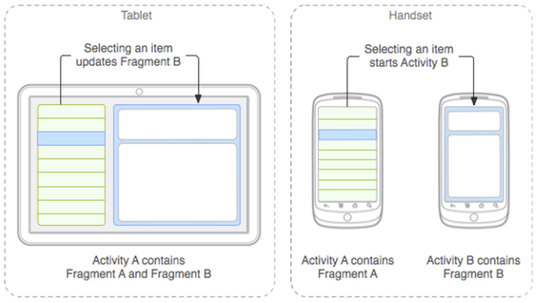
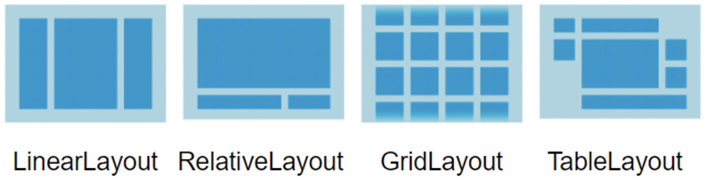
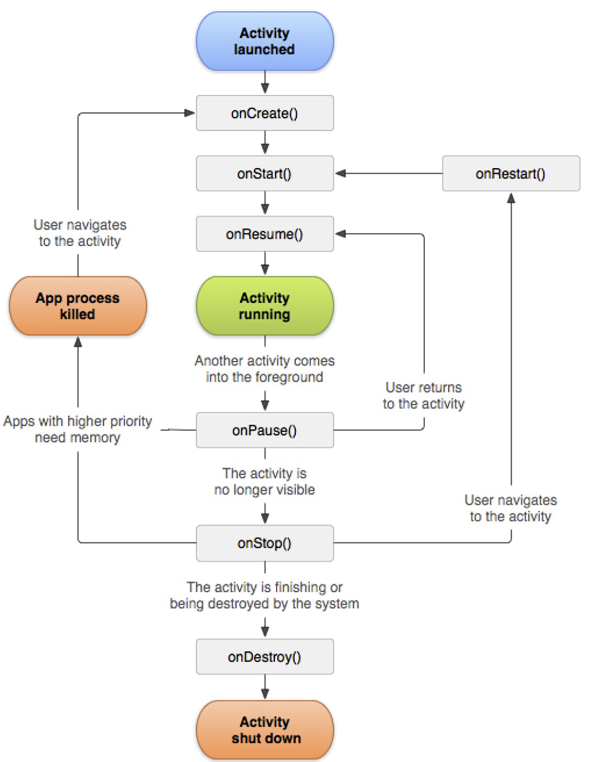

# Mangers, Risorse e Activities 

Android segue una architettura a **strati**, dove ogni livello offre  servizi a quello superiore nascondendo la complessità del livello inferiore.  



1. Hardware:  
    Metallo nudo, sono le componenti fisiche del nostro dispositivo, come processore, memoria, fotocamera ecc... 

2. Linux Kernel:  
    Primo strato di SW, cuore del OS, fa da tramite tra l'hardware e il resto del software, implementa _driver_ che permettono al SW di parlare con l'hardware (camera driver, wifi driver, ecc...)  

3. Libraries & Android Runtime:  
    Le librerie scritte in C++, si occupano di compiti pesanti in modo efficiente (OpenGL per grafica 3D, Webkit per pagine web, SQLite per database)  
    L'Android Runtime è l'ambiente in cui esegue il nostro codice Java/Kotlin.  

4. **Application Framework:**    
    Livello più importante per lo sviluppo mobile, contiene tanti metodi e attrezzi di alto livello che ci permettono di costruire le app astraendo i dettagli dei livelli inferiori, si interagisce con i servizi attraverso i **Manager**.  

5. Applications:  
    Lo strato di più alto livello, è ciò che vede l'utente finale, quindi le applicazioni complete.  


Le applicazioni android sono costruite utilizzando due linguaggi:
1. **XML**: Per definire l'interfaccia grafica (struttura, colori, testi)
2. **Java/Kotlin**: Per definire il comportamento e la logica (es: cosa succede quando clicco un pulsante, come vengono caricati i dati, ...)  

<br><br>

# Manager

Un **Manager** in Android è una classe dell'application framework che agisce come tramite tra la nostra applicazione $\rightarrow$ un servizio specifico del OS, fornisce una API per accedere a questi servizi.  
I manager hanno anche il compito di proteggere le risorse, la nostra app non può liberamente accedere a tutti i dati del nostro dispositivo, per accedere a un determinato servizio deve chiedere i permessi e ottenere un riferimento al manager di quel servizio (se il permesso viene garantito).  

<br>

## Manager Principali:  

### 1. Activity Manager  

È il supervisore del ciclo di vita delle applicazioni, i suoi compiti principali sono:

1. **Gestire lo stack delle activity:** per garantire una navigazione coerenete e prevedibile per l'utente, ogni app messa in primo piano (la sua activity) viene messa in cima allo stack, questo manager gestisce questo stack. 

2. **Governare il ciclo di vita:** Un'app può essere in primo piano e attiva (`Resumed`), visibile ma non interattiva (`Paused`) oppure in background e non visibile (`Stopped`).  L'activity manager ordina a ogni activity di passare da uno stato all'altro invocando metodi specifici $\rightarrow$ fondamentale per gestire le risorse e memoria.  

3. **Gestire le risorse:** decide quante risorse allocare per le applicazioni, se in un momento lo stack è grande e le risorse iniziano a scarseggiare allora può decidere di chiudere processi per liberare risorse (tipicamente quelli in fondo allo stack).  


### 2. Package Manager: 

Il package manager conosce tutte le applicazioni installate nel sistema (protegge e interroga il file `packages.xml`), serve a interrogare il sistema per ottenere informazioni su tutti i pacchetti (app) installati.  
Conosce tutte le app e le loro 'intenzioni' (`intent`), sa quindi quali app sono registrate come 'browser web' o 'app per scattare foto'.  
Fondamentale nello sviluppo quando ci dobbiamo appoggiare a servizi di altre app.  

### 3. Window Manager: 

Il window manager è l'amministratore dello schermo, bisogna pensare allo schermo come una serie di fogli trasparenti sovrapposti.  
Gestisce i livelli di profondità: Ogni elemento visuale è una finesta su un 'foglio' separato, il windoww manager sa che ordine devono essere impilati questi fogli.  
Se sono in un app e mi arriva una notifica il window manager disegna il foglio della notifica sopra quello dell'app che sto utilizzando.  


### 4. Connectivity Manager: 

Questo manager è il sensore dello stato della rete del dispositivo, ci permette di: 
- Conoscere lo stato attuale (capire se siamo connessi o meno)
- Essere notificati dei cambiamenti di rete: capire se siamo collegati a WiFi o 4G/3G/... (metered) e 'abbonarci' al manager ci permette di essere notificati se lo stato di rete cambia (es: se da WiFi passiamo a 3G allora la nostra app potrebbe avere della logica che previene il download di file pesanti).  

### 5. Content Provider  

Funge da interfaccia standardizzata per esporre o accedere ai dati delle app $\rightarrow$ permette a un app di esporre i propri dati ad **altre** applicazioni in modo sicuro.  

Un app che vuole condividere i propri dati crea un `ContentProvider` che le altre app useranno come API per accedere ai dati che stiamo esponendo. Le altre app non accedono mai direttamente al database della nostra app, fanno invece richieste al `ContentProvider` che abbiamo creato attraverso metodi standard (query, insert, delete, ...).  
_nota_: Sotto il cofano la comunicazione tra app e content provider avviene tramite il meccanismo di Binder IPC (inter process communication) - il content provider è un astrazione di alto livello.  


Ci sono molti altri Manager, come il Resource Manager (gestisce accesso alle risorse dell'app che non sono codice) e il Location Manager (gestisce GPS).  
In breve i manager sono tutti una misura di sicurezza per una determinata risorsa, controllano l'accesso in quanto per ottenere determinati dati bisogna interfacciarsi con loro ed ottenere un permesso specifico.  


<br><br>


## Resources: 

In Android una risorsa è tutto ciò che _non_ è codice!   

Nello sviluppo in android va affrontato un grande problema, ossia la eterogeneità di dispositivi, le applicazioni non sono progettate per girare su un solo tipo di telefono, ma su migliaia di dispositivi diversi che possono avare schermi di dimensioni diverse, densità di pixel diverse, lingue impostate dall'utente diverse ecc...  

La soluzione di Android è quella di **Separe il codice dalle risorse** - non inseriamo esplicitamente una riga nel codice per "mostrare la scritta `hello`".  
Avremo invece una risorsa che contiene la scritta e che è accessibile da un ID $\rightarrow$ chiederemo al sistema "mostra la risorsa  con ID `saluto` "   

Sarà poi il sistema Android a decidere quale versione di saluto mostrare in base alle caratteristiche del dispositivo in quel preciso momento.  


### Struttura dell'albero delle risorse

  

All'interno di un progetto avremo: 
- una cartella `src` $\rightarrow$ contine il codice Java/Kotlin
- una cartella `res` $\rightarrow$ contiene tutte le risorse 
 
La cartella `res` è divisa in sottocartelle, ognuna per un tipo specifico di risorsa:  
- layout: contiene file XML che definiscono las truttura dell'interfaccia utente 
- values: contiene file XML per valori semplici (es: strings.xml per testo)  
- drawables: contiene risorse come immagini 

<br>

### qualificatori 

Ricordiamo che il problema principale è quello di dover fornire risorse specifiche in base al dispositvo (e configurazione) su cui sta attualmente eseguendo l'app.   

Per fare ciò si usano i **Qualificatori di Configurazione**  che seguono questa struttura:

```
<nome_risorsa> - <qualificatore>
```

È importante avere sempre un risorse di default, verranno considerate come tali quelle risorse che non hanno nessun qualificatore.  

I qualificatori si possono usare e combinare a seconda delle necessità, questo permette di avere e creare esperienze utenti gradevoli nonostante la grande etereogeneità dei dispositivi; per garantire questo Android usa un algoritmo per scegliere le risorse migliori, è un processo gerarchico e di eliminazione logica.  

<center>

  

</center>

<br>

## Componenti di un app Android

Programmare per Desktop/Server e per Mobile prevede due approcci diversi, in particolare dato dal limite di risorse e vincoli di batteria dei dispositivi mobili.  

Uno smarthphone seppure potente ha risorse limitate rispetto a un PC, non possiamo sprecare batteria e memoria (RAM) altrimenti l'`ActivityManager` chiuderà la nostra app.  
Inoltre un app può essere interrotta in qualsiasi momento (un utente clicca pulsante home, arriva una chiamata all'utente, ecc...) e le nostre app devono essere progettate per sopravvivere a qesto scenario di interruzioni continue salvando il proprio stato e riprendendo da dove erano rimaste.  

L'**SDK** (**Software Development Kit**) di Andoid fornisce componenti per costruire le nostre app, principalmente divisibili in due macrocategorie:

### 1. Aspetto (come appare l'app)
- **Activities:** Rappresentano una _singola_ schermata dell'interfaccia utente (lista di email è una activity, la lettura di una mail è un'altra activity).  È analogo a un JFrame, possiamo vedere una Activity come un contenitore della finestra principale dentro la quale inseriamo i nostri contenuti. 

<br>

- **Fragments:** Sono delle 'mini-activity' riutilizzabili che possono essere combinate all'interno di una Activity. È una porzione modulare e riutilizzabile dell'interfaccia e ci permette di adattarci a vari dispositivi (consultare immagine).  
    es: su tablet -> c'è abbastanza spazio, allora l'activity A contiene due fragment contemporaneamente: Fragent A (la lista) e Fragment B (il dettaglio), in questo modo quando clicchi un elemento in A si aggiorna il Fragment B.  

    <center>

    

    </center>

    Questo mostra la comodità nell'uso di Fragments, scriviamo la logica e il layout per il Fragment A e Fragment B una sola volta, e poi vengono assemblati a seconda dello spazio disponibile $\rightarrow$ possiamo avere file di layour in `res/layout` per telefono e `res/layout-sw600dp` per tablet (dove -sw600dp è il qualifier).  
    Quindi quando lo apriremo sul tablet c'è abbbastanza spazio per contenere i due fragment nello schermo, ma passando a handset (telefono) L'activity A conterrà solo il fragment A e quando si clicca su un suo element si avvia la Activity B che contiene solo il fragment B.   

<br>

- **Views:** Sono i singoli componenti dell'interfaccia, come un bottone, un campo di testo, un immagine,...  
Sono i mattoni base con cui si costruisce l'aspetto di un'Activity o di un fragment.  
Esistono diversi tipi di View (TextView, EditView, Button, ...)  


### 2. Logica (come funziona l'app)
- **Bundles:** Sono oggetti simili a dizionari usati per passare dati tra componenti, ad esempio da un'Activity a un altra, o per salvare lo stato di un Activity quando viene interrotta.  

<br>

- **Intents:** Sono messaggi che un componente può inviare per richiedere un'azione a un altro componente (anche di un altra app volendo).  Quando la nostra app vuole aprire una pagina web, non dobbiamo implementare un browser $\rightarrow$ creeremo un intent che dice 'voglio visualizzare questo URL' e lo invieremo al sistema, l'ActivityManager lo intercetta e avvierà il browser web che l'utente sceglierà (o che ha scelto di default).   

<br>

---

<br>


### Costruire una View:

Una View ha attributi (larghezza, altezza, colore di sfondo,...) ed è organizzata in ViewGroups (layout).  
Possiamo costruire una View in 3 modi:
1. Da file XML: modo preferito di costruirle in quanto si definisce la view e tutti i suoi attributi, separa l'aspetto dalla logica ed è più facilmente manutenibile.  
2. Da editor drag&drop: AndroidStudio mette a disposizione un editor di questo tipo, alla fine non fa altro che scrivere il file XML per noi.  
3. Programmaticamente: Sconsigliato a meno che sia indispensabile e il programmatore sappia bene cosa sta facendo.  


### Sintassi XML:

- `android:<nome_proprietà>=<valore>` è la sintassi base

- `@<tipo_risorsa>/<id_risorsa>` è il modo per fare riferimento a una risorsa   

    <br>
    
    es: `android:text="@string/button_label_next`
    
    significa: per il testo di questo bottone vai a prendere il valore della risorsa di tipo `string` chiamata `button_label_next` (consente la traduzione in base alla lingua del dispositivo)  

- `="@+id/<nuovo_id>"` è la sintassi per definire un nuovo ID per una View, l'ID è fondamentale perchè ci permette di travera questa specifica View nel nostro codice Java/Kotlin per poterla manipolare (es:legare un evento al suo click).   


### Proprietà di una TextView:  
Si possono impostare da file XML o programmaticamente  
- File XML: attraverso attributi, per esempio per una TextView potremmo avere  
    android:text; android:textColor; android:textSize; ... 

- Programmaticamente: 

```Java
TextView textView = new TextView(this); 
textView.setText("Testo di prova");
```

Crea un oggetto `TextView`, la keyword `this` è fondamentale e si riferisce al **contesto**, che è un oggetto che fornisce accesso a risorse e servizi globali di sistema.  
una View ha bisogno di un contesto per sapere quale tema grafico usare o come accedere alle risorse e siccome una Activity è un Context, passiamo `this`.  


**nota:** Il `Context` è un oggetto che agiscecome un ponte tra il componente dell'app e l'ambiente del sistema operativo, fornisce accesso a informazioni e servizi a livello di applicazione
- dove trovo le risorse (immagini, stringhe, ecc...)
- come lancio una nuova activity
- come accedo a un servizio di sistema (es. connectivity manager)
- in quale cartella del dispositivo salvo i file privati 


<br>

---

<br>

### Views e Layouts 

Abbiamo spiegato come creare le nostre Views (che sono i mattoni singoli), ora dobbiamo capire come disporre di queste views.  
Dobbiamo prestare particolare attenzione e assicurarci che la disposizione si adatti bene a schermi di dimensioni e orientamenti diversi, per fare ciò usiamo proprio i Layout.   

In Android la disposizione di componenti è gestita da contenitori speciali chiamati **Layouts**, che in realtà sono delle view invisibili il cui unico scopo è organizzare le view figlie che contiene, secondo specifiche regole.  

Concetti chiave: 
- Non disponiamo le view in modo assoluto ma le inseriamo dentro un layout al quale indicheremo come deve gestirle. 
- L'uso dei layout è fondamentale per creare interfacce flessibili che si adattano a diversi display.  
- Possiamo annidare i layout (strutture nested o ad albero): potremmo avere un layout verticale principale che al suo interno contine un layout orizzontale (per due bottoni) e sotto di esso contine un altro layout a griglia (per visualizzare immagini).  La struttura ad albero è importantissima per costruire UI complesse.  
- Si possono definire tramite IDE/XML (consigliato) o prgrammaticamente (sconsigliato).  


### Classi di Layout: 

1. `LinearLayout`: È il più semplice, dispone i suoi figli in un'unica riga orizzontale o verticale
2. `RelativeLayout`: Più complesso ma molto potente, posiziona i figli in relazione _tra loro_ (metti bottone x sotto bottone y) adattandoli.  
3. `GridLayout`: Dispone i figli in un unica griglia rettangolare 
4. `TableLayout`: Simile alla griglia ma organizza i figli in righe e colonne
5. `ConstraintLayout`: È l'evoluzione del RelativeLayout e considerato ad oggi da Google come il layout più importante e flessibile.  

<center>



</center>


### Portabilità dei Layout:

Per costruire Layout che funzionano bene su ogni dispositivo dobbiamo usare unità di misure strandardizzate, in particolare useremo:

1. **dp (Density Independent Pixel)** : È l'unità di misura che va usata _sempre_ per definire le dimensioni dei layout e delle view. Un `dp` è un unità astratta che non dipende dalla densità di pixel del dispositivo, assicura che un pulsante di 160dp sia della stessa dimensioni su qualsiasi schermo, il OS si occupa di fare la conversione matematica per assicurare questa cosa.  
2. **cp (Scalable Pixel)** : È identico al dp ma rispetta anche la dimensioni del testo preferita dall'utente $\rightarrow$ va usato ogni volta che abbiamo del testo nella nostra app!


<br>

--- 

<br>


## Ciclo di vita delle Activity

Una Activity è una singola schermata con cui l'utente può interagire, una nostra app sarà quindi composta da un insieme di activity.  

Dire che un app è in **esecuzione** equivale a dire che le sue componenti (le activity) vengono create, avviate, messe in pausa e distrutte dal sistema operativo a seconda delle azioni dell'utente.


Il mondo mobile è caotico e pieno di interruzioni, abbiamo bisogno di gestire questi eventi improvvisi per garantire una buona esperienza utente.  

<br>

Il ciclo di vita di una activity è un **contratto** tra la activity e il sistema operativo.  
Il OS avvisa prima che accada qualcosa di importante chimando metodi specifici, dovremo implementare la risposta a questi metodi per reagire in modo appropriato.  


<center>



</center>


1. `onCreate()`:  
    Viene chiamato una sola volta quando viene creata l'activity per la prima volta, fa le operazioni di inizializzazione:
    - importa layout di interfaccia: `setContentView()`
    - inizializza le variabili: le View nel layout  
    Alla fine di onCreate() l'activty è creata ma ancora non visibile all'utente  

<br>   

2. `onStart()`:  
    Viene chiamato subito dopo onCreate() quando stiamo per passare o tornare in primo piano (si avviano processi legati all'aggiornamento della UI).    
    L'activity a questo punto diventa visibile ma ancora non interagibile.  


<br>

3. `onResume()`:  
    Viene chiamato subito dopo onStart(), l'activity ora si trova in primo piano ed è nello stato _Activity Running_, qui va avviato tutto ciò che richiede una interazione attiva (animazioni, audio, fotocamera, GPS, ...)


<br>

4. `onPause()`:  
    Viene chiamato quando l'activity sta per perdere il primo piano, in questo stato vanno fatte operazioni molto veloci, va messo in pausa tutto ciò che consuma CPU o batteria e che non ha senso tenere in vita se l'utente non sta interagendo attivamente con l'app.  
    L'activity è parzialmente visibile ma sta perdendo il focus: da questo punto può otnrare in onResume() o passare in onStop().  


<br>

5. `onStop()`:  
    Invocato quando l'activity non è più visibile all'utente, è stata avviata un'altra activity che ha preso il primo piano.  
    Qui si rilasciano le risorse più pesanti che non servono se la UI non è visibile, l'activity è ancora in memoria ma _congelata_ in background.  

<br>

6. `onDestroy()`:  
    Invocato poco prima che l'activity vennga distrutta, accade quando l'utente clicca il tasto 'indietro' o quando il OS decide di uccidere questa activity per recuperare memoria.  
    È il momento per pulire tutto, vanno rilasciate le risorse allocate in onCreate().  


<br>

7. `onRestart()`:  
    Invocato quando un activity dallo stato Stopped sta per esere avviata nuovamente, ossia prima di passare in onStart().  


### Inversion of Control  (IoC)

I metodi del ciclo di vita delle activity vengono registrati come **callback**, e seguono il pattern IoC/Observer.   
I metodi non verranno mai chiamati esplicitamente dal programmatore, dovremo solo fare l'override e implementazione di questi metodi; sarà poi il sisteam Android (in particolare ActivityManager) a chiamare questi metodi per noi nel momento giusto.    
Il ciclo di vita è il modo in cui Android implementa il pattern IoC/Observer, dandoci dei "ganci" (hooks) specifici in cui inserire il nostro codice per gestire lo stato della nostra schermata in un ambiente imprevedibile e controllato dal sistema.  


<br>  


### Salvare lo stato e architettura dell'app:  

Nel mondo mobile le cose possono essere imprevedibili e la nostra app potrebbe essere chiusa improvvisamente (dal OS o utente), occorre un meccanismo _fail-safe_ per salvare i dati temporanei importanti prima che l'activity venga distrutta e per ripristinarli una volta che viene ricreata.  


### Bundles:  

Sono delle HashMap dove possiamo mettere oggetti ed etichettarli con chiavi

```java
// per salvare i dati 
b.putFloat("punteggio_giocatore", 123.45f);

// per recuperare i dati 
float punteggio = b.getFloat("punteggio_giocatore");
```

Abbiamo due callback importanti in cui vengono usati i bundle: 
1. `onSaveInstanceState(Bundle outBundle)`:  
    Il sistema chiama quanto metodo quando l'activity è messa a rischio di distruzione, viene invocato quando l'utente lascia la activity ma NON quando la chiude esplicitamente.  
    In questo stato il sistema passa un `Bundle` vuoto e noi dovremo riempirlo con tutti i dati temporanei che vogliamo salvare (es: testo inserito in una textbox, punteggio attuale di un gioco, ...)  

<br>

2. Activity ricreata dal sistema dopo distruzione:  
    Il bundle che avevamo riempito prima di essere stati distrutti ci viene restituito in:
    1. `onCreate(Bundle savedInstanceState)`
    2. `onRestoreInstanceState(Bundle inBundle)` che è un altra callback chiamata subito dopo di onStart().   
    Di solito il ripristino avviene in onCreate, quindi la prima cosa da fare è controllare se savedInstanceState è null $\rightarrow$ se lo è allora la nostra activity è stata avviata per la prima volta ; altrimenti significa che l'activity è stata ricreata e che possiamo estrarre i dati dal Bundle per ripristinare lo stato dell'activity.  


<br>

## Android Manifest

La nostra app non è strutturata come un blocco monolitico ma come insieme di componenti indipendenti, quelle studiate fin ora sono state le Activity, ma ci sono anche altre **componenti fondamentali**:

- Services: per operazioni lunghe in background in cui non serve l'interfaccia utente (scaricare un file, suonare musica, ...)  
- Broadcast Receivers: sono gli ascoltatori di eventi del sistema (batteria quasi scarica, il dispositivo ha finito di avviarsi, ...)
- Content Providers: per condividere dati con altre app in modo sicuro
- Intents: messaggi usati per fare comunicare diverse componenti

Ciò che tiene insieme tutti questi pezzi e li presenta la OS come una applicazioni unica è un file chiamato `AndroidManifest.xml`  

<br>

Al suo interno si deve dichiarare:  
- nome dell'app 
- le componenti che la costituiscono (ogni Activity, Service, ...)
- i permessi di cui l'app ha bisogno
- caratteristiche hardware richieste  


```xml
<activity android:name=".MainActivity">
    <intent-filter>
        <action android:name="android.intent.action.MAIN" />
        <category android:name="android.intent.category.LAUNCHER" />
    </intent-filter>
</activity>
```

- `<activity android:name=".MainActivity">`: Dichiara al sistema che esiste una classe Activity chiamata MainActivity  
- `<intent-filter>`: Il filtro di intents dichiara per quali tipi di intent (messaggi) questa activity è in grado di rispondere 
- `<action android:name="android.intent.action.MAIN" />`: Indica che questa activity è un punto di ingresso principale per un'applicazione  
- `<category android:name="android.intent.category.LAUNCHER" />`: Mostra l'icona di questa activity nel launcher del telefono (la schermata home)  

---