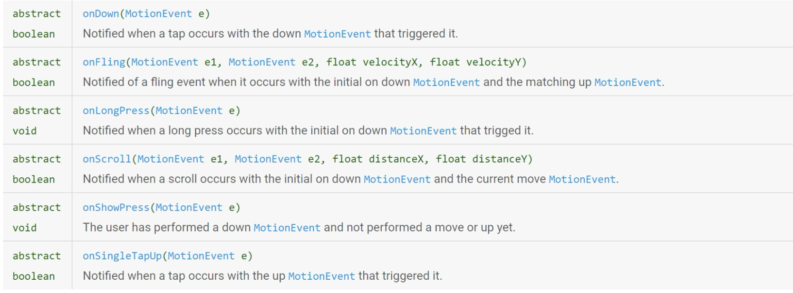

# Intents in Android 

Gli Intents sono il modo che hanno le activity di comunicare tra di loro.  
Un Intent è un messaggio astratto che descrive l'azione che si desidera eseguire, non dice esattamente come ottenere quell'azione.  

<br>

Serve per fare un **late runtime binding** tra un componente e un altro.  

_nota:_ un binding è un collegamento tra (una chiamata a una funzione) e (codice specifico che deve essere eseguito), esistono due tipi di binding:
1. Early Binding: Modo classico che corrisponde a:  
    `myObj obj = new myObj(); obj.doSomething();` Il compilatore sa esattamente cosa fare al momento della compilazione, quale pezzo di codice eseguire, il binding è fatto a tempo di compilazione.  
2. Late Runtime Binding: Il collegamento tra la richiesta e il codice che la esegue non avviene a tempo di compilazione ma avviene a tempo di **esecuzione** (runtime), cioè mentre l'app sta girando sul telefono   

Il meccanismo di late runtime binding è ciò che consente ad Android di essere flessibile e interconnesso, permette alle app di collaborare senza conoscersi.

<br>

**es:** la nostra app crea un itent per 'aprire una pagina web', la nostra app non sa quali browser siano installati e non ne implementa uno.  
Invierà un intent che esprime il voler aprire la pagina web e il sistema a _runtime_ guarderà l'intent - cercherà tra le app installate una in grado di eseguire quel tipo di richiesta e quando la trova farà il **binding**, la richiesta dell'app viene collegata al codice specifico dell'app che sa aprire pagine web (browser).  

<br>

## Tipi di Intent

Un Intent può essere usato per 3 scopi principali: 
1. Avviare un activity
2. Avviare un Service 
3. Inviare un Broadcast  

E può farlo in due modi:
1. **Intent Esplicito:** L'intent dice al sistema _esattamente_ quale componente vuole avviare  
Activity A manda intent per avviare la Activity B.   

<br>

2. **Intent Implicito:** Dichiariamo l'operazione che vogliammo fare e il sistema troverà l'app migliore per soddisfare questa richiesta (esempio del browser).  


### Intent Espliciti:  
Gli intent espliciti sono spesso usati per avviare un'altra activity, fargli fare un lavoro e **ricevere un risultato indietro**.  

<center>


</center>


`FirstAct` è in esecuzione (onResume()) e lancia `SecondAct` (tramite un intent).  
SecondAct viene creata (onCreate()) fa il suo lavoro e prima di chiudersi prepara il suo risultato e chiama `finish()`.  
Il sistema distrugge SecondAct riportando in primo piano FirstAct e consegnando il risultato nel metodo di callback `onActivityResult()`.  

<center>

**Codice Intent Esplicito** 

</center>

### First Activity: codice che invia la richiesta

```Java 
Intent i = new Intent(this, SecondAct.class);
i.putExtra('Data', 'stringa passata');
this.startActivityForResult(i,1);
```

(1) Crea un intent esplicito, `this` è il contesto ovvero la activity di partenza (FirstAct).  
SecondAct è la classe esatta dell'activity di destinazione, stiamo dando un indirizzo preciso.   

(2) Aggiungiamo dati extra all'intent (con un Bundle: 'Data' è la chiave 'stringa passata' il valore che inviamo).  

(3) startActivityForResult è il comando chiave, avvia la seconda activity ma si aspetta una risposta, il parametro `i` è l'intent che abbiamo preparato mentre `1` è il requestCode che ci permette di identificare a quale delle nostre richieste si riferisce quello specifico risultato (utile per distinguere risultati quando lanciamo più intent).  


### First Activity: codice che riceve la risposta

```Java
@Override
public void onActivityResult(int requestCode, int resultCode, Intent data){
    if (resultCode == RESULT_OK && requestCode == 1){
        data.getExtras().getString('CodRisposta');
    } else if (resultCode != RESULT_OK){
        // activity identificata con request code
        // ha fallito
    }
}
```

(1) è il metodo di callback (IoC), `requestCode` è l'ID che avevamo inviato; `resultCode` ci dice se l'operazione è andata a buon fine; `data` è un Intent che arriva da SecondAct contenente i dati della risposta.  

**nota:** tutto il codice soprastante è in un unico file  


### SecondAct 

```Java
Intent i = getIntet();
String ops = i.getExtra('Data');
// ... procedi con elaborazione ...
```

(1) Recupera l'intent che ha causato l'avvio di questa activity
(2) Estrae il valore dal Bundle allegato all'intent usado la chiave corretta (riceve 'stringa passata')   


```Java
@Override
public void finish(){
    Intent i = new Intent();
    i.putExtra('CodRisposta', 'Addio!');
    setResult(RESULT_OK, i);
    super.finish();
}
```

(1) ovverride di finish   

(2) Crea un nuovo intent _vuoto_ che sarà il nostro 'veicolo' per la risposta, non serve specificare il destinatario in quanto il sistema sa già che deve tornare a chi l'ha chiamata  

(3) Allega i dati della  risposta al nuovo intent   

(4) Dice al sistema che l'operazione ha avuto successo  

(5) Chiama il metodo finish originale per chiudere l'activity   


<br>

### Campo `data` degli intent 

Un intent ha una componente separato dagli `extras` chiamato `data` che serve per passare riferiemnti a dati specifici. Se una activity deve operare su un dato grande (tipo immagine o video) o su un dato che non possediamo direttamente (tipo in rubrica o su un file cloud) non possiamo passare tale dato direttamente nell'intent (non lo possediamo o è troppo pesate).  

Il campo `data` serve a passare oggetti di questa natura, in quanto contiene un oggetto `Uri` che serve per passare identificativi a oggetti (li passiamo per riferimento).  

```java
// pasiamo un indirizzo web 
i.setData(Uri.parse("https://www.unimore.it"))

// passiamo file locale sul dispositivo
i.setData(Uri.fromFile(new File("/sdcard/fotografia.jpg")));
```

<br>

## Intent Impliciti  

_situazione:_ Ho un app social network e ho bisogno che il mio utente scatti una foto da inserire nel suo profilo $\rightarrow$ **NON** devo scrivere da zero il codice per interagire con l'hardware della fotocamera, sul telefono ho già un app che fa tutto ciò, quindi devo **delegare** questo compito a tale app.  
Non so però quale app per scattare foto abbia installato l'utente (fotocamera google, samsung o di terze parti?) $\rightarrow$ la soluzione è usare un intent implicito.  

L'intent implicito serve per chiedere all'intero sistema chi può esaudire la mia richiesta, disinteressandomi dell'attore stesso e aspettando solo un risultato.  

```java
@Override
public void onClick(View v) {
    Button bottonePremuto = ((Button)v);
    if(bottonePremuto.equals(bottoneScatta)){
        //creiamo un intent implicito...
        Intent intent = new Intent(android.provider.MediaStore.ACTION_IMAGE_CAPTURE);
        activity.startActivityForResult(intent, 1);
    }
}
``` 

Il dato che ho richiesto lo ottengo dal metodo onActivityResult, il risultato di un generico intent finisce in `data`.  

```java
@Override
protected void onActivityResult(int requestCode, int resultCode, Intent data) {
    // Ecco dove è finita la nostra foto.
if (requestCode == 1 && resultCode == Activity.RESULT_OK) {
    Bundle extras = data.getExtras();
    Bitmap imageBitmap = (Bitmap) extras.get("data");
    // il campo extras mi restituisce una thumbnail dell'immagine...
    image.setImageBitmap(imageBitmap); //qua avviene il caricamento vero e proprio...
    }
}
```

Il pattern per intent impliciti è sempre:  

<center>

**Azione + [Dati] = Intent implicito**

</center>


## Android Manifest e Intent filters : 

Il manifest è il registro centrale del sistema, serve al sistema per sapere quali app possono gestire determinati compiti.  
Le app devono dichiarare queste capability nel manifest seguendo la sintassi universale.  

```xml
<activity android:name=".activity.SignInActivity" ... >
    <intent-filter>
        <action android:name="android.intent.action.MAIN" />
        <category android:name="android.intent.category.LAUNCHER" />
    </intent-filter>
</activity>

<activity android:name=".activity.CategorySelectionActivity" ... />

<activity android:name=".activity.QuizActivity" ... />
```

1. Ogni tag <activity> registra una schermata presso il sistema, senza questa l'activity non esiste per Android, è quindi necessaria sia per intent espliciti che impliciti
2. il tag **<intent-filter>** è cruciale, ed è il modo in cui un activity mette a disposizione del sistema le sue capability.  

<br>

---

Quando si fa un intent **esplicito** il sistema guarda il manifest per assicurarsi che esista, ignora completamente i filtri.  

Quando si fa un intent **implicito** (`new Intent(Intent.ACTION_VIEW, uri)`), il sistema legge i manifest di tutte le app cercando un <intent-filter> che contenga il tag desiderato (`<action android:name="android.intent.action.VIEW" />`) e che sia compatibile con i dati dell'Uri.   

--- 

### Analisi del codice XML nel Manifest

- `SignInActivity` ha un intent filter per `MAIN` e `LAUNCHER`, questo è un intent implicito che risponde alla richiesta del OS quando un utente clicca l'icona dell'app, è il punto di ingresso pubblico dell'app.  

- `CategorySelectionActivity` e `QuizActivity` non hanno intent filters, significa che nessun'app esterna può avviarle, l'unico modo per aprire è tramite un intent esplicito proveniente da un'altra activity della stessa applicazione (ad esempio, SignInActivity avvierà CategorySelectionActivity dopo un login corretto).   

Le dichiarazioni <activity> rendono i componenti noti al sistema, e i tag <intent-filter> li pubblicizzano come capaci di rispondere a specifiche richieste implicite, permettendo la collaborazione tra app.  

<br>

# Gestione degli eventi:  

Una volta costruita la nostra interfaccia con view e layout ci serve un meccanismo per ascoltare le azioni dell'utente sulle view.  

Il sistema di ascolto sarà composto da: 
- Listener - Componente ascoltatore: È il cuore del sistema, per ogni tipo di evento esiste un'interfaccia java specifica, noi creiam un oggetto listener che implementa questa interfaccia.  
- Registrazione: Associamo il nostro oggetto listener alla view che vogliamo monitorare   
    `myButton.setOnClickListener(myListener);`  
- Callback: L'interfaccia del listener ha metodi di callback, quando l'evento si verifica il OS chiama automaticamente il metodo di callback sul nostro listener.  


<br>

La gestione di eventi può essere fatta in due modi:
1. **Da file XML:**  
 È il modo più semplice per gestire eventi, consigliato per eventi semplici e comuni come il click di un bottone.  
    Nel file XML all'interno del tag \<button> si aggiunge un attributo speciale:  
    `android:onClick="mostraDialogo"`:    
    - onClick è l'attributo per le'evento di click
    - mostraDialogo è il nome del metodo che volgiamo venga eseguito al click del bottone.  

    Nel file Java dell'activity dovremo implementare un metodo che corrisponda esattamente alla firma definita nel XML, deve avere lo stesso nome utilizzato nel file XML e accettare un solo parametro di tipo View che serve da riferimento alla view che ha scatenato l'evento (nell'esempio il bottone).  

<br>

2. **In codice Java:**  
    È l'approccio standard, più potente e flessibile, segue un processo a 3 passaggi:
    1. Ottenere riferimento alla view:  
        `Button button = (Button)findViewById(R.id.bottone1)`; trova il bottone tra tutte le view che compongono il nostro layout   
        Restituisce una view generica, per questo serve fare il casting a bottone.  
    
    2. Associare il listener:  
        `setOnClickListener()` è il metodo che registra un ascoltatore per l'evento di click su quello specifico bottone.  
        `new ClasseAscoltatrice()` crea un'istanza di una classe che abbiao definito noi e che sa gestire l'evento  
    
    3. Implementare il listener:  
        ```java
        public class ClasseAscoltatrice implements View.OnClickListener {
            @Override
            public void onClick(View v) {
                // La logica da eseguire al click va qui!
            }
        }        
        ```  
        Creaiamo una classe che implementa l'interfaccia View.OnClickListener (quella che passiamo poi come istanza a setOnClickListener).  
        Faremo l'override del metodo di interesse con la nostra logica e tale codice verrà eseguito quando il bottone a cui è stato associato questo listener verrà cliccato.  


### Distinguere view della stessa categoria: 

Se abbiamo più button che compongono il nostro layout vogliamo un comportamento diverso a seconda di quale button viene cliccato, possiamo farlo da:
- **XML:**  
    dando un `android:onClick` diverso a ogni bottone e dedicando un metodo Java a ognuno (semplice ma porta a tanti piccoli metodi).  

- **codice:**   
    - listener separati: Creare una classe listener per ogni bottone, soluzione pulita ma in presenza di tanti bottoni diventa verbosa 
    - listener unico: associa lo stesso listener a tutti i bottoni, e dentro il metodo on click del listener usiamo il parametro view per capire quale bottone è stato cliccato, gestiamo la logica per i diversi bottoni con if-else o switch case.  

- **classe anonima:**  
    È un pattern molto comune e comodo, invece di definire una classe separata (su un file a parte) la definiamo e la istanziamo al volo direttamente dove serve.  
    ```java
    bottone.setOnClickListener(new View.OnClickListener() {
        @Override
        public void onClick(View v) {
            // logica specifica assegnata a “bottone”
        }
    });
    ```

<br>


## Gestures e `GestureDectector`

Le interazioni con un touchscreen prevedono eventi diversi e complessi, dobbiamo avere la capacità di poter distinguere tra un singolo tocco, un doppio tocco, un tocco prolungato, un trascinamento veloce, uno scroll lento o un pinch per fare zoom.  

Rilevare queste gestures non è banale infatti sarà il framework android a fornirci la soluzione pronta tramite il **`GestureDetector`**  e le API che mette a disposizione.  

Il gesture detector è un traduttore di eventi, una sorta di listener. Il suo lavoro è ricevere gli eventi di tocco grezzi e interpretarli a basso livello, notificando quando riconosce un gesto di alto livello (tipo longpress, fling, ...).  


### Come funziona il GestureDetector

- Si crea una istanza di `GestureDetector` 
- Si fornisce un listener da noi implementato 
- Intercettiamo eventi di tocco grezzi e li passiamo al `GestureDetector`
- Il `GestureDetector` si occupa della logica complessa (calcolare velocità, tempi, distanze) e quando riconosce un gesto, chiamerà il metodo di callback appropriato sul nostro listener.  


**alcune callback del gesture detector**:  

<center>



</center>

_nota:_ gli eventi individuati non sono mutuamente esclusivi, un doubleTap è di fatto due singleTap $\rightarrow$ l'API ci fornirà strumenti per gestire questo.  

Notiamo che i metodi di callback ricevono come parametro un `MotionEvent e` che descrive un singolo evento di tocco.  

Notiamo anche che molti di questi metodi restituiscono un valore booleano, questo è fondamentale in quanto serve a controllare **la propagazione dell'evento**.  


<br>

### Propagazione dell'evento: 

Ricoridiamo che layout e  view sono organizzati tramite una gerarchia ad albero.  
Quando si rileva un evento di tocco qualcuno deve gestirlo, in android il processo funziona in questo modo:  

Il sistema consegna l'evento di tocco (motionEvent) al nodo più profondo della gerarchia che si trova sotto il dito dell'utente, a tale nodo viene data la prima possibilità di gestire l'evento, viene invocato il suo listener, tale listener deve prendere una decisione e restituire True o False.  

1. Evento consumato: Il codice del nostro listener esegue la sua logica e restituisce True, l'evento (motionEvent) si ferma qui, gli altri nodi _non sapranno mai_ che è avvenuto un tocco.  
2. L'Evento risale la gerarchia: Il listener di questo nodo restituisce False, l'evento non risulta consumato, il sistema lo passa al livello successivo, ossia al genitore del nodo. L'algoritmo di propagazione continua in questo modo risalendo da figlio verso padre (mai verso i fratelli) fino a quando non viene consumato.  


---

### Struttura di un progetto Android


Abbiamo due componenti fondamentali

1. Codice Java:  
    Dentro la cartella `app/src/main/java/com/nome_app/` si creano i file `.kt`, ogni activity dell'app sarà un file **separato**.  

2. Risorse:  
    Dentro `app/src/main/res/` abbiamo le sottocartelle delle risorse (drawable, values, layout), e dentro la cartella `layout` avremo i file XML che definiscono l'albero delle view (potremmo avere un file `activity_main.xml` che descrive l'interfaccia della MainActivity).  

Per collegare il codice Java/Kotlin al layout si usa il metodo onCreate() definito nell'activity: 

```java
@Override
protected void onCreate(Bundle savedInstanceState) {
    super.onCreate(savedInstanceState);
    // QUESTA È LA RIGA CHE COLLEGA I DUE MONDI!
    setContentView(R.layout.activity_main);
    // ... altro codice, come la creazione del GestureDetector ...
}
```

- `setContentView()` gonfia (inflates) il file XML e costruisce l'abero di View e Layout definito in esso e lo attacca alla activity, da questo momento l'activity ha una sua gerarchia di views.  

Esistono due modi principali per gedtire eventi/gesti:

1. Un Listener per ogni view:  
    Si usa per eventi semplici e specifici di un componente (come click di un bottone)  
    ```java
    // Dentro onCreate(), DOPO setContentView()
    Button mioBottone = findViewById(R.id.id_del_bottone);
    RelativeLayout mioLayout = findViewById(R.id.id_del_layout);

    mioBottone.setOnClickListener(new View.OnClickListener() {
        @Override
        public void onClick(View v) {
            // Questo codice si esegue SOLO se clicco su mioBottone
            // Qui non ha senso restituire true/false
        }
    });

    // Potrei mettere un listener anche sul layout genitore
    mioLayout.setOnTouchListener(new View.OnTouchListener() {
        @Override
        public boolean onTouch(View v, MotionEvent event) {
            // Qui posso decidere se consumare l'evento
            return true; // L'evento si ferma qui
        }
    });
    ```


<br>

2. L'activity è UNICO listener globale:  
    Viene usato principalmente per le gesture, in quanto un gesto è spesso legato all'intera schermata e non a un singolo componente (swipe o scroll).  
    L'activity si candida come Listener e intercetta tutto, in questi casi conviene usare un GestureDetector per tradurre gli eventi ad alto livello.  


Il MotionEvent è un oggetto a basso livello, corrisponde al dato grezzo che il OS produce ogni volta che il dito dell'utente interagisce con il touchscreen.  

onTouchListener è l'ascoltatore di più basso livello che si possa usare, il suo metodo onTouch viene invocato per ogni MotionEvent che si vericica all'interno della view a cui è attaccato, fornisce il controllo totale ma anche tutta la complessità, dovremo noi manualmente interpretare il MotionEvent.  
Il **GestureDetector** è un aiutante che si mette in mezzo, esiste per evitare di dover lavorare direttamente con i MotionEvent grezzi, esso prende in ingresso un MotionEvent e lo traduce per noi in eventi di alto livello come onFling, onLongPress, ...  

