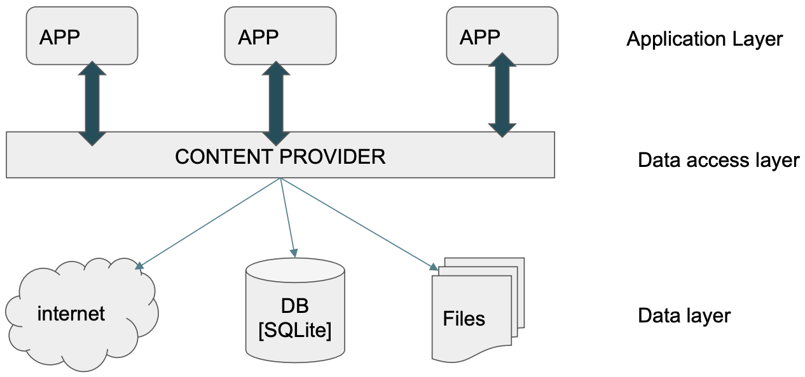

# Content Provider

Ogni app android vive in una sandbox isolata (per motivi di sicurezza), significa che di default le app non possono leggere i file di altre app.  
È assolutamente necessario disporre di un meccanismo per condividere dati tra applicazioni, ed è qui che entra in gioco il **Content Provider**, che consiste in una forma standardizzata, sicura e controllata di accedere ai dati delle altre app.  


<center>



</center>


- I dati delle altre app vivono nel `DataLayer` (database privati)
- Il content provider si trova al `DataAccessLayer` ed è l'unica interfaccia pubblica e controllata verso i dati
- Le app vivono nel `ApplicationLayer` e per leggere dati delle altre app devono fare richiesta tramite il content provider, che si accerterà che le app dispongano dei permessi necessari per permettere questa operazione.  

Il content provider lo possiamo vedere come un server nell'app di destinazione, la comunicazione tra l anostra app (client) e l'app che ospita il server provider (server) avviene tramite meccanismi di basso livello di comunicazione tra processi (IPC), il content provider è un'astrazione di questo meccanismo che ci nasconde la complessità.  


### Package Manager:  

Il `PackageManager` ci permette di sapere quali applicazioni abbiamo nel sistema e lo possiamo usare anche per sapere quali `ContentProvider` sono disponibili sul telefono.  


```java
// Ottieni un riferimento al PackageManager
List<ProviderInfo> providers = getPackageManager().queryContentProviders(null, 0, 0);

// Scansiona la lista dei risultati
for (ProviderInfo pi : providers) {
    Log.d(TAG, "Provider : " + pi.authority + " " + pi.readPermission);
}
```

- `pi.authority`: l'authority è un nome univoco che identifica senza ambiguità un ContentProvider
- `pi.readPermission`: ci dice quale permesso deve avere la nostra app per poter leggere i dati da questo provider  


### Content Resolver:  

Il ContentResolver è colui che invia la API, chiama l'authority (aka il nome esatto) del content provider e invia le nostre richieste.   
Ci fornisce una interfaccia con i metodi CRUD per interagire con i dati.  

**nota:**  
- `ContentProvider` $\rightarrow$ vive nell'app che _possiede_ i dati (app server)
- `ContentResolver` $\rightarrow$ vive nella nostra app, quella che _vuole accedere_ ai dati (app client)  


Il metodo più comune per usare un contentResolver è attraverso la clausola `query()` che corrisponde a una lettura.  

```java
// 1. L'INDIRIZZO (FROM table)
Uri table = ContactsContract.CommonDataKinds.Phone.CONTENT_URI;

// 2. LE COLONNE CHE VOGLIAMO (SELECT column)
String[] projection = new String[]{ ContactsContract.CommonDataKinds.Phone.NUMBER };

// 3. LA CONDIZIONE DI FILTRO (WHERE clause)
String selectionClause = ContactsContract.Contacts.DISPLAY_NAME + " = ?";

// 4. I VALORI PER IL FILTRO
String selArgs[] = new String[]{"Mario Rossi"};

// 5. ESEGUIRE LA QUERY
Cursor c = getContentResolver().query(table, projection, selectionClause, selArgs, null);
```


In SQL corrisponde a:

```SQL
SELECT NUMBER from PHONE
WHERE display_name = "Mario Rossi"
```  

- `CONTENT_URI`: costante predefinita che ci dà l'indirizzo esatto della tabella dei numeri d itelefono all'interno del Content Provider dei contatti.  
- `projection`: ci permette di specificare il dato che ci interessa (Phone.NUMBER) 
- `selectionClause = ?`: il '?' serve come placeholder sicuro (evitare SQL injections)
- `selArgs`: valore che sostituirà il '?'
- `getContentResolver().query(...)`: metodo che fa la chiamata vera e propria al content provider che ci interessa.  
- `Cursor c`: corrisponde a un oggetto di tipo puntatore, si posiziona sulla tabella dei risultati. Per leggere i dati dobbiamo scorrere questo cursore riga per riga ed estrarre i valori dalle colonne che abbiamo richiesto  


<br>

### Gestione dei permessi: 

In passato i permessi venivano chiesti al momento dell'installazione, in particolare nel Manifest; se l'utente voleva scaricare l'app doveva consentire tutti i permessi richiesti.  


Nasce quindi la necessità di avere una maggiore granularità nella gestione dei permessi, infatti a partire da Android 6.0 è stato introdotto il **`RUNTIME PERMISSION HANDLING`**.   

Il nuovo sistema classifica i permessi in **Livelli di protezione**.  
- **Regular**: sono permessi 'non invadenti' che una volta dichiarati nel manifest vengono concessi automaticamente 
- **Dangerous**: sono permessi che coinvolgono dati sensibili dell'utente, vanno chiesti a runtime, non basta metterli nel manifest.  


<br><br>

<center>

Gestione permessi a runtime: esempio

</center>


```java
// 1. Permesso da richiedere
private static final String PERMESSO = Manifest.permission.READ_CONTACTS;
private static final int COD_RICHIESTA = 1;


// 2. Controllo se dispongo del permesso
if (checkCallingOrSelfPermission(PERMESSO) != PackageManager.PERMISSION_GRANTED) {
    // Se entri qui, significa che NON hai il permesso.

    // 4. RICHIEDI IL PERMESSO
    if (Build.VERSION.SDK_INT >= Build.VERSION_CODES.M) {
        requestPermissions(new String[]{PERMESSO}, COD_RICHIESTA);
    }

} else {
    // se entriamo qui, hai già il permesso!
    // procedi tranquillamente con la tua query...
}
```

Questo processo è **asincrono**, la chiamata a `requestPermission` non blocca l'app, mostra il popup di dialogo e continua a girare, la risposta dell'utente arriverà in un metodo di callback separato.  

Il metodo di callback:  

```java
@Override
public void onRequestPermissionsResult(int requestCode, String[] permissions, int[] grantResults) {
    // ...
}
```

- requestCode: è il nostro COD_RICHIESTA precedente, ci permette di capire a quale richiesta stiamo rispondendo 
- permissions: la lista dei permessi che erano stati richiesti
- grantResults: array che contiene PERMISSION.GRANTED o PERMISSION.DENIED per ogni permesso richiesto.  


<br>

### ContentProvider & ContentResolver per query complesse:

Come precedentemente detto, possiamo interagire con il database di un app esterna in due modi:

- **contentResolver $\rightarrow$ contentProvider**: Standard de facto, utilizzato nella stra gran maggioranza di app, considerato sicuro e buona pratica; si interroga il database attraverso il metodo `query()` del contentResolver.  

    <br>  

    - **contentResolver $\rightarrow$ contentProvider $\rightarrow$ queryBuilder**: Implementiamo noi manualmente la query complessa che ci interessa, se il contentProvider non disponde di un metodo per accedere ai metodi come vorremmo, dobbiamo fare $n$ query separate e trattare i dati manualmente per fare la nostra composizione.    

<br>

- **rawQueries**: Metodo che permette di interrogare il database direttamente attraverso query SQL, altamente sconsigliato e considerato insicuro.


Quindi possiamo concludere e concentrare le nostre attenzion sull'uso del contentResolver, ossia colui che interroga il contentProvider che ci interessa attraverso i metodi previsti.  

La potenza espressiva delle query che possiamo fare è vincolata a come gli sviluppatori dell'app che ci interessa hanno implementato il contentProvider, sarà necessario leggere la documentazione e studiarla per capire cosa possiamo e non possiamo fare attraverso il loro contentProvider.  


<br>

## Creazione di un `contentProvider` personalizzato:

In questo contesto siamo l'app 'server' che deve servire i dati, creeremo un contentProvider che gestisca i nostri dati interni e li esponga al mondo estrerno in modo sicuro.  
_nota:_ possiamo servire dati ad app esterne ma anche a noi stessi, in questo caso possiamo avere un riferimento diretto al ContentProvider e scrivere metodi di cortesia da usare.  

<center>

Esempio di implementazione: app per gestione studenti 

</center>


Per prima cosa avremo il nostro file `Studente.java` dentro il nostro package principale, sarà un classico POJO.  

```java
package <packageDeclaration>;
public class Studente {
    private String nome;
    private String corso;
    private int mediaAttuale;
    public Studente(String nome, String corso, int mediaAttuale){
    this.nome = nome;
    this.corso = corso;
    this.mediaAttuale = mediaAttuale;
    }
    public String getNome(){ return nome; }
    // ... 
}
```

Creiamo il contentProvider in un file dedicato `MioContentProvider.java` all'interno dello stesso package del POJO.  
Per crearlo dobbiamo estendere la classe base `android.content.ContentProvider` che ci obbliga a implementare una serie di metodi standard (CRUD) che saranno i servizi principali che offriamo al mondo esterno.  

```java
public class ContentStudenti extends ContentProvider{
    // Indirizzo di univoco aka authority del nostro provider
    static final String PROVIDER_NAME = "<packageDeclaration>.ContentStudenti";
    // URL completo per accedere alla tabella degli studenti 
    static final String URL = "content://" + PROVIDER_NAME + "/studenti";
    // Si usano gli URI per gestire gli URL in android! 
    static final Uri CONTENT_URI = Uri.parse(URL);

    // nome colonne del nostro db 
    static final String NOME = "nome";
    static final String CORSO = "corso";

    private SQLiteDatabase db; //reference ad un vero database gestito da SQLite

    static final String DATABASE_NAME = "Universita";
    static final String STUDENTS_TABLE_NAME = "studenti";
}
```

In questo modo stiamo definendo il contratto pubblico del nostro ContentProvider, stiamo indirizzando i client con regole per accedere ai dati:
- devono usare CONTENT_URI se vogliono accedere ai dati 
- usare NOME, CORSO, ... come identificativi quando vogliono inserire dati o usare query  


Un ContentProvider è una facciata del nostro DB, per gestire il nostro DB usiamo classi helper che fornisce adroid come `SQLiteOpenHelper`, queste vanno inserite come classi annidate all'interno dello stesso file del nostro ContentProvider, in quanto sarà solo lui a usare tale classe.  

```java
/*nello stesso file dove abbiamo definito ContentStudenti*/
private static class DBWrapper extends SQLiteOpenHelper{
    // chiamiamo il costruttore della classe padre passando il nome del DB e la vers.
    DBWrapper(Context context){
        super(context, DATABASE_NAME, null, DATABASE_VERSION);
    }

    // chiamato UNA sola volta quando viene creato il DB
    @Override 
    public void onCreate(SQLiteDatabase db){
        db.execSQL(CREATE_DB_TABLE);
    }

    // chiamato quando aggiorniamo l'app e aumenta il DATABASE_VERSION
    // permette di aggiornare lo schema 
    @Override 
    public void onUpgrade(SQLiteDatabase db, int oldVersion, int newVersion){
        // butta via vecchia tabella e ricrea una nuova 
        db.execSQL("DROP TABLE IF EXISTS " + STUDENTS_TABLE_NAME);
        onCreate(db);
    }
}
```

### Metodi notevoli del ContentProvider:  

Guardiamo i principali metodi che deve implementare il ContentProvider (torniamo nel file ContentStudenti)  

```java
@Override
public boolean onCreate(){
    Context context = getContext();
    // instanziamo il helper 
    DBWrapper dbHelper = new DBWrapper(context);
    /*
    Ottiene riferimento scrivile al DB e se:
    - DB non esiste -> il helper chiamerà il suo onCreate()
    - DB esiste -> riferimento scrivibile al DB
    */
   db = dbHelper.getWritableDatabase();
   // ritorniamo T se l'inizializzazione ha avuto successo
   return (db != null);
}

@Override 
public Cursor query(Uri uri, String[] projection, ...){
    // Useremo SQLiteBuilder per permettere solo Query in modo sicuro 
    // ... codice ...
    Cursor c = qb.query(db, projection, ...);
    return c;
}
```

Altri metodi notevoli sono quelli che implemenano le classiche operazioni CRUD, quindi `insert()`, `delete()`, `update()`.


### Usare il nostro ContentProvider:

Per collegarci al contentProvide da una activity inseriamo il seguente codice nel file dell'activity: 

```java
// P1
ContentResolver resolver = getContentResolver();
ContentProviderClient client = resolver.acquireContentProviderClient(ContentStudenti.CONTENT_URI)
ContentStudenti contentStudenti = (ContentStudenti) client.getLocalContentProvider();

// usiamo un nostro metodo di cortesia per vedere se DB è vuoto
if (contentStudenti.contaElementi() == 0){
    // il db è vuoto, lo popoliamo!
    List<Studente> studenti = new ArrayList<>();
    // ... codice che riempie l'array list ... 

    ContentValues valori = new ContentValues();
    for (Studente s: studenti){
        valori.put(ContentStudenti.NOME, s.getNome());
        valori.put(ContentStudenti.CORSO, s.getCorso());
        valori.put(ContentStudenti.MEDIA_ATTUALE, s.getMediaAttuale());

        // P2
        getContentResolver().insert(ContentStudenti.CONTENT_URI, valori);
    }
} else {
    // il db non è vuoto, uso un metodo di cortesia per stamparne il valore
    contentStudenti.debugContent();
}
```

- `P1`: La parte iniziale è un metodo per ottenere un riferimento diretto all'oggetto `ContentStudenti`, questo ci permette di chiamare i nostri metodi di cortesia personalizzati che **NON** fanno parte dell'interfaccia standard del ContentProvider.  
    Possiamo ottenere un riferimento diretto al content provider **SOLO** ed esclusivamente nel caso in cui client e provider si trovano nello stesso processo, ovvero nella stessa applicazione; se un app esterna prova a fare questa richiesta risulta in `null`.  

- `P2`: È la chiamata universale al ContentProvider (attraverso il ContentResolver, non un riferimento diretto al ContentProvider); il resolver prende l'URI, contatta il ContentProvider e invoca il suo metodo `insert()`.  
- `ContentValues`: È una mappa (K,V) ottimizzata per passare dati al ContentProvider 


## Riassunto:  

Si può ottenere un riferiemento diretto al ContentProvider solo se sia il client che il server sono sulla stessa app (io programmatore che uso il mio stesso ContentProvider).  
Le app esterne client non potranno mai ottenere un riferimento diretto, esse potranno solo invocare il metodo query() del ContentResolver per interagire (indirettamente) con il ContentProvider.  

Dobbiamo vedere il ContentProvider come un server web che espone un API REST.  
Il ContentResolver e i metodi query(), insert(), ... sono l'equivalente android di una richiesta HTTP a un webserver $\rightarrow$ sono l'unica porta di comunicazione standard tra il client e il provider.  

Offrire query espressive:  
Come precedentemente detto, un client può interagire con il nostro database solo attraverso i metodi crud o attraverso il metodo query() del content resolver che di base non gestisce la complessità di query espressive, bisognerà usarla in modo intelligente.  

Possiamo offrire risultati di query espressive ai client trattando il nostro ContentProvider come un server API e le diverse URI come i suoi endpoint!  
- ContentProvider $\rightarrow$ server API
- URI $\rightarrow$ endpoint

Le diverse URI saranno dei trigger per query pre-programmate, in questo modo il client non scrive il JOIN (anche perchè non potrebbe) ma sceglie l'URI corretto che produrrà il risultato della JOIN che si aspetta.  

Il client deve quindi conoscere queste URI e la loro semantica, noi in quanto sviluppatori del provider dovremo pubblicare nella nostra documentazione una classe `Contract`.  

Creiamo quindi una classe `Contract` separata sempre però nel package di interesse

```java
public final class StudentiContract{
    // authority del provider
    public static final String AUTHORITY = "com.miaapp.provider.studenti";
    // Uri di base su cui costruiamo gli altri endpoint
    public static final Uri BASE_CONTENT_URI = Uri,parse("content://" + AUTHORITY);
    // path che definiscono i nostri endpoit
    public static final String PATH_STUDENTI = "studenti";
    public static final String PATH_STD_CON_ESAMI = "studenti_con_esami";  
}
```

Il codice SQL per fare queste query espressive va insierito all'interno dell definizione di query(), ossia in ContentStudenti.java    

Per concludere, una volta fatto tutto, dobbiamo registrare il nostro ContentProvider nel Manifest, altrimenti rimane invisibile al sistema operativo:

```XML
<provider
    android:name=".ContentStudenti"
    android:authorities="com.miaapp.provider.studenti" /> <!-- SOLO L'AUTHORITY! -->
```
_nota:_ va aggiunto solo l'authority, i diversi URI vengono gestiti internamente (tramite UriMatcher).  

