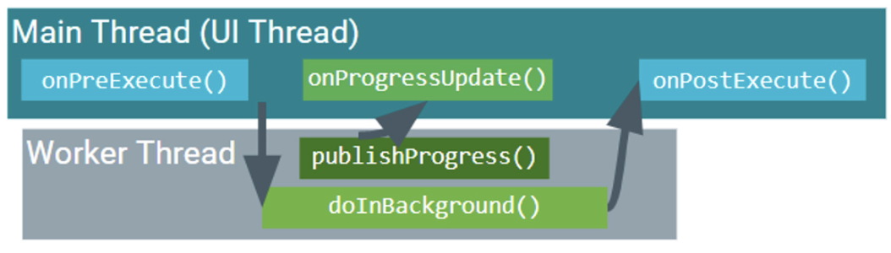

# Multi Threading in Java/Kotlin

Molte delle applicazioni moderne sfruttano l'architettura a più core delle CPU attraverso i Thread, non si esegue un programma unicamente in modo sequenziale, in specifici casi dividere il lavoro in più thread torna estremamente utile e velocizza l'applicazione in questione.  

Consideriamo un app con una interfaccia grafica contenente un pulsante, una volta cliccato un pulsante dobbiamo fare una operazione lunga e complessa.  
Se siamo nel paradigma single thread, allora una volta cliccato il pulsante la GUI si blocca fino a quando la computazione lunga non è terminata, non è il comportamento che vorremmo.  

La soluzione di base in Java è l'utilizzo dei Thread

### Threads

Il mattone fondamentale è la classe `Thread`, possiamo creare una nostra classe che estende Thread per definire un compito che deve essere eseguito in parallelo.  
Il codice di questo compito va inserito all'interno del metodo speciale `run()`.   


<center>

Esempio uso classe Thread:

</center>

  
Creiamo classe ThreadEX che andrà nel suo file dedicato (ThreadEX.java), estenderà la classe Thread e il calcolo lungo verrà inserito nel metodo `run()`  

```java
public class ThreadEX extends Thread{
    public int startingNumber;
    private int numDivs;

    public ThreadEX(int startingNumber){
        this.startingNumber = startingNumber;
    }

    @Override
    public void run(){
        int div=2;
        for(int i=2; i<startingNumber; i++)
            if( (startingNumber % i) == 0)
            div++;
        numDivs = div;
    }

    public int getNumDivs(){ return numDivs; }
}
```


Creiamo la classe che sfrutterà i thread, andrà nel suo file dedicato (MainTester.java).  

```java
public class MainTester {
    public static void main(String[] args) {
        ThreadEX tex1 = new ThreadEX(1000);
        ThreadEX tex2 = new ThreadEX(1105);
        tex1.start();
        tex2.start();
        try {
            tex1.join();
            tex2.join();
            System.out.println("Tex 1 divs : " + tex1.getNumDivs());
            System.out.println("Tex 2 divs : " + tex2.getNumDivs());
        } catch (InterruptedException e) {
            e.printStackTrace();
        }
    }
}
```

Questo esempio risolve parzialmente il problema dei thread, in quanto presenta dei forti limiti in un contesto grafico:
1. **Manca la separazione Grafica/Logica:** il calcolo risulta separato ma non esiste un modo per fare comunicare i due mondi, il thread di calcolo non riesce a dire al thread grafico che ha finito e che deve aggiornare la GUI.  
2. **Nessun feedback sul progresso:** il metodo `join()` forza l'attesa della computazione del thread, non abbiamo un modo di sapere se il calcolo è al 10%, al 80% o al 99%.  
3. **Boilerplate code:** Per gestire comunicazione e aggiornamenti tra thread dovremmo implementare manualmente un sistema di osservatori e ascoltatori, diventerebbe eccessivamente verboso.  


In conclusione, i Thread nudi non dispongono di un modo strutturato per gestire i risultati e gli aggiornamenti, diventando poco utili in un contesto grafico.  
Java mette a disposizione strumenti più avanzati per gestire i thread ad un livello più alto di astrazione. 


<br>


### Il pacchetto `java.util.concurrent` e `FutureTask<Callable V>`


Abbiamo la seguente necessità per i Thread:

1. Chiedere in qualsiasi momento se ha finito la computazione 
  
2. Una volta che ha finito ottenere il risultato del suo calcolo 

Inoltre la classe Thread di base non offre un modo diretto per ottenere un valore di ritorno (il metodo run() restituisce void).   

Java/Kotlin fornisce un intero pacchetto di strumenti avanzati per gestire la concorrenza, uno dei più importnati è il concetto di **`Future`**.  

Un `FutureTask` è un oggetto che avvolge una oprazione che girerà in un thread separato e dispone dei seguenti metodi:
1. `boolean isDone()`: consiste in un operazione immediata che mi dice se il risultato è pronto o meno 
2. `<V> get()`: Quando invocato, se il risultato è pronto lo restituisce subito, se invece è ancora in corso, blocca il thread chiamante (che ha invocato la get()) mettendolo in attesa fino a quando il risultato non è disponibile.  


<br>

FutureTask usa l'interfaccia `Callable` che permette di assegnare un valore di ritorno al suo metodo `call()` $\rightarrow$ consente di restituire un valore!  

FutureTask ha bisogno di un `Executor` per essere avviato, ossia un oggetto che gestisce un pool di thread in modo efficiente.  


<center>

Stesso esempio di thread riscritto con FutureTask 

</center>  

```java
// classe Thread che implementa Callable<Integer>
public class FutureEXThread implements Callable<Integer>{
    public int num;
    public FutureEXThread(int num){
        this.num = num;
    }

    // riusciamo a restituire un int!
    @Override 
    public Integer call() throws Exception{
        int div = 2;
        for(int i=2; i < num; i++){
            if ( (num % i) == 0)
                div++;
        }
        return div;
    }
}
```

```java
public class MainTester{
    public static void main(String args[]){
        // crea il FutureTask avvolgendo il nostro oggetto callable 
        FutureTask<Integer> futTask = new FutureTask<Integer>(new FutureEXThread(1891));


        // thread mandato all'executor
        Executor exec = \
            Executors.newSingleThreadExecutor();
        exec.execute(futTask);

        try{
            Integer ris = futTask.get();
            System.out.println("Divs: "+ ris);
        } catch (InterruptedExecution | ExecutionException e){
            e.printStackTrace();
        }
    }
}
```


Il FutureTask è un grande upgrade rispetto ai Thread nudi ma ha ancora grossi limiti nel contesto di un applicazione grafica:
1. Il thread non riesce a comunicare con la GUI per aggiornarla, non riesce a dire ' sono al 50%, aggiorna la barra di progresso '.  
2. Mancanza di risultati intermedi (interim results): il metodo get() restituisce solo il risultato finale, non abbiamo un modo di ricevere aggiornamenti durante l'esecuzione del thread.  

<br>


## SwingWorker: 

Il team di Java Swing si è trovato a dover risolvere queste due mancanze della FutureTask, le studiamo in quanto molto simile alla soluzione che adotta Android per gestire i Thread.  

In questo nuovo paradigma abbiamo: 

1. **`WorkerThread`**: Thread pescato da un pool in background, è il responsabile di eseguire la computazione pesante, lontano dalla grafica 

<br>

2. **`EventDispatcherThread`**: Conosciuto anche come EDT, questo è _l'unico_ Thread autorizzato a modificare la GUI

<br>

3. **`CurrentThread`**: È il Thread che avvia lo SwingWorker


`SwingWorker<R,P>` è doppiamente parametrizzato:
- `R` (result): il tipo di dato del risultato finale 
- `P` (progress): il tipo di dato degli aggiornamenti intermedi

Ci fornisce dei metodi da sovrascrivere, ognuno verrà eseguito sul Thread corretto!  
- `doInBackground()`: il codice qui dentro viene eseguito dal **workerThread**, in questo metodo va inserita la computazione pesante, da questo metodo possiamo chiamare:
    - `publish(P...)`: per inviare aggiornamenti di progresso intermedi 
    - `setProgress(int)`: per aggiornare un valore di progresso (da 1 a 100)
- `process(List<P> chunks)`: viene eseguito sull'**EDT**, riceve i dati da publish() e aggiorna la GUI
- `done()`: eseguito anche questo sull'**EDT** ma solo dopo che `doInBackground` ha terminato il suo lavoro, è il momento ideale per aggiornare la GUI.   


Definizione di un thread SwingWorker

```java
public class SwingWorkerEXThread extends SwingWorker<Integer, Integer>{
    public int num;
    private MainTester mt;
    private int div;
    public SwingWorkerEXThread(int num, MainTester mt){
        this.num = num;
        this.mt = mt;
    }

    // metodo che racchiude la computazione pesante
    @Override
    protected Integer doInBackground() throws Exception {
        int div=2;
        for(int i=2; i<num; i++){
            if(i%1000==0){
                // invia valore di i corrente ogni 1k iterazioni come aggiornamento di progresso
                publish(i);
            }
            if( (num % i) == 0){
                div++;
            }
        }
        this.div = div;
        // restituzione del valore finale della computazione (come Integer)
        return this.div
    }

    // eseguito sull'EDT alla fine di tutto, aggiorna definitivamente la barra
    @Override
    protected void done(){
        mt.pBar.setValue(100);
        mt.pBar.setForeground(Color.RED);
    }
    // riceve i valori inviati da publish e aggiorna la pBar
    @Override
    protected void process(List<Integer> args){
        float progress = (float)(args.get(args.size()-1)) / (float) num
        mt.pbar.setValue((int)(progress*100))
    }
}
```

Uso di uno SwingWorker per aggiornare una progress bar  

```Java
public class MainTester {
    public JProgressBar pBar;
    public MainTester(){
        JFrame frame = new JFrame("SwingWorker example");
        frame.setDefaultCloseOperation(JFrame.EXIT_ON_CLOSE);
        pBar = new JProgressBar();
        // ... altro codice ...

        // definiamo lo swingworker per invoare il thread
        SwingWorkerEXThread sw = new SwingWorkerEXThread(Integer.MAX_VALUE,this);
        sw.execute();
    }
    // ... altro codice ... 
}
```

<br>

## Sincronizzazione in Java: 

Usando Thread bisogna stare molto attento al concetto di sincronizzazione, per evitare problemi di Race Condition.  

Per evitare questi problemi introduciamo il concetto di **sezione critica e mutua esclusione**, dobbiamo garantire che solo un thread alla volta possa eseguire codice racchiuso in questa sezione.  

Java offre:

- `synchronized(list)`: crea un blocco sincronizzato, le operazioni dentro questo blocco sono protette da lock.  
- `lockObjects`: permette di usare lock espliciti dentro il codice, permette una granularità molto fine.  

Ma la soluzione definitiva e più comoda è la collezione **`Thread-Safe`**:  
Java offre strutture dati che hanno già la sicnronizzazione incorporata e sono pronte all'uso, basterà usare queste strutture dati per assicurarci di non imbatterci in race condition es $\rightarrow$ `Vector` invece di ArrayList !  

_nota:_ usare vector in contesti senza thread è un errore in quanto rallenterebbe di molto l'esecuzione del programma.  


<br>


## Thread in Android: 

Le basi della concorrenza in Android sono le stesse di Java (`Thread`, `synchronized`, `Executors`, ...) ma cambia l'astrazione ad alto livello.   
Android non ha `SwingWorker` ma fornisce alternative progettate specificamente per lo sviluppo mobile: 

1. **`AsyncTask`**: l'equivalente di swingWorker in Android

2. **`JobScheduler`**: meccanismo moderno e intelligenete per schedulare lavori in background 

<br>

<center>

### AsyncTask:  

</center>

Esiste una netta separazione tra due mondi:
1. **Main Thread (UI Thread)**: È dove vive l'interfaccia grafica, qui vengono eseguiti i metodi per preparare il lavoro, ricevere gli aggiornamenti di progressi e gestire il risultato finale. 

2. **Worker Thread**: È un thread in background dove viene eseguito il lavoro pesante

<center>



</center>

I metodi notevoli sono i seguenti:

1. `doInBackground` (WT): Eseguito sul Worker Thread, consiste nell'unico metodo dove inserire codice lungo e bloccante (calcoli pesanti, download, query)
2. `publishProgress` (WT): Invia aggiornamenti alla UI, catturato da onProgressUpdate.
3. `onPreExecute` (UI): Viene invocato prima di doInBackground() ed è il metodo per preparare l'interfaccia (mostrare rotellina di caricamento o barra di progresso)
4. `onProgressUpdate` (UI): Invocato ogni volta che doInBackground() invoca publishProgress 
5. `onPostExecute`(UI): Invoato una volta che doInBackground ha finito, riceve il risultato del lavoro svolto dal thread e lo usa per aggiornare la GUI.


### Creazione 

AsyncTask è una classe che accetta tre tipi di parametri `AsyncTask<P, U, R>`  
- `P` (Params): il tipo di dato che si passa a doInBackground quando si avvia il task (es: URL di un file da scaricare) 
- `U` (Update): tipo di dato per gli aggiornamenti di progresso, quello che publishProgress manda e che onProgressUpdate riceve 
- `R` (Result): tipo di dato del risultato finale, inviato da doInBackground e ricevuto da onPostExectue  


Si definisce la classe (come privata) all'interno dell'activity che la usa, in questo esempio il codice andrebbe dentro `MainActivity2.java`  

```Java
private class SwingWorkerEq extends AsyncTask<Integer, Integer, Integer>{
    private ProgressBar pBar;
    private int num;

    public SwingWorkerEq(ProgressBar pBar, int num){
        this.pBar = pBar;
        this.num = numL
    }

    // exe su UI THREAD prima del lavoro (fase di init)
    @Override 
    protected void onPreExecute(){
        pBar.setProgress(0); // azzera barra di progresso
    }

    // exe su UI THREAD dopo il lavoro 
    @Override
    protected void onPostExecute(Integer result){
        pBar.setProgress(100); // barra al 100%
    }

    // exe su WORKER THREAD -> svolge il lavoro pesante vero e proprio  
    @Override 
    protected Integer doInBackground(Integer... params){
        int num = params[0]
        // ... resto codice ...

        if(condizione == 0){
            // invia aggiornamento di progresso all'UI THREAD
            publishProgress(i);
        }
    }

    // exe su UI THREAD, cattura i dati di progresso inviati da publishProgress
    @Override
    protected void onProgressUpdate(Integer... prog){
        // ... codice ... 
    }
}
```


Sempre nello stesso file dell'activity, si definisce il modo in cui viene avviata questa activity insieme all'asyncTask 

```Java

public class MainActivity2 extends Activity{
    public ProgressBar pBar;
    private SwingWorkerEq asyncTask;
    private static final int BIG_NUMERO = 702002;

    @Override 
    protected void onCreate(Bundle savedInstanceState){
        super.onCreate(savedInstanceState);

        // ... codice ... 
        pBar = findViewById(R.id.progressBar);

        // crea istanza del nostro task! 
        asyncTask = new SwingWorkerEq(pBar, BIG_NUMERO);

    }

    // - invocato quando activity diventa visibile
    @Override
    protected void onStart(){
        asyncTask.execute(BIG_NUMERO);
    }
}
```

