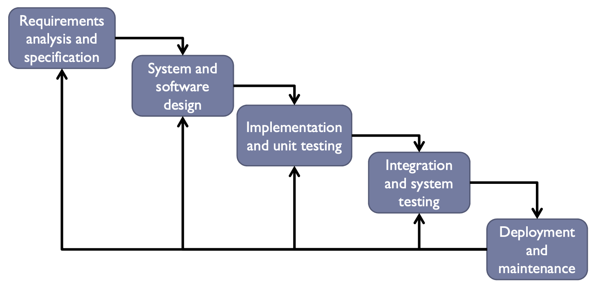
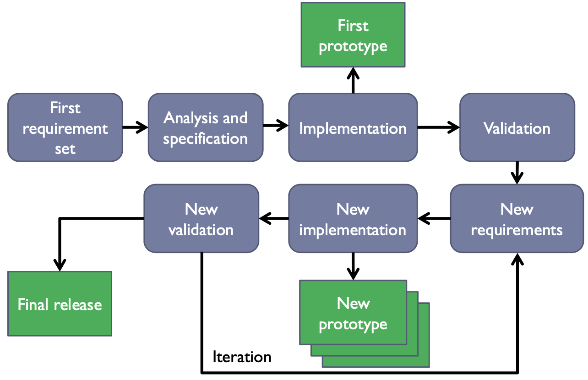
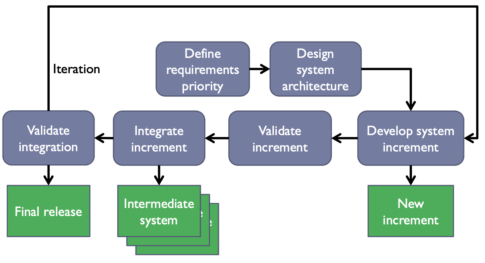
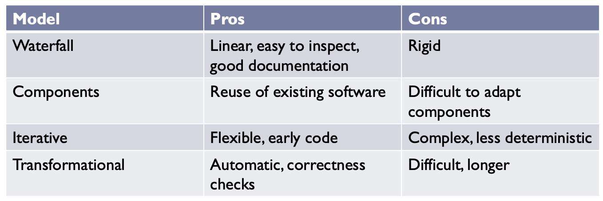
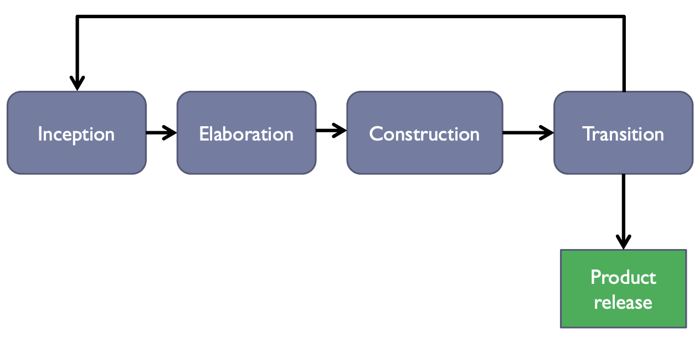

# Model Methodologies

### Table of contents 

 

## Il modello del processo di sviluppo (model of development process): 
Un processo di sviluppo è strutturato come insieme di **attività** (o fasi) necessaria a sviluppare un sistema software, e sono le seguenti:

1. Specifica 
2. Design
3. Implementazione 
4. Test e Validazione
5. Manutenzione e Evoluzione

Un modello del processo di sviluppo è una rappresentazione astratta di esso.  

### 1. Fase di specifica 
La fase di specifica è un'attività che mira a definire due aspetti chiave:
- **I requisiti** espliciti o impliciti del cliente 
- **I vincoli** del sistema e del suo sviluppo

feasibility study $\rightarrow$ extraction and analysis of requirements $\rightarrow$ specification of the requirements $\rightarrow$ validation 

### 2. Fase di Design e Implementazione  
È il processo in cui si traducono le specifiche/requisiti in un sistema funzionante.  
La parte di **Design** definisce la struttura e l'architettura che realizzerà le specifiche ai vari livelli.  
La parte di **Implementazione** traduce i prodotti e le scelte dalla fase di design a codice eseguibile.  

Queste due fasi sono fortemente connesse tra di loro ma dobbiamo fare il possibile per mantenerle separate!  

### 3. Verification e Validation 
La verifica e la validazione hanno lo scopo di mostrare che il sistema sviluppato:
    - soddisfa le specifiche
    - soddisfa i requisiti del cliente
 

 ### 4. Testing
 La fase di testing serve per verificare il comportamento del sistema in un set di casi, il set deve essere abbastanza largo per dimostrare che il sistema si comporterà analogamente in altre situazioni simili.  

 La fase di testig può essere strutturata in:
    - **Testing in the small**: si testano singoli moduli o unità  
        si testana l'intero codice -> coverage test usando la white box, ossia testando sapendo cosa c'è all'intero del codice - chiamata anche code inspection.  
    - **Testing in the large**: si testa l'intero sistema  
        quando le componenti e moduli sono integrati si testa l'intero sistema, si considera il comportamento del sistema di fronte alle specifiche usando il black-box method, ossia senza sapere cosa c'è all'interno della singola unità.  
    - **Regression Testing**: consiste nel andare a testare il codice una volta che si introduce un cambiamento, per controllare se delle modifiche portano con se effetti collaterali.  

 

## Process Models :

**code and fix**: usato solo per progetti molto piccoli, si parte da una fase iniziale in cui si scrive codice e poi si sistemano i bug, non prevede fase di design, pianificazione o collaborazione.  

### 1. Modelli Sequenziali: 

### 1.1 Waterfall model:

1. Requirements analysis and specification $\rightarrow$ si capisce coa vuole il cliente e si formalizzano i requisiti.  
2. System and software design $\rightarrow$ si costruisce un modello del sistema che bisogna sviluppare 
3. Implementation and unit testing $\rightarrow$ si implementano i vari componenti della parte di design e si fanno i test (white box)
4. Integration and system testing $\rightarrow$ si integrano le varie componenti sviluppate e si testa il sistema (black box)
5. Deployment and maintenance $\rightarrow$ Il sistema si rende operativo e si fanno le modifiche necessarie.  

Pro: processo ben definito, si può stimare con precisione il tempo necessario alla terminazione del progetto, si crea un buon livello di documentazione.  
Contro: processo molto rigido, diventa difficile gestire cambiamenti improvvisi (in particolar monto se vengono cambiati i requirements), inoltre manca flessibilità tra le varie fasi.  

Per affrontare questi contro si introduce il modello waterfall con feedback.  

### 1.2 Component-based Model:

Si basa sul riutilizzo di componenti software sviluppate internamente, si costruisce il sistema assemblandole (glue code), forte uso di OOP.

Requirements specifications $\rightarrow$ analisi delle componenti disponibili $\rightarrow$ modifica ai requirements per adattarli alle componenti esistenti $\rightarrow$ fase di design dell'integrazione delle componenti $\rightarrow$ implmenetazione dell'integrazioen $\rightarrow$ validazione del sistema  

Pro: Si usano componenti già creati (no need to reinvent the wheel) e testati come funzionanti  
Contro: I requisiti vanno riadattati per essere compatibili con le componenti preesistenti, è difficile svilippare componenti veramente riutilizzabili e spesso e volentieri il glue code è più difficile da implementare rispetto a iniziare da zero.  

### 2. Modelli iterativi: 

I processi sequenziali sono rigidi, nella fase di sviluppo che spesso è soggetta a cambiamenti di {requisiti, comprensioni(understsandings), condizioni}.
Per questo motivo è utile performare più volte alcune fase del processo per rivedere cosa è stato fatto alla luce delle nuove situazioni.  
**I modelli iterativi** $\rightarrow$ iterano più volte su alcune/tutte le fasi  
**Pro**: sono flessibili e danno la possibilità di mostrare prototipi nelle fasi iniziali al cliente
**Contro**: meno deterministici sul tempo di consegna del prodotto finale e molto più complessi da gestire (richiedono esperienza ed competenza).  

### Evolutionary Model: 
Il sistema evolve durante lo sviluppo e gli step da seguire sono i seguenti:
1. Un primo set di requisiti è chiesto al cliente
2. Si crea un prototipo a partire da questi e lo si mostra al cliente 
3. dal passo precedente potrebbe crearsi un nuovo set di requisiti o cambiamenti 
4. si sviluppa un nuovo prototipo a partire da questi e lo si mostra al cliente
5. si itera in loop fino a quando la versione finale non è pronta.  

Pro: Flessibile e molto adattabile a cambiamenti repentini
Contro: Fase d isviluppo difficilmente ispezionabile, difficile definire una stima temporale per la conclusione del progetto.  

Può essere usato per parti di sistemi a larga scala, sistemi a vita breve o sistemi sconosciuti.  
**Richiede** tool, linguaggi e tecniche per la prototipazione veloce!! il tempo è un grande vincolo - si mira a raggiungere un prototipo nel minor tempo possibile.  

### Modello Incrementale:  
Lo sviluppo dell'intero sistema si divide nello sviluppo di 'incrementi', gli step sono i seguenti:  
1. i requisiti hanno la priorità
2. fase di architecture design
3. si crea un incremento seguendo la priorità dei requisiti 
4. si valida l'incremento, si integra e si valida l'integrazione (3 step separati)
5. si itera lo step 4 e 5 fino a quando non si ha la versione finale

Le parti già sviluppate non si modificano, si aggiungono solo incrementi successivi. 

Pro: le funzionalità core sono velocemente disponibili per il cliente, la prima release può servire come prototipo per fare emergere nuovi requisiti, il rischio di fallimento è basse **e** le funzionalità core sono testate più volte (regression test).  
Contro: È difficile stimare il numero di incrementi a priori ed è difficile stimare il tempo necessario alla release finale.  

## Transformation Models: 

Si basano su modelli formali a partire dalla specifica dei requisiti che vengono trasformati in codice.  
Pro: il processo di trasformazione in codice è quasi automatico e le modifiche alle specifiche sono riflesse sull'implementazione.  
Contro: Molto difficili da gestire e richiedono ampio tempo nelle prime fasi di sviluppo.  

## Confronto dei modelli:  
- Waterfall: guidato da artefatti e documentazione
- Components: guidato da componenti pre-esistenti
- Iterativi (evo e incrementali): guidati da incrementi successivi
- Tranformational: guidato dalle specifiche 

## Unified Process Model:
Nasce negli anni '60 come standard industriale, sfruttano SRS, UML e risk management.  
È il precursore della metodologia Objectory e Rational.    

È iterativo incrementale, per ogni iterazione viene rilasciato un prodotto $\rightarrow$ che è runnabile e con documentazione.  

I fattori incrementali sono: {miglioramenti sull'usabilità, migliore identificazione del prodotto}.  
Gli incrementi sono addittivi e perfettivi 

Il modello UP è composto da **cicli e fasi**, dove ogni ciclo è composto da 4 fasi:  
1. Inception:
    - studio della feasibility
    - raccolta di requisiti
    - definizione del business case 
    - allocazione di priorità 
2. Elaborazione: 
    - definizione dell'architettura 
    - selezione del 10-20% dei requisiti
3. Construction:
    - implementazione delle componenti 
    - si testano le componenti
    - Integrazione delle componenti e check quality
4. Transition:  
    - si scrive la documentazione 
    - si rilascia il prodotto software
    - test di acceptance

Il modello UP ha dato le fondamenta per lo sviluppo delle metodologie agili e la loro accettazione nei contesti industriali.  

