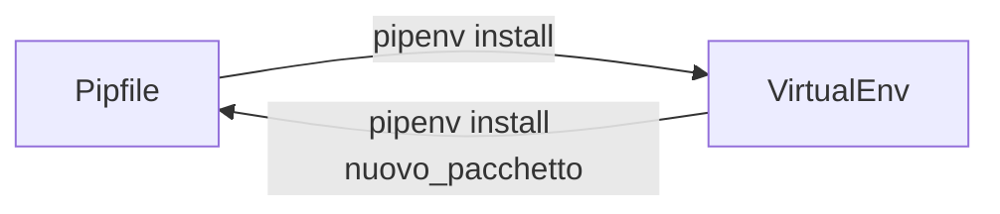

# Ambienti Virtuali in Python con Pipenv


Gli ambienti virtuali in Python sono spazi isolati dove puoi installare e gestire dipendenze specifiche per ogni progetto. Sono fondamentali perché:
- Evitano conflitti tra versioni diverse delle librerie 
- Mantengono l'ambiente di sviluppo pulito e organizzato 
- Facilitano la condivisione dei progetti 
- Permettono di avere versioni diverse delle stesse librerie per progetti diversi 


### Struttura consigliata per i progetti :

```
/NomeProgetto/  
    ├── Pipfile          # Contiene le dipendenze del progetto  
    ├── Pipfile.lock     # Blocca le versioni esatte delle dipendenze  
    └── script.py        # I tuoi file Python  

```


## Comandi Principali Pipenv:

**Installazione di Pipenv:**  

```bash 
pip install pipenv
```

**Gestione Ambiente Virtuale:**

```bash
# Creare un nuovo ambiente virtuale nel progetto
pipenv --python /opt/homebrew/bin/python3 # usa la versione specificata dal percorso 
pipenv --python 3.13 # specifica solo il numero di versione
pipenv install #usa la versione default di python


# Attivare l'ambiente virtuale
pipenv shell

# Uscire dall'ambiente virtuale
exit
# oppure
deactivate

# Rimuovere un ambiente virtuale
pipenv --rm

# Vedere il percorso dell'ambiente virtuale attivo
pipenv --venv
```

**Gestione Pacchetti:**  

```bash
# Installare un pacchetto
pipenv install nome_pacchetto

# Installare tutti i pacchetti dal Pipfile
pipenv install

# Disinstallare un pacchetto
pipenv uninstall nome_pacchetto

# Eseguire uno script nel venv senza attivarlo
pipenv run python script.py
```


## Gestione Progetti:  

**Creare un Nuovo Progetto:**  
1. Creare una cartella per il progetto 
2. Entrare nella cartella 
3. Eseguire `pipenv shell`
4. Installare le dipendenze necessarie con `pipenv install nome_pacchetto`  


**Spostare un progetto:**  
1. Spista l'intera cartella con il Pipfile e codice 
2. Nel nuovo percorso esegui `pipenv install` 
3. L'ambiente verrà creato con tutte le dipende correttamente 

**Utilizzo in Editor:**  
Se si utilizza come editor **VScode**, esso riconoscerà automaticamente gli ambienti virtuali e selezionerà l'interprete Python del venv nelle impostazioni.  
I vari venv appariranno nella lista degli interpreti disponibili.  

### Best Practices:  
Si consigli di usare un ambiente virtuale per ogni progetto e mantenere il Pipfile nella root del progetto.  
Non condividere ambienti virtuali tra progetti per evitare conflitti con librerie e versionamento.  
Se il progetto viene incluso in un repository Github assicurarsi di includere i Pipfile  


<br>

---


**Vantaggi dell'Uso di Pipenv:**  
- Gestione automatica delle dipendenze
- File di lock per versioni consistenti
- Separazione pulita tra progetti
- Facilità di condivisione e riproduzione dell'ambiente
- Integrazione con strumenti di sviluppo

<br>



<br>

I veri e proprio virtualenvs sono in `/Users/{username}/.local/share/virtualenvs`  
Contengono tutti i pacchetti installati e l'interprete corretto, se la si cancella non comporta nessun danno, è facilmente ricreabile a partire dai Pipfile $\rightarrow$ Fondamentale non perdere o cancellare i Pipfile!!    